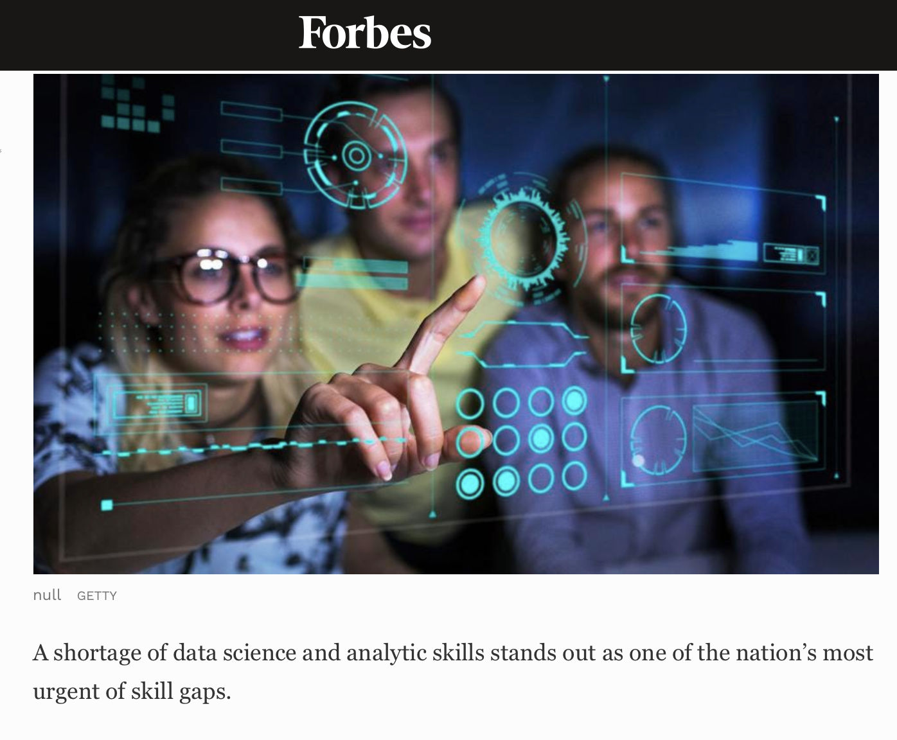
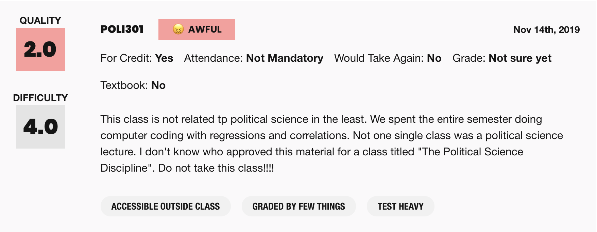
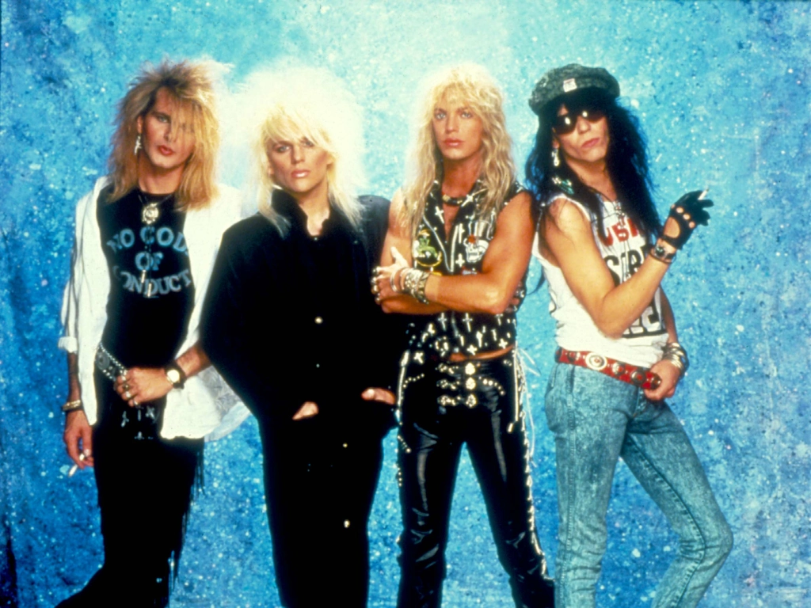

```{r setup, include=FALSE}
options(htmltools.dir.version = FALSE)
xaringanExtra::use_editable()
knitr::opts_chunk$set(
  fig.width=9, 
  fig.height=3.5, 
  fig.retina=3,
  out.width = "100%",
  cache = FALSE,
  echo = FALSE,
  message = FALSE, 
  warning = FALSE,
  hiline = TRUE
)
```


```{r packages}
library(tidyverse)
library(haven)
library(ggrepel)
library(ggdag)

# dubois colors
red = "#dc354a"
yellow = "#ecb025"
blue = "#213772"


# theme
theme_nice = function() {
  theme_minimal(base_family = "Fira Sans Condensed", base_size = 14) +
    theme(panel.grid.minor = element_blank(),
          plot.background = element_rect(fill = "white", color = NA),
          plot.title = element_text(face = "bold"),
          axis.title = element_text(face = "bold"),
          strip.text = element_text(face = "bold"),
          strip.background = element_rect(fill = "grey80", color = NA),
          legend.title = element_text(face = "bold"), 
          plot.subtitle = element_text(hjust = .5, face = "italic"))
}
theme_set(theme_nice())
```


class: left, middle
background-image: url("images/dubois-spiral-2.png")
background-position: right
background-size: contain

# `r rmarkdown::metadata$title`

### *`r rmarkdown::metadata$subtitle`*

### Professor `r rmarkdown::metadata$author` 

#### University of California, Davis

---

class: center
.large[
# Today's agenda
]

--
.box-1.large.sp-after[What's this class about?]

--
.box-2.large.sp-after[Getting to know each other]

--
.box-3.large.sp-after[UN voting patterns]

---

class: center, middle, inverse
# What's this class about? 

---


# Most wanted lists


.pull-left[

- Countries like the US spend lots of resources trying to kill, capture leaders of *non-state armed groups*
    - Rebel groups, terrorist orgs, organized crime
    
    
- This is known in the literature as **decapitation**
]

.pull-right[
```{r}

```
]

---

class: center, middle, inverse
# Does **decapitation** work?

---

# The data: Milton and Price (2020)


```{r decap}
set.seed(1990)
df = haven::read_dta("data/MiltonPrice_II_Final.dta") 

df %>% 
  filter(name %in% c("al-Qaeda", 
                     "April 19 Movement (M-19)", 
                     "Loyalist Volunteer Force (LVF)")) %>% 
  select(Name = name, Year = year, 
         Decapitated = decap, Failure = failure) %>% 
  group_by(Name) %>% 
  slice(1:2) %>% 
  knitr::kable()

```

---

# The results: a big effect!


```{r model}
m1 = glm(failure ~ decap, data = df)
pDat = ggeffects::ggeffect(m1, terms = "decap") %>% as_tibble()


ggplot(pDat, aes(x = factor(x), 
                 y = predicted, 
                 ymin = conf.low, 
                 ymax = conf.high, 
                 color = factor(x))) + 
  geom_pointrange(size = 2, fatten = 2, 
                  alpha = .8) + 
  scale_y_continuous(labels = scales::percent, 
                     limits = c(0, .2)) + 
  scale_x_discrete(breaks = c(0, 1), labels = c("No", "Yes")) + 
  labs(x = "Was the group decapitated?", 
       y = "Likelihood of group failure in any given year") + 
  theme(legend.position = "none", 
        panel.grid.minor = element_blank()) + 
  scale_color_manual(values = c(red, blue)) + 
  coord_flip() + 
  ggrepel::geom_label_repel(aes(label = c("Chance of failure: 2.2%", "Chance of failure: 9.6%")), nudge_x = -.2, family = "Fira Sans Condensed")
```

--

Decapitated terrorist groups are **3 times** more likely to dissolve

---


class: center, middle, inverse
# Does this mean decapitation **causes** organizations to break down?

--

.can-edit[Reasons for doubt]

???
What do you think?
---

class: center, middle
## Not so fast

--

Groups that **are** decapitated are *different* from groups that **aren't** decapitated
    
--

```{r dag, out.width="60%",fig.align='center'}
confounder_triangle(x = "Decapitate", y = "Failure", 
                    z = "???") %>% 
  ggdag_status(text = FALSE, use_labels = "label") + 
  theme_dag(legend.position = "none") + 
  scale_color_manual(values = c(red, blue)) + 
  scale_fill_manual(values = c(red, blue))
```

--

`???` = Strength, resources, size, location, etc.

--

Ignoring these differences will **confound** our estimate of the effect of decapitation!

---


class: center, middle
# What is this class about?

--

**Wrangling** and **visualizing** data to explore the questions we care about

--

Using **models** to describe how one political variable might cause another 

--

Thinking **causally** about the relationships we observe

--

Grappling with **uncertainty** in the relationships we observe


---

class: center, middle
# An emphasis on **doing**

--

*No readings* or giant, cram-in-one-day exams

--

regular, *sustained* practice with hands-on problem sets

--

*synthesize* what you learn in a final project

---

class: center, middle
# Programming as a way in


```{r,out.width="60%"}
knitr::include_graphics("images/rstudio.png")
```


10 weeks of focused study in **R**, a powerful and in-demand programming language


---


# Class philosophy:


Little to none of this: 

$$\sigma^2 = \frac{\sum_{i=1}^{n}(x_i - \mu)^2} {n}$$

--

Lots of this: 

```{r,eval = FALSE,echo = TRUE}
m1 = glm(failure ~ decap, data = df)
pDat = ggeffects::ggeffect(m1, terms = "decap") %>%  
  as_tibble()
ggplot(pDat, aes(x = factor(x), y = predicted, 
                 ymin = conf.low, ymax = conf.high, 
                 color = factor(x))) + 
  geom_pointrange(size = 2, fatten = 2, 
                  alpha = .8)
```

---

# This class is practical


This class *could* be a couple lines on a resume:


.pull-left[
- Ability to work with data ➡️ marketable

- R is popular in industry

- Familiarity with R ➡️ other languages

- Principles learned in R can be applied elsewhere (Excel)

- Problem-solving in Slack
]

.pull-right[

```{r}

```
]
---


class: center, middle, inverse
# Let's look at the **website**

---


# There's a lot of work, and coding, in this class

.pull-left[

- I warned you!

- Anyone can do it, yes "*even*" you

- you will be surprised at what you can do by the end

- But you have to try your best

- If this doesn't work for you, take another class

]

.pull-right[
```{r}

```

]


---


class: center, middle, inverse
> It’s easy when you start out programming to get really frustrated and think, “Oh it’s me, I’m really stupid,” or, “I’m not made out to program.” But, that is absolutely not the case. Everyone gets frustrated. I still get frustrated occasionally when writing R code. It’s just a natural part of programming. So, it happens to everyone and gets less and less over time. Don’t blame yourself. Just take a break, do something fun, and then come back and try again later.

Hadley Wickham,
Chief Data Scientist at RStudio

---


class: center, middle, inverse
# 🚨🚨 Problem sets = 50% 🚨🚨

---

class: center, middle
# For the love of all that is good

--

**Do** the weekly check-ins; they are free points

--

**Go** to section, ask for help on Slack

--

**Do not** miss homeworks in this class

--

Missing one = leaving a big chunk of your final exam blank

--

I want students who are working hard to do well, but I can't save you


---


class: center, middle, inverse
# Try your best and have fun!
---


class: center, middle, inverse
# Who am *I* ?

---


class: middle, left
background-image: url("images/travel-colombia.png")
background-size: contain
background-position: right

## Grew up in Cali, Colombia...

---


class: middle, left
background-image: url("images/florida.jpg")
background-size: contain
background-position: right

### ...and Ft. Lauderdale
### Went to UF (go gata)...

---


class: left, bottom
background-image: url("images/nc.jpg")
background-size: 600px
background-position: top

PhD at Duke University in Durham, NC...

I specialize in **political violence**, **development**, and **Latin America**

Wrote a dissertation on the Colombian civil war

---


class: middle, left
background-image: url("images/cocks.jpg")
background-size: 750px
background-position: right

## ...Worked at UofSC...
---

class: middle, left
background-image: url("images/boss-baby.jpg")
background-size: 750px
background-position: right
## ...The baby

Due: 10/4 (any day now)
---

class: center, middle, inverse
# The TAs

👨‍🎓 Jack Rametta


👩‍🎓 RyuGyung (Rio) Park


👩‍🎓 Alexa Federice


---


class: center, middle, inverse
# Who are *you* ? 

---

# What year are you?

```{r spreadsheet}
f21 = read_csv("/Users/juan/Dropbox/teaching/davis/pol51/misc/intake/pol51-responses-f21.csv") %>% 
  janitor::clean_names() 
who = read_csv("/Users/juan/Dropbox/teaching/davis/pol51/misc/intake/pol51-responses-f22.csv") %>% 
  janitor::clean_names() %>% 
  rename(from = where_are_you_from_hometown_use_this_format_if_within_the_us_city_state_if_outside_the_us_city_country)

who %>% 
  group_by(what_year_are_you) %>% 
  tally() %>% 
  mutate(pct = n/sum(n)) %>% 
  ggplot(aes(x = fct_reorder(what_year_are_you, pct), y = pct, 
             fill = what_year_are_you)) + 
  geom_col(alpha = .8, color = "white") + 
  coord_flip() + 
  labs(x = NULL, y = NULL) + 
  scale_y_continuous(limits = c(0, 1), labels = scales::percent) + 
  theme(legend.position = "none") + 
  scale_fill_viridis_d(option = "rocket", end = .8)
```

---

# Where are you from?

.scroll-output[
```{r}
knitr::kable(who$from, col.names = "")
```
]
---


# Everyone's in the same boat

.scroll-output[

]
```{r}
who %>% 
  select(`Experience with coding` = how_much_experience_if_any_do_you_have_with_computer_programming_coding, `Experience with data` = how_much_experience_if_any_do_you_have_with_working_with_data) %>% 
  pivot_longer(everything()) %>% 
  group_by(name, value) %>% 
  tally() %>% 
  ggplot(aes(x = value, y = n)) + 
  geom_col(fill = red, color = "white", alpha = .9) + 
  facet_wrap(vars(name)) + 
  labs(x = NULL, y = NULL)
```

---


# Same concerns

.scroll-output[
```{r}
set.seed(1990)
who %>% 
  select(concern = what_if_anything_concerns_you_about_this_class) %>% 
  drop_na() %>% 
  filter(str_detect(concern, "programming|coding|code|math")) %>% 
  knitr::kable(col.names = "What are you concerned about?")
```
]


---


# Lots of cool stuff


.scroll-output[
```{r}
who %>% 
  select(tell_me_something_cool_about_yourself) %>% 
  knitr::kable(col.names = "Something cool about you?")
```
]

---


# No euthanasia

.scroll-output[
```{r}
who %>% 
  select(spain = contains("in_spain")) %>% 
  knitr::kable(col.names = "What should happen with the mass shooter?")
```
]

---

# True crime: we all want to kill 


```{r}
who %>% 
  select(crime = contains("true")) %>% 
  slice(99, sample(x = c(1:150), size = 20)) %>% 
  knitr::kable(col.names = "Why is true crime so popular?")
```


---

# What is hair metal?


```{r, out.width="80%", out.height="80%",fig.align='center'}

```


---


# Does Guns N' Roses count?

```{r}
who %>% 
  select(guns = does_guns_n_roses_technically_count_as_hair_metal) %>% 
  group_by(guns) %>% 
  tally() %>% 
  mutate(percent = n/sum(n)) %>% 
  ggplot(aes(y = reorder(guns, percent), x = percent, fill = guns)) + 
  geom_col(alpha = .9, color = "white") + 
  scale_x_continuous(labels = scales::percent) + 
  scale_y_discrete(labels = scales::label_wrap(15)) +
  labs(x = "% of students", y = NULL, title = "Does Guns 'n Roses count as hair metal?") + 
  paletteer::scale_fill_paletteer_d("nationalparkcolors::Badlands") +
  theme(legend.position = "none")
```


---


class: middle, left
background-image: url("images/archie.jpeg")
background-size: contain
background-position: right
## weak TV consensus: Riverdale
---


# But i'm a creep...


<iframe width="1000" height="500" src="https://www.youtube.com/embed/wnMEp02P-_k" title="YouTube video player" frameborder="0" allow="accelerometer; autoplay; clipboard-write; encrypted-media; gyroscope; picture-in-picture" allowfullscreen></iframe>

---


class: center, middle, inverse
# UN Voting
---

class: center
## 🚨 Your turn 🚨

.can-edit[Instructions]