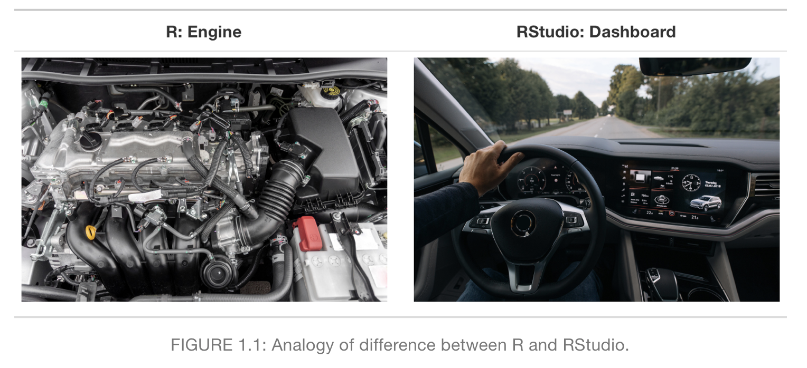
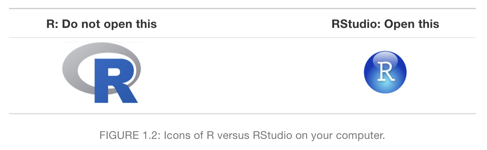
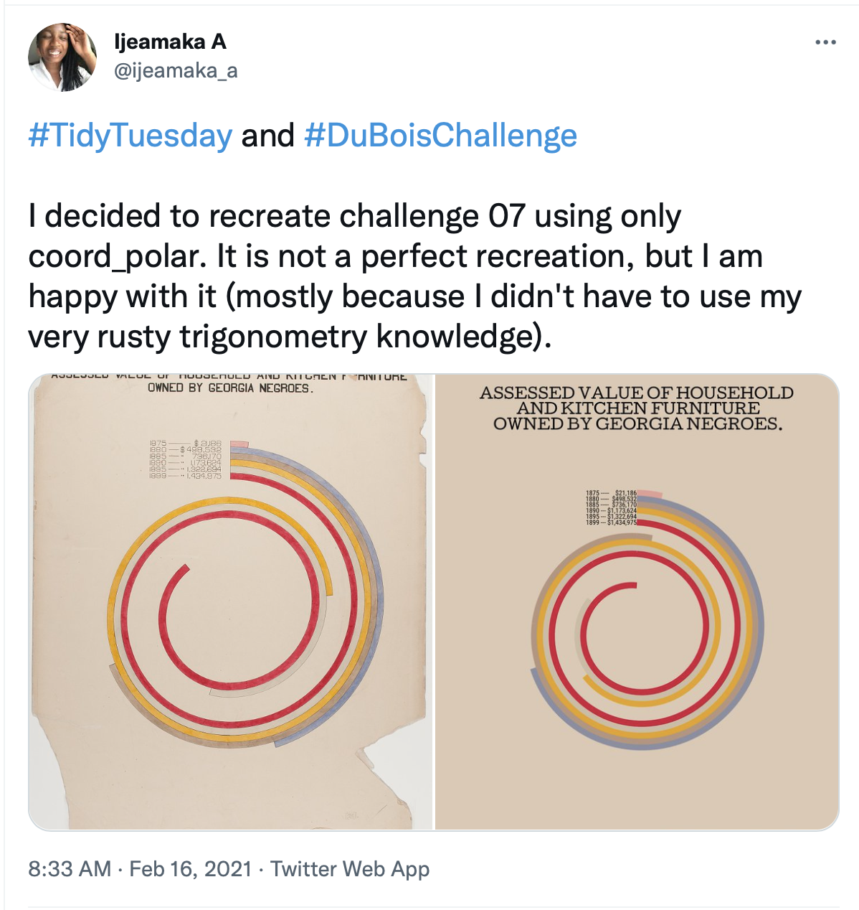
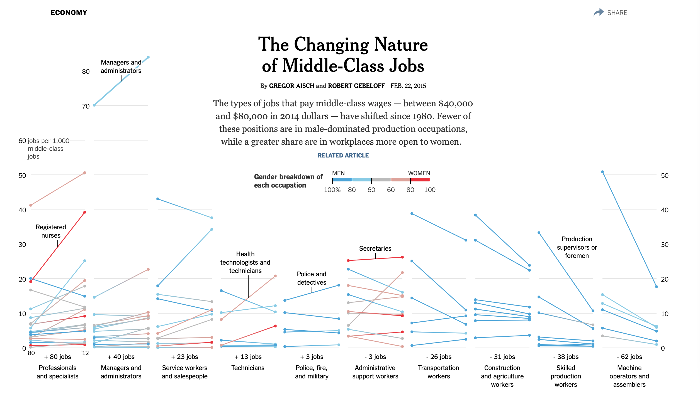
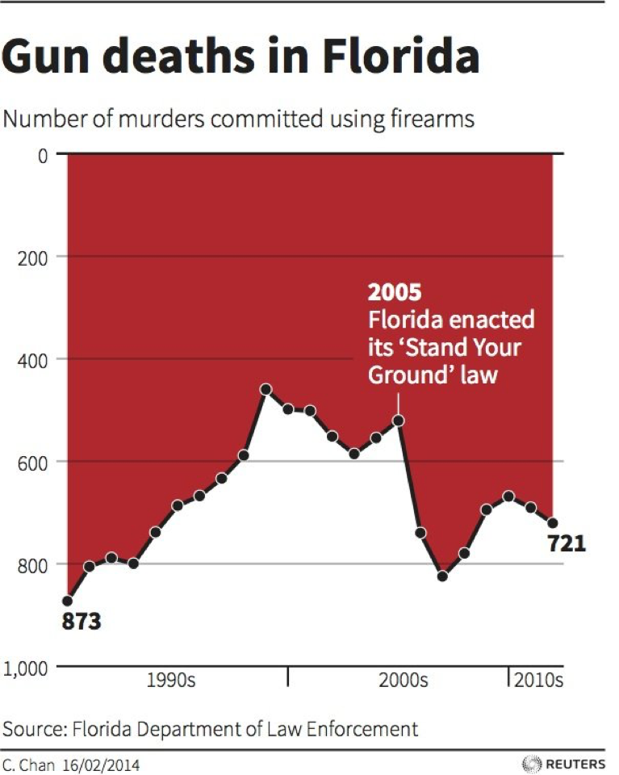

```{r setup, include=FALSE}
xaringanExtra::use_panelset()
xaringanExtra::use_clipboard()
options(htmltools.dir.version = FALSE)
knitr::opts_chunk$set(
  fig.width=9, 
  fig.height=3.5, 
  fig.retina=3,
  out.width = "100%",
  cache = FALSE,
  echo = FALSE,
  message = FALSE, 
  warning = FALSE,
  hiline = TRUE
)
xaringanExtra::use_editable(id = "02-viz")
```


```{r packages}
library(tidyverse)
library(gapminder)
library(socviz)
library(ggbeeswarm)
library(ggrepel)

# dubois colors
red = "#dc354a"
yellow = "#ecb025"
blue = "#213772"
```


class: left, middle
background-image: url("images/dubois-spiral-2.png")
background-position: right
background-size: contain

# `r rmarkdown::metadata$title`

### *`r rmarkdown::metadata$subtitle`*

### Professor `r rmarkdown::metadata$author` 

#### University of California, Davis

---

class: center
.large[
# This week's agenda
]

--
.box-1.large.sp-after[A quick tour of RStudio]

--
.box-2.large.sp-after[The grammar of graphics]

--
.box-3.large.sp-after[A graph for every season]

---

# Tortured metaphor 1: R as a car


```{r}

```


---

# Tortured metaphor 1: R as a car


```{r}

```


---

background-image: url("images/cooking-metaphor.jpeg")
background-size: 800px

# Tortured metaphor 2: Rstudio as a kitchen


---

background-image: url("images/rstudio-cook.png")
background-size: contain


???

Pointless to cover every dropdown menu
---

class: center, middle, inverse

# Look at the UN again

---


background-image: url("images/r-apps.png")
background-size: 800px
background-position: bottom

# Tortured metaphor 3: RStudio as a phone


Packages are where most of our **functions** and **data** live

---

# Installing packages

Check out the [link on the website](https://quantpol.juanftellez.com/reference/install/#install-cran-packages)


Or type this into the console and hit return/enter (note the quotation marks!):


```{r,echo=TRUE,eval=FALSE}
install.packages("Name of the package")
```


---


class: center, middle, inverse

# Why **visualize** data?

---


class: left, middle
background-image: url("images/dubois.jpeg")
background-position: right
background-size: contain

# WEB Dubois
(1868 - 1963)

- American sociologist

- historian

- civil rights advocate

- Data visualization specialist?

---


background-image: url("images/dubois-income.jpeg")
background-size: contain

---

background-image: url("images/dubois-graphs.jpeg")
background-size: contain

---

class: middle, left
background-image: url("images/dubois-pop.jpeg")
background-position: right
background-size: contain

## These are *hand-drawn*

---


# Brought back to life


.pull-left[
[**TidyTuesday**](https://github.com/rfordatascience/tidytuesday/blob/master/data/2021/2021-02-16/readme.md) challenge to bring his data visualization work back to life

]

.pull-right[
```{r}

```
]

---


class: center, middle
## Why go through the pain of **hand-drawing** graphs?

--

For better or worse, data carries **weight** in our society

--

**Visualizing** data is an effective way to convince, argue (and *mislead*)


---

class: center
## Dataviz to inform


```{r,out.width="60%"}

```

---

class: center
## Dataviz to mislead

```{r,out.width="40%"}

```

---

class: middle, center, inverse
# Making graphs in R

---


# The Gapminder dataset

.scroll-output[
```{r}
knitr::kable(gapminder)
```
]

---


# The finished product

```{r,echo = FALSE}
# subset data to focus on 2007
gap_07 = 
  gapminder %>% 
  filter(year == 2007)


# calculate average life span by year
life_yr = 
  gapminder %>% 
  select(year, lifeExp) %>% 
  group_by(year) %>% 
  summarise(avg_yrs = mean(lifeExp))

# calculate average life expectancy by continent
life_region = 
  gap_07 %>% 
  group_by(continent) %>% 
  summarise(avg_yrs = mean(lifeExp))

# calculate average life expectancy by continent-year
life_region_yr = 
  gapminder %>% 
  group_by(continent, year) %>% 
  summarise(avg_yrs = mean(lifeExp))

# plot
ggplot(gap_07, aes(x = gdpPercap, y = lifeExp, 
                      color = continent, 
                      size = pop)) + 
  geom_point() + 
  labs(x = "GDP per capita ($USD, inflation-adjusted)", 
       y = "Life expectancy (in years)", 
       title = "Wealth and Health Around the World", 
       subtitle = "Data from 2007. Source: gapminder package.") + 
  theme_bw()
```


???
What's going on in this graph? What variables are depicted, and how?

---

class: middle, center

# The **grammar** of graphics

--

**Data** = variables in a dataset

--


**Aesthetic** = visual property of a graph (position, shape, color, etc.)

--

**Geometry** = representation of an aesthetic (point, line, text, etc.)


---

# Mapping data to aesthetics


```{r}
df = tribble(~Data, ~Aesthetic, ~Geometry, 
             "GDP per capita", "Position(x-axis)", "Point", 
             "Life expectancy", "Position (y-axis)", "Point", 
             "Continent", "Color", "Point", 
             "Population", "Size", "Point")
knitr::kable(df)
```


1. Take the **data**, 

2. map it onto an **aesthetic**, 

3. and visualize it with a **geometry**

---

# In R


```{r}
df = tribble(~Data, ~`aes()`, ~`geom_`, 
             "gdpPercap", "`x`", "`geom_point()`", 
             "lifeExp", "`y`", "`geom_point()`", 
             "continent", "`color`", "`geom_point()`", 
             "pop", "`size`", "`geom_point()`")
knitr::kable(df)
```

---


## `ggplot()`: our first function 😢

```{r, echo = TRUE}
ggplot() #<<
```

---

## `ggplot`: specify the data

```{r, echo = TRUE}
ggplot(data = gap_07) #<<
```

---


## Use `aes()` to map data to aesthetics

```{r,echo=TRUE}
ggplot(data = gap_07, aes(x = gdpPercap, y = lifeExp)) #<<
```

---


## add geometries and layers using `+`

```{r,echo=TRUE, out.width="80%"}
ggplot(data = gap_07, aes(x = gdpPercap, y = lifeExp)) + 
  geom_point() #<<
```

---


## mapping population to size in `aes()`

```{r,echo=TRUE, eval = FALSE, out.width="80%"}
ggplot(data = gap_07, aes(x = gdpPercap, y = lifeExp, `size = pop`)) + 
  geom_point()
```

```{r,echo=FALSE, out.width="80%"}
ggplot(data = gap_07, aes(x = gdpPercap, y = lifeExp, size = pop)) + 
  geom_point()
```


---

## mapping continent to color in `aes()`

```{r,echo=TRUE, eval = FALSE, out.width="80%"}
ggplot(data = gap_07, aes(x = gdpPercap, y = lifeExp, size = pop, `color = continent`)) + 
  geom_point()
```

```{r,echo=FALSE, out.width="80%"}
ggplot(data = gap_07, aes(x = gdpPercap, y = lifeExp, size = pop, color = continent)) + 
  geom_point()
```

---


## Other layers: add the missing titles with `labs()`

```{r,echo = TRUE, eval = FALSE}
ggplot(data = gap_07, aes(x = gdpPercap, y = lifeExp, size = pop, color = continent)) + 
  geom_point() + `labs(x = "GDP per capita", y = "Life expectancy", title = "Global wealth and health in 2007")`
```

```{r,echo = FALSE, out.width="70%"}
ggplot(data = gap_07, aes(x = gdpPercap, y = lifeExp, size = pop, color = continent)) + 
  geom_point() + labs(x = "GDP per capita", y = "Life expectancy", 
       title = "Global wealth and health in 2007")
```

Notice that text is placed within **quotation marks**!

---

## Other layers: add a theme

```{r,echo = TRUE, eval = FALSE}
ggplot(data = gap_07, aes(x = gdpPercap, y = lifeExp, size = pop, color = continent)) + 
  geom_point() + labs(x = "GDP per capita", y = "Life expectancy", title = "Global wealth and health in 2007") + 
  `theme_bw()`
```

```{r,echo = FALSE, out.width="60%"}
ggplot(data = gap_07, aes(x = gdpPercap, y = lifeExp, size = pop, color = continent)) + 
  geom_point() + labs(x = "GDP per capita", y = "Life expectancy", 
       title = "Global wealth and health in 2007") + 
  theme_bw()
```


There are many more themes, [here are a few](https://ggplot2.tidyverse.org/reference/ggtheme.html)

---


## The formula


```{r,echo = TRUE, eval = FALSE}
ggplot(data = gap_07, aes(x = gdpPercap, y = lifeExp, 
                          size = pop, color = continent)) +
  geom_point() + labs(x = "GDP per capita", y = "Life expectancy", 
       title = "Global wealth and health in 2007") +
  theme_bw()
```


--

1. Tell `ggplot()` the data we want to plot

--

2. Map all variables onto aesthetics within `aes()`

--

3. Add layers like `geom_point()` and `theme_bw()` using `+`

---


## What's that country way out on the bottom right? 


```{r,echo = FALSE}
ggplot(data = gap_07, aes(x = gdpPercap, y = lifeExp, 
                          size = pop, color = continent)) +
  geom_point() + 
  labs(x = "GDP per capita", y = "Life expectancy", 
       title = "Global wealth and health in 2007") + 
  theme_bw() + 
  geom_label_repel(data = filter(gap_07, country == "Gabon"), 
                   aes(label = "???"), color = red, 
                   nudge_x = 5e3, size = 4, fontface = "bold")
```


---

class: left
## 🚨 Your turn: try labelling the points 🚨


1. Add labels to each point by mapping country names onto the `label` aesthetic within `aes()`

2. Add `geom_text` layer to your plot to plot the names


```{r}
countdown::countdown(minutes = 5L)
```

---

exclude: false
## Map country names to label aesthetic

```{r, echo = TRUE,out.width="70%"}
ggplot(data = gap_07, aes(x = gdpPercap, y = lifeExp, size = pop, color = continent, 
                          label = country)) + #<<
  geom_point()
```


---

exclude: false
## Plot the labels

```{r, echo = TRUE,out.width="70%"}
ggplot(data = gap_07, aes(x = gdpPercap, y = lifeExp, size = pop, color = continent, 
                          label = country)) + 
  geom_point() + 
  geom_text() #<<
```


---

exclude: false
## What did we do?

```{r}
df = tribble(~Data, ~Aesthetic, ~Geometry, 
             "gdpPercap", "`x`", "`geom_point()`", 
             "lifeExp", "`y`", "`geom_point()`", 
             "continent", "`color`", "`geom_point()`", 
             "pop", "`size`", "`geom_point()`", 
             "country", "`label`", "`geom_text()`")
knitr::kable(df)
```


Take your *data*, map it onto an *aesthetic*, represent with a *geometry*


---


# 🇺🇸 The presidents 🇺🇸


.scroll-output[
```{r}
elections_historic %>% 
  select(year, winner, win_party, ec_pct, popular_pct, two_term, winner_label) %>% 
  head() %>% 
  knitr::kable(caption = "Sample of presidential elections")
```
]


---

class: left
# 🚨 Your turn 🚨


--

Make a plot of presidential election results using the `elections_historic` dataset

--

% of popular vote (x-axis) and % of electoral college vote (y-axis)

--

map the winner's party to the `color` aesthetic, whether or not president served two terms to `shape`, and add labels to each point (use `winner_label`)


```{r}
countdown::countdown(minutes = 5L)
```

---

exclude: false
## Map the x and y axes


```{r,echo = TRUE,out.width="70%"}
ggplot(elections_historic, aes(x = popular_pct, y = ec_pct)) #<<
```

---

exclude: false
## Add a point geometry


```{r,echo = TRUE,out.width="70%"}
ggplot(elections_historic, aes(x = popular_pct, y = ec_pct)) + 
  geom_point() #<<
```

---

exclude: false
## Add point color and shape


```{r,echo = TRUE,eval = FALSE, out.width="70%"}
ggplot(elections_historic, aes(x = popular_pct, y = ec_pct, `color = win_party, shape = two_term`)) +
  geom_point()
```

```{r,echo = FALSE,out.width="70%"}
ggplot(elections_historic, aes(x = popular_pct, y = ec_pct, color = win_party, shape = two_term)) + #<<
  geom_point()
```

---

exclude: false
## Add point labels


```{r,echo = TRUE,out.width="70%"}
ggplot(elections_historic, aes(x = popular_pct, y = ec_pct, color = win_party, shape = two_term,
                               label = winner_label)) + #<<
  geom_point() + 
  geom_text() #<<
```

---

exclude: false
## Add a theme and titles


```{r,echo = TRUE,out.width="50%"}
ggplot(elections_historic, aes(x = popular_pct, y = ec_pct, color = win_party, shape = two_term,
                               label = winner_label)) +
  geom_point() +  
  geom_text() + 
  theme_minimal() + #<<
  labs(x = "Percent of popular vote", y = "Percent of Electoral College vote", title = "Presidential Elections: Popular & Electoral College Margins", subtitle = "1824-2016") #<<
```

---

exclude: false

```{r, echo = FALSE, eval = TRUE, fig.height=5}
ggplot(elections_historic, aes(x = popular_pct, y = ec_pct, label = winner_label,
                               color = win_party, 
                               shape = two_term, label = winner_label)) + 
  geom_point() +  geom_text_repel(family = "Fira Sans Condensed") + 
  theme_minimal(base_family = "Fira Sans Condensed") +
  labs(x = "Percent of popular vote", y = "Percent of Electoral College vote", title = "Presidential Elections: Popular & Electoral College Margins", subtitle = "1824-2016", color = NULL, size = NULL) + 
  scale_y_continuous(labels = scales::percent) + 
  scale_x_continuous(labels = scales::percent) + 
  scale_color_manual(values = c(yellow, red, blue, "gray")) + 
  geom_hline(yintercept = 0.5, size = 1.4, color = "gray80") +
    geom_vline(xintercept = 0.5, size = 1.4, color = "gray80") +  theme(legend.position = "none") 
```


???
What's going on here?

---

exclude: false

## What did we do?

```{r}
df = tribble(~Data, ~Aesthetic, ~Geometry, 
             "popular_pct", "`x`", "`geom_point()`", 
             "ec_pct", "`y`", "`geom_point()`", 
             "win_party", "`color`", "`geom_point()`", 
             "two_term", "`shape`", "`geom_point()`",
             "winner_label", "`label`", "`geom_text_repel()`")
knitr::kable(df)
```


Take your *data*, map it onto an *aesthetic*, represent with a *geometry*


---

exclude: false

.panelset[
.panel[.panel-name[Output]
```{r, echo = FALSE, eval = TRUE}
ggplot(elections_historic, aes(x = popular_pct, y = ec_pct, label = winner_label,
                               color = win_party, 
                               shape = two_term, label = winner_label)) + 
  geom_point() +  geom_text_repel(family = "Fira Sans Condensed") + theme_minimal(base_family = "Fira Sans Condensed") +
  labs(x = "Percent of popular vote", y = "Percent of Electoral College vote", title = "Presidential Elections: Popular & Electoral College Margins", subtitle = "1824-2016", color = NULL, size = NULL) + 
  scale_y_continuous(labels = scales::percent) + 
  scale_x_continuous(labels = scales::percent) + 
  scale_color_manual(values = c(yellow, red, blue, "gray")) + 
  geom_hline(yintercept = 0.5, size = 1.4, color = "gray80") +
    geom_vline(xintercept = 0.5, size = 1.4, color = "gray80") +  theme(legend.position = "none") 
```
]

.panel[.panel-name[Code]
.scroll-output[

]
```{r, echo = TRUE, eval = FALSE}
# just if you're curious! Note you'd need the ggrepel package
ggplot(elections_historic, aes(x = popular_pct, y = ec_pct, label = winner_label,
                               color = win_party, shape = two_term, 
                               label = winner_label)) + 
  geom_point() +  
  geom_text_repel() + 
  theme_minimal() +
  labs(x = "Percent of popular vote", 
       y = "Percent of Electoral College vote", 
       title = "Presidential Elections: Popular & Electoral College Margins",
       subtitle = "1824-2016", color = NULL, size = NULL) + 
  scale_y_continuous(labels = scales::percent) + 
  scale_x_continuous(labels = scales::percent) + 
  scale_color_manual(values = c(yellow, red, blue, "gray")) + 
  geom_hline(yintercept = 0.5, size = 1.4, color = "gray80") +
    geom_vline(xintercept = 0.5, size = 1.4, color = "gray80") +  theme(legend.position = "none") 
```
]
]

