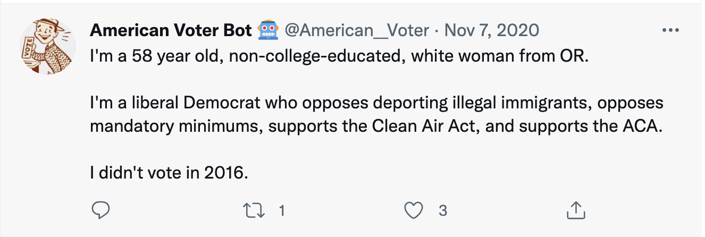

```{r setup, include=FALSE}
options(htmltools.dir.version = FALSE)
xaringanExtra::use_editable(id = "wrangle1")
knitr::opts_chunk$set(
  fig.width=9, 
  fig.height=3.5, 
  fig.retina=3,
  out.width = "100%",
  cache = FALSE,
  echo = FALSE,
  message = FALSE, 
  warning = FALSE,
  hiline = TRUE
)
```


```{r packages}
library(tidyverse)
library(juanr)

# dubois colors
red = "#dc354a"
yellow = "#ecb025"
blue = "#213772"


```


class: left, middle
background-image: url("images/dubois-spiral-2.png")
background-position: right
background-size: contain

# `r rmarkdown::metadata$title`

### *`r rmarkdown::metadata$subtitle`*

### Professor `r rmarkdown::metadata$author` 

#### University of California, Davis

---

class: center
.large[
# Today's agenda
]

--
.box-1.large.sp-after[Wrangling and pipes]

--
.box-2.large.sp-after[`filter()` and logical operators]

--
.box-3.large.sp-after[Objects]

---


class: center, middle
# The new starting point

--

Before, I  *wrangled* data and you plotted the finished product

--

First step of all your code was `ggplot()`


--

Now, **you** will wrangle the data 

--

First step is now *the data object*

---

class: center, middle, inverse
# What is data-wrangling?

--


>  ...the process of transforming and mapping data from one "raw" data form into another format with the intent of making it more appropriate and valuable for a variety of downstream purposes such as analytics... **Data analysts typically spend the majority of their time in the process of data wrangling compared to the actual analysis of the data.** -- Wikipedia


---


# Pipes: connecting data to functions


```{r, echo = TRUE, eval = FALSE}
# code from homework
directors_profit = movies %>% 
  # only look at horror movies
  filter(genre1 == "Horror" | genre2 == "Horror" | genre3 == "Horror") %>% 
  # calculate profit
  mutate(profit = gross - budget)
```

You've seen these before...

---


# What are pipes? 


.pull-left[
- **Pipes** link .shout[data] to .shout[functions]

- They look like this in R: ` %>% `

- For the love of all that is good: Use keyboard shortcuts
  - OSX: <kbd>Cmd</kbd> + <kbd>Shift</kbd> + <kbd>M</kbd> 
  - Windows: <kbd>Ctrl</kbd> + <kbd>Shift</kbd> + <kbd>M</kbd> 
]

.pull-right[
```{r}
knitr::include_graphics("images/not-pipe.jpeg")
```
]

---

# Why pipes? 


--


With pipes: 😍

```{r, echo = TRUE, eval = FALSE}
penguins %>% 
  filter(species == "Adelie") %>% 
  mutate(body_mass_kg = body_mass_g / 1000) %>% 
  select(body_mass_kg)
```


--


Without pipes: 🤢

```{r, echo = TRUE, eval = FALSE}
select(mutate(filter(penguins, species == "Adelie"), body_mass_kg = body_mass_g / 1000), body_mass_kg)
```


---

# Making sense of pipes: "and then..."


```{r, echo = TRUE, eval = FALSE}
# code from homework
movies %>% 
  # only look at horror movies
  filter(genre1 == "Horror" | genre2 == "Horror" | genre3 == "Horror") %>% 
  # calculate profit
  mutate(profit = gross - budget)
```

> Take the data object `movies`, AND THEN `filter` so that genres 1 2 or 3 equal horror, AND THEN `mutate` so that...


---

class: center, middle, inverse
# Filtering and logical operators
---

class: center
# Our first wrangling function 😢: `filter()`

--

`filter()` **subsets** data objects based on **rules**


```{r, out.width="60%"}
knitr::include_graphics("images/filter.png")
```


--

```{r, eval = FALSE, echo = TRUE}
baby_subset <- babynames %>%
  filter(name == "Riley")
```

Subset `babynames` to only babies named `Riley`

---

class: center, middle
# Why filter? 

--

Lots of real-world **applications**: finding flights, addresses, IDs, etc.

--

Sometimes we want to focus on a specific **subset** of data: the South, Latin America, etc.

--

Deal with common problems: outliers, missing data, strange responses

---

# Using `filter()`


To use `filter()`, we need to tell R which **observations** we want to include (or exclude) using *rules*

--

```{r, eval = FALSE, echo = TRUE}
baby_subset <- babynames %>%
  filter(name == "Riley")
```


Rule: return all observations from `babynames` where the `name` variable **is equal to** "Riley"


---

# Making the rules: logical operators


.pull-left[
Rules filter data based on whether **variables** meet certain criteria

Rules rely on **logical operators**:

  - Equal to, not equal to, less than, more than, included in, etc.


]

.pull-right[
```{r, out.width="90%"}
knitr::include_graphics("images/ben.jpeg")
```
]

---

# The logical operators


```{r,echo = FALSE}
tribble(~Operator, ~meaning, 
        "==", "equal to", 
        "!=", "not equal to", 
        ">", "greater than", 
        "<", "less than", 
        ">=", "greater than or equal to", 
        "<=", "less than or equal to", 
        "&", "AND (both conditions true)", 
        "|", "OR (either condition is true)") %>% 
  knitr::kable(align = "cc")
```

???
Why double equal sign?

---

# Using `filter()`

```{r}
apples = tribble(~name, ~color, ~pounds, ~sweet,
        "Fuji", "red", 2, TRUE,
        "Gala", "green", 4, TRUE,
        "Macintosh", "green", 8, FALSE,
        "Granny Smith", "red", 3, FALSE)


apples %>% knitr::kable()
```

---

# Green and unsweet apples

```{r,echo = TRUE}
apples #<<
```


---

# Green and unsweet apples

```{r,echo = TRUE}
apples %>% 
  filter(color == "green") #<<
```

Notice words are in quotations!

---

# Green and unsweet apples

```{r,echo = TRUE}
apples %>% 
  filter(color == "green") %>% 
  filter(sweet == FALSE) #<<
```

Notice TRUE/FALSE are all-caps!

---

# Apples that aren't green

```{r,echo = TRUE}
apples %>% 
  filter(color != "green") #<<
```


---


# At least 4 pounds but less than 6

```{r,echo = TRUE}
apples %>% 
  filter(pounds >= 4, pounds < 6)
```


Notice: I can put two *conditions* on one line

Notice: **at least** implies *greater than or equal to*


---

# Combinations: the AND operator (&)


The `&` operator can be used to combine rules

Returns observations where *both* rules are true

"Apples that are red AND sweet": 

--

```{r, echo = TRUE, eval = FALSE}
# apples that are red AND sweet
apples %>% 
  filter(color == "red" `&` sweet == TRUE)
```

--

Notice this is same as:

```{r, echo = TRUE, eval = FALSE}
apples %>% filter(color == "red", sweet == FALSE)
```


---

# Combinations: The OR (|) operator


"Observations where either *this* is true **OR** *that* is true"

```{r, echo = TRUE}
# apples that are red and sweet OR green and sour
apples %>% 
  filter(color == "red" & sweet == TRUE | 
           color == "green" & sweet == FALSE)
```


The <kbd>|</kbd>  should be above your Return/Enter key!

---

exclude: true
# Let's try: students

Put the below in human terms:

.can-edit.key-student[Instructions.]


---

# 🚨 Your turn: 👑 World leaders 👑 🚨


Using the `leader` dataset, identify: 


1. A Vietnamese Emperor who, in his first year in office, was 11 years old. Famously depraved.

2. Leaders with graduate degrees who in 2015 reached their 16th year in power. 

3. The number of world leaders in the post-2000 period who have known physical or mental health issues. 

---


# 🔥 The (unusual) American voter 🔥

There was once a Twitter bot that would randomly tweet profiles of real voters from the Cooperative Election Study:

--

```{r, out.width="80%"}

```

---


.scroll-output[
```{r}
juanr::bot %>% 
  sample_n(5) %>% 
  knitr::kable(caption = "A small sample of Americans")
```
]


---


# 🔥 The (unusual) American voter 🔥


.can-edit[Instructions.]


```{r}
countdown::countdown(minutes = 10L)
```


---


class: center, middle, inverse
# Objects
---

# The last step: creating objects

--


Step 1-2: the data, the pipe, the wrangling functions


```{r, echo = TRUE, eval = FALSE}
apples %>% 
  filter(sweet == "green") #<<
```

--

Step 3: store the subsetted data as a new **object** for later use

```{r, echo = TRUE, eval = FALSE}
green_apples = apples %>% #<<
  filter(sweet == "green")
```

---

# Objects

In programming, **objects** can be used to store all sorts of stuff for later use: data, functions, values. We create objects using `=`

Like this: 

```{r, echo = TRUE, eval = FALSE}
new_object = stuff %>% filter(year == 1999)
```


Or like this: 

```{r, echo = TRUE, eval = FALSE}
new_object <- stuff %>% filter(year == 1999)
```

---


# Naming objects

> *There are only two hard things in Computer Science: cache invalidation and naming things.*
-- Phil Karlton


Few rules: cannot begin with a number; use `_` to separate words

```{r, echo = TRUE, eval = FALSE}
# Good
day_one
day_1

# Bad
DayOne
dayone
1day
first_day_of_the_month
```

---

# The formula

--

- *Wrangle* the data until you're satisfied with the output: 

```{r, echo = TRUE, eval = FALSE}
apples %>% 
  filter(sweet == FALSE)
```


--


- Store the output as a new object: 

```{r, echo = TRUE, eval = FALSE}
sour_apples = apples %>% 
  filter(sweet == FALSE)
```


--

- Use the new object (e.g., plotting):

```{r, echo = TRUE, eval = FALSE}
ggplot(sour_apples, aes(x = name, y = pounds)) + geom_col()
```


---

# 🚨 Your turn: election analyst 🚨

Using the `elections` dataset:

.small[
1. Make a histogram (or beeswarm plot!) of Democratic performance in the South in 2020, excluding Florida.

2. Identify the counties that both Obama and Hillary won in 2012 and 2016 (respectively), but Trump won in 2020. Make a (nice) barplot of these counties and their 2020 Republican vote shares.

3. Find the worst place I've lived: median income is less than $45,000, either in the South or the Northeast, the population is between 155k and 156k and Trump won with more than 53% of the vote. What county is it?

]


```{r}
countdown::countdown(minutes = 10L)
```


