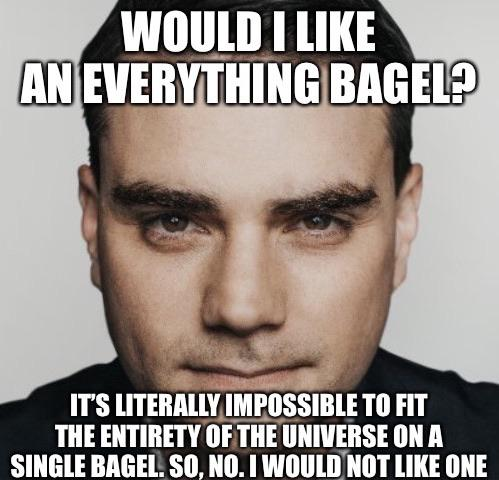

```{r setup, include=FALSE}
options(htmltools.dir.version = FALSE)
knitr::opts_chunk$set(
  fig.width=9, 
  fig.height=3.5, 
  fig.retina=3,
  out.width = "100%",
  cache = FALSE,
  echo = FALSE,
  message = FALSE, 
  warning = FALSE,
  hiline = TRUE
)
```


```{r packages}
library(tidyverse)
library(nycflights13)

# dubois colors
red = "#dc354a"
yellow = "ecb025"
blue = "#213772"


```


class: left, middle
background-image: url("images/dubois-spiral-2.png")
background-position: right
background-size: contain

# `r rmarkdown::metadata$title`

### *`r rmarkdown::metadata$subtitle`*

### Professor `r rmarkdown::metadata$author` 

#### University of California, Davis

---

class: center
.large[
# Today's agenda
]

--
.box-1.large.sp-after[Wrangling and pipes]

--
.box-2.large.sp-after[`filter()` and logical operators]

--
.box-3.large.sp-after[Objects]

---


class: center, middle
# The new starting point

--

Before, I  *wrangled* data and you plotted the finished product

--

First step of all your code was `ggplot()`


--

Now, **you** will wrangle the data 

--

First step is now *the data object*

---

class: center, middle
# What is data-wrangling?

--


>  ...the process of transforming and mapping data from one "raw" data form into another format with the intent of making it more appropriate and valuable for a variety of downstream purposes such as analytics... **Data analysts typically spend the majority of their time in the process of data wrangling compared to the actual analysis of the data.** -- Wikipedia


---


# Pipes: connecting data to functions


```{r, echo = TRUE, eval = FALSE}
# code from homework
movies `%>%`
  # exclude movies before 1980
  filter(year >= 1980) `%>%`
  # make decades variable
  mutate(decade = case_when(year >= 1980 & year < 1990 ~ "80s", 
                            year >= 1990 & year < 2000 ~ "90s", 
                            year >= 2000 & year < 2010 ~ "2000s", 
                            year >= 2010 ~ "2010s"))
```

You've seen these before...

---


# What are pipes? 


.pull-left[
- **Pipes** allow you to string together a series of function calls on an object

- They look like this in R: ` %>% `

- OSX: <kbd>Cmd</kbd> + <kbd>Shift</kbd> + <kbd>M</kbd> 
- Windows: <kbd>Ctrl</kbd> + <kbd>Shift</kbd> + <kbd>M</kbd> 
]

.pull-right[
```{r}
knitr::include_graphics("images/not-pipe.jpeg")
```
]

---

# Why pipes? 


--


With pipes: 😍

```{r, echo = TRUE, eval = FALSE}
penguins %>% 
  filter(species == "Adelie") %>% 
  mutate(body_mass_kg = body_mass_g / 1000) %>% 
  select(body_mass_kg)
```


--


Without pipes: 🤢

```{r, echo = TRUE, eval = FALSE}
select(mutate(filter(penguins, species == "Adelie"), body_mass_kg = body_mass_g / 1000), body_mass_kg)
```


---

# Making sense of pipes: "and then..."


```{r, echo = TRUE, eval = FALSE}
# code from homework
movies `%>%`
  # exclude movies before 1980
  filter(year >= 1980) `%>%`
  # make decades variable
  mutate(decade = case_when(year >= 1980 & year < 1990 ~ "80s", 
                            year >= 1990 & year < 2000 ~ "90s", 
                            year >= 2000 & year < 2010 ~ "2000s", 
                            year >= 2010 ~ "2010s"))
```

> Take the object `movies`, AND THEN `filter` such that year is greater than or equal to 1980, AND THEN `mutate` so that...


---


class: center
# Our first wrangling function: `filter()`

--

`filter()` **subsets** data objects based on **rules**


```{r, out.width="60%"}
knitr::include_graphics("images/filter.png")
```


--

```{r, eval = FALSE, echo = TRUE}
baby_subset <- babynames %>%
  filter(name == "Elizabeth")
```

Subset `babynames` to only babies named `Elizabeth`

---

class: center, middle
# Why filter? 

--

Lots of real-world **applications**: finding flights, addresses, IDs, etc.

--

Sometimes we want to focus on a specific **subset** of data: the South, Latin America, etc.

--

Deal with common problems: outliers, missing data, strange responses

---

# Using `filter()`


To use `filter()`, we need to tell R which **observations** we want to include (or exclude) using *rules*

--

```{r, eval = FALSE, echo = TRUE}
baby_subset <- babynames %>%
  filter(name == "Elizabeth")
```


Rule: return all observations from `babynames` where the `name` variable **is equal to** "Elizabeth"


---

# Making the rules: logical operators


.pull-left[
Rules filter data based on whether **variables** meet certain criteria

Rules rely on **logical operators**:

  - Equal to, not equal to, less than, more than, included in, etc.


]

.pull-right[
```{r, out.width="90%"}

```
]

---

# The logical operators


```{r,echo = FALSE}
tribble(~Operator, ~meaning, 
        "==", "equal to", 
        "!=", "not equal to", 
        ">", "greater than", 
        "<", "less than", 
        ">=", "greater than or equal to", 
        "<=", "less than or equal to", 
        "%in%", "is among the set", 
        "%", "AND (both conditions true)", 
        "|", "OR (either condition is true)") %>% 
  knitr::kable(align = "cc")
```

???
Why double equal sign?

---

# Using `filter()`

```{r}
apples = tribble(~name, ~color, ~pounds, ~sweet,
        "Fuji", "red", 2, TRUE,
        "Gala", "green", 4, TRUE,
        "Macintosh", "green", 8, FALSE,
        "Granny Smith", "red", 3, FALSE)


apples %>% knitr::kable()
```

---

# Green and unsweet apples

```{r,echo = TRUE}
apples %>% 
  filter(color == "green") #<<
```

Notice words are in quotations!

---

# Green and unsweet apples

```{r,echo = TRUE}
apples %>% 
  filter(color == "green") %>% 
  filter(sweet == FALSE) #<<
```

Notice TRUE/FALSE are all-caps!

--

Same as:


```{r,echo = TRUE, eval = FALSE}
apples %>% filter(color == "green", sweet == FALSE) #<<
```

---


# At least 4 pounds but less than 6

```{r,echo = TRUE}
apples %>% 
  filter(pounds >= 4, pounds < 6)
```


Notice that *at least* implies *greater than or equal to*


---

# Using `%in%`


Apples named either Fuji or Gala and weigh more than 2 pounds:

```{r,echo = TRUE}
apples %>% 
  filter(name %in% c("Fuji", "Gala")) %>% 
  filter(pounds > 2)
```

Notice how "lists" of things are wrapped in `c()`

---

# Combinations: the AND operator (&)


The `&` operator can be used to combine rules

Returns observations where *both* rules are true

--

```{r, echo = TRUE, eval = FALSE}
# apples that are red AND sweet
apples %>% 
  filter(color == "red" `&` sweet == TRUE)
```

--


Same as:


```{r, echo = TRUE, eval = FALSE}
# apples that are red AND sweet
apples %>% 
  filter(color == "red") %>% 
  filter(sweet == TRUE)
```


---

# Combinations: The OR (|) operator


"Observations where either *this* is true **OR** *that* is true"

```{r, echo = TRUE}
# apples that are red and sweet OR green and sour
apples %>% 
  filter(color == "red" & sweet == TRUE | 
           color == "green" & sweet == FALSE)
```


The <kbd>|</kbd>  should be above your Return/Enter key!

---

# 🚨 Your turn: find the flights 🚨

.scroll-output[
```{r}
flights %>% 
  select(month, day, origin, dest, carrier, dep_time, arr_time) %>% 
  sample_n(20) %>% 
  knitr::kable()
```
]

---


# 🚨 Your turn: find the flights 🚨

--

Using the `flights_small` object, find the following:


--

1. Flights in the winter that took off between 8:13am and 12:59pm

--

2. How many flights arrived late on Thanksgiving Day or Christmas Eve?

--

3. Spring break flights to Fort Lauderdale or Miami from JFK, in April

--


```{r}
countdown::countdown(minutes = 10L)
```

---

# The last step: creating objects

--


Step 1-2: the data, the pipe, the wrangling functions


```{r, echo = TRUE, eval = FALSE}
flights_small %>% 
  filter(dest == "FLL")
```

--

Step 3: store the subsetted data as a new **object** for later use

```{r, echo = TRUE, eval = FALSE}
miami_flights = flights_small %>% 
  filter(dest == "MIA")
```

---

# Objects

In programming, **objects** can be used to store all sorts of stuff for later use: data, functions, values. We create objects using `=`

Like this: 

```{r, echo = TRUE, eval = FALSE}
new_object = stuff %>% filter(year == 1999)
```


Or like this: 

```{r, echo = TRUE, eval = FALSE}
new_object = 
  stuff %>% filter(year == 1999)
```

---


# Naming objects

> There are only two hard things in Computer Science: cache invalidation and naming things.
-- Phil Karlton


Few rules: can't start with a number; use `_` to separate words

```{r, echo = TRUE, eval = FALSE}
# Good
day_one
day_1

# Bad
DayOne
dayone
1day
first_day_of_the_month
```

---

# The formula

--

- *Wrangle* the data until you're satisfied with the output: 

```{r, echo = TRUE, eval = FALSE}
apples %>% 
  filter(sweet == FALSE)
```


--


- Store the output as a new object: 

```{r, echo = TRUE, eval = FALSE}
sour_apples = apples %>% 
  filter(sweet == FALSE)
```


--

- Use the new object (e.g., plotting):

```{r, echo = TRUE, eval = FALSE}
ggplot(sour_apples, aes(x = name, y = pounds)) + geom_col()
```


---

# 🚨 Your turn: election analyst 🚨

Using the `elections` dataset:

.small[
1. Find the worst place I've lived: Trump won with more than 53% of the vote, median income is less than $45,000, either in the South or the Northeast, and the population is between 155k and 156k. What county is it?

2. Make a histogram of Democratic performance in the South in 2020, excluding Florida.

3. Identify the counties that both Obama and Hillary won in 2012 and 2016 (respectively), but Trump won in 2020. Make a plot of your choosing about these counties.

4. Identify the counties where Trump outperformed Romney by 15 points. Make a (nice) barplot of these counties and their vote shares. 
]

```{r}
countdown::countdown(minutes = 10L)
```

---


