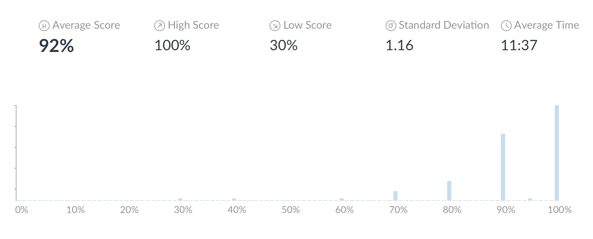

```{r setup, include=FALSE}
options(htmltools.dir.version = FALSE)
knitr::opts_chunk$set(
  fig.width=9, 
  fig.height=3.5, 
  fig.retina=3,
  out.width = "100%",
  cache = FALSE,
  echo = FALSE,
  message = FALSE, 
  warning = FALSE,
  hiline = TRUE
)
```


```{r packages}
library(tidyverse)
library(socviz)
library(juanr) 
library(ggbeeswarm)

# dubois colors
red = "#dc354a"
yellow = "#ecb025"
blue = "#213772"

# theme
theme_nice = function() {
  theme_minimal(base_family = "Fira Sans Condensed", base_size = 14) +
    theme(panel.grid.minor = element_blank(),
          plot.background = element_rect(fill = "white", color = NA),
          plot.title = element_text(face = "bold"),
          axis.title = element_text(face = "bold"),
          strip.text = element_text(face = "bold"),
          strip.background = element_rect(fill = "grey80", color = NA),
          legend.title = element_text(face = "bold"), 
          plot.subtitle = element_text(hjust = .5, face = "italic"))
}
theme_set(theme_nice())

```


class: left, middle
background-image: url("images/dubois-spiral-2.png")
background-position: right
background-size: contain

# `r rmarkdown::metadata$title`

### *`r rmarkdown::metadata$subtitle`*

### Professor `r rmarkdown::metadata$author` 

#### University of California, Davis

---

class: center
.large[
# Today's agenda
]

--
.box-1.large.sp-after[Making amends]

--
.box-2.large.sp-after[Mutating new variables]

--
.box-3.large.sp-after[Creating categories]

---

class: center, middle
# Weekly check-in

So far, you: 

--

somehow do not know how to make every graph from scratch based solely off memory

--

are confused about errors you are seeing for the first time in a computer program you've never used before

--

are unable to re-type all the code I am presenting on slides into your notes at what would be a rate on par with a professional court stenographer


---

exclude: true
# And yet...


```{r}

```


---

class: center, middle
# Weekly check-in


You are *confused* and *unsure* of yourselves

--

But you are doing **well**

--

You've only been coding for two weeks

--

You just need to know how to piece together answers from notes + slides

--

You will **slowly** get better at coding, and dealing with errors (be patient!)


---

class: middle
background-image: url("images/buddha.jpeg")
background-position: center
background-size: cover
# Please calm down

---


# The logical operators


```{r,echo = FALSE}
tribble(~Operator, ~meaning,
        "==", "equal to",
        "!=", "not equal to",
        ">", "greater than",
        "<", "less than",
        ">=", "greater than or equal to",
        "<=", "less than or equal to",
        "&", "AND (both conditions true)",
        "|", "OR (either condition is true)") %>%
  knitr::kable(align = "cc")
```


---

class: center, middle
# Filter review

> Which counties in California did Romney beat Obama *by more than 20 percentage points*? Make a plot of your choosing about these counties.


---

# Breaking it down: the puzzle

> Which counties in California did Romney beat Obama *by more than 20 percentage points*? Make a plot of your choosing about these counties.

Can be overwhelming at first but think about it in "chunks": 

--

1. Counties in California...

--

2. ...Romney beat Obama

--

3. ...By more than 20 points


---


# Breaking it down: the data


```{r, echo = TRUE}
elections
```

---

# Breaking it down: counties in California


```{r, echo = TRUE}
elections %>%
  filter(state == "CA") #<<
```

---

# Breaking it down: where Romney beat Obama

```{r, echo = TRUE}
elections %>%
  filter(state == "CA") %>%
  filter(per_gop_2012 > per_dem_2012) #<<
```

---

# Breaking it down: by more than 20 points...


Tricky!

```{r, echo = TRUE}
elections %>%
  filter(state == "CA") %>%
  filter(per_gop_2012 - per_dem_2012 > .2) #<<
```

---

# Breaking it down: store as an object

```{r, echo = TRUE}
romney_ca = elections %>% #<<
  filter(state == "CA") %>%
  filter(per_gop_2012 - per_dem_2012 > .2)
```


--

Storing objects is very important! The original `elections` dataset remains unchanged!


```{r, echo = TRUE}
elections
```


---


# Breaking it down: make the plot


Notice!! The data object I want is not `elections` anymore


```{r, echo = TRUE, out.width="70%"}
ggplot(romney_ca, aes(x = name, y = per_gop_2012)) +
  geom_col(fill = "orange") + coord_flip() +
  labs(y = "2012 GOP vote share (%)", x = "County")
```


---


# The formula

--

- *Wrangle* the data until you're satisfied with the output:

```{r, echo = TRUE, eval = FALSE}
apples %>%
  filter(sweet == FALSE) %>% filter(pounds < 2)
```


--


- Store the output as a new object:

```{r, echo = TRUE, eval = FALSE}
sour_apples = apples %>% #<<
  filter(sweet == FALSE) %>% filter(pounds < 2)
```


--

- Use the new object (e.g., plotting):

```{r, echo = TRUE, eval = FALSE}
ggplot(sour_apples, aes(x = name, y = pounds)) + geom_col()
```


---


class: center, middle
# Making new variables with `mutate()`


`mutate()` **adds** new variables to data


```{r, out.width="60%"}
knitr::include_graphics("images/mutate.png")
```

---

# Using mutate


Say I want a new variable that gives me the apple weight in **ounces**

This is called changing a variable's **scale**


```{r}
apples = tribble(~name, ~color, ~pounds, ~sweet,
        "Fuji", "red", 2, TRUE,
        "Gala", "green", 4, TRUE,
        "Macintosh", "green", 8, FALSE,
        "Granny Smith", "red", 3, FALSE)


apples %>% knitr::kable()
```

???
How to convert pounds to ounces
---

# Create an "ounces" variable

```{r,echo = TRUE}
apples %>%
  mutate() #<<
```


---

# Create an "ounces" variable

--

The new variable, ounces, is going to equal *pounds* multiplied by 16 (16 oz in a pound)


--


```{r,echo = TRUE, eval = TRUE}
apples %>%
  mutate(ounces = pounds * 16) #<<
```


---

# New variable -> new object

--

If I want to use this new variable later, I **have** to make a new object


--


```{r,echo = TRUE, eval = TRUE}
apples_oz = apples %>% #<<
  mutate(ounces = pounds * 16)
```


.pull-left[
```{r}
knitr::kable(apples_oz, caption = "apples_oz")
```
]

.pull-right[
```{r}
knitr::kable(apples, caption = "apples")
```
]

---


# normalizing variables


Say that in 2020 California had 300 murders and Wyoming had 100 murders. Is California **three times** as violent as Wyoming?


```{r}
ca = tibble(people = rnorm(n = 3000, mean = 200, sd = 20),
       state = "CA\n(300 deaths)") %>% 
  mutate(murders = ifelse(rbinom(n = n(), size = 1, prob = .1) == 1, "yes", "no"))

wy = tibble(people = rnorm(n = 200, mean = 200, sd = 20),
       state = "WY\n(100 deaths)") %>% 
  mutate(murders = ifelse(rbinom(n = n(), size = 1, prob = .5) == 1, "yes", "no"))

bind_rows(ca, wy) %>% 
  filter(murders == "yes") %>% 
  ggplot(aes(x = state, y = people)) + 
  geom_quasirandom() + 
  labs(x = NULL, y = NULL, title = "Deaths in CA and WY")
```


---

# Normalizing variables


Not *necessarily*! These states have very different underlying populations; if we consider this a different picture emerges


```{r}
bind_rows(ca, wy) %>% 
  ggplot(aes(x = state, y = people, color = murders)) + 
  geom_quasirandom() + 
  labs(x = NULL, y = NULL, title = "Deaths in CA and WY", 
       color = "Resident was:") + 
  scale_color_manual(values = c(red, blue), 
                     labels = c("Not murdered", "Murdered")) + 
  theme(legend.position = "top")
```


---

# Normalizing variables


To truly compare CA and WY we need to **take into account** the population of each

--

We want to know how many murders have taken place (or drug overdoses, or crimes, or COVID cases, or...) per person in the state (**per capita**)

--

This is called **normalizing** a variable; *changing* it so that we can make units more *comparable*

--

In math terms this is just dividing murders by population: 

$Murders_{per capita} = \frac{Murders}{Population}$ = "how many murders per person"


---


# Math on computers


```{r}
tribble(~Math, ~Keyboard, 
        "Add", "`+`",
        "Subtract", "`-`",
        "Multiply", "`*`",
        "Divide", "`/`") %>% 
  knitr::kable()
```

---


# 🚨 Your turn 🌡️ Climate change 🌡️ 🚨


```{r}
climate %>% 
  head() %>% 
  knitr::kable(caption = "Sample from climate dataset")
```

---


# 🚨 Your turn 🌡️ Climate change 🌡️ 🚨


Using `climate`, make the following two plots looking only at Germany, USA, China, India:


1. A grouped time-series of co2 emissions over time (separate country by color)


2. A grouped time-series of co2 emissions **per capita** over time (separate country by color)


Who's to "blame" for climate change? And where should we focus environmental efforts?


```{r}
countdown::countdown(minutes = 10L)
```

---


class: center, middle, inverse
# Creating categories
---


# Creating categories with `case_when()`

--

Sometimes we want to create **categorical variables** (tall, short, poor, rich, Republican-leaning, Democrat-leaning, etc.)

--

We can use `case_when()`, a special function that goes **within** `mutate()`

--

Like `filter()`, `case_when()` also relies on logical operators

---

# Who won the county? And by how much?

```{r}
elections %>%
  select(name, state, per_gop_2020, per_dem_2020) %>%
  head() %>% knitr::kable(caption = "sample from elections dataset")
```

---


# Who won the county? And by how much?

Let's say we want to break down county results into four categories:

--

- places where R's won **big** (let's say big = more than 10 points)
- places where R's won *small* (from winning at all up to 10 points)
- places where R's lost *small* (from winning at all up to 10 points)
- places where R's lost **big** (let's say big = more than 10 points)

???
How to measure *size of win* based on vote shares?

---


# Winning categories

First we figure out *by how much* Republicans won (or lost) to Democrats in a county (this is called the **margin of victory**):

--

```{r, echo = TRUE, eval = TRUE}
elections_margin = elections %>%
  mutate(reps_margin = per_gop_2020 - per_dem_2020) #<<
```


```{r, echo = FALSE, eval = TRUE}
elections %>%
  select(state, name, per_gop_2020, per_dem_2020) %>%
  mutate(reps_margin = per_gop_2020 - per_dem_2020)
```


---


# Winning categories

We can use `case_when()` to build categories out of the margin variable


`case_when()` uses the following formula: `LOGICAL CONDITION ~ "category name"`

--

Like so:


```{r, echo = TRUE}
elec_win_cat = elections_margin %>%
  mutate(win_type = case_when(reps_margin >= .10 ~ "Big R win"))
```

```{r, echo = FALSE, eval = TRUE}
elec_win_cat %>%
  select(name, state, reps_margin, win_type)
```

---


# Winning categories

The rest of the categories:

```{r, echo = TRUE}
elec_win_cat = elections_margin %>%
  mutate(win_type = case_when(reps_margin >= .10 ~ "Big R win", 
                              reps_margin > 0 & reps_margin < .1 ~ "Small R win", 
                              reps_margin < 0 & reps_margin > -.10 ~ "Small R loss", 
                              reps_margin <= -.10 ~ "Big R loss")) 
```

```{r, echo = FALSE, eval = TRUE}
elec_win_cat %>%
  select(name, state, reps_margin, win_type)
```

---


# Make a plot

```{r, echo = TRUE}
ggplot(elec_win_cat, aes(x = per_gop_2020, fill = win_type)) +
  geom_histogram() + theme_light()
```

---


# 🚨 Your turn 🚨

Using the `elections` dataset:


1. Create a variable that tells you what happened in the 2016 election in each county. The variable should incorporate four possibilities: 

    1) the county was blue in 2012 and stayed blue in 2016;
    
    2) the county was red... and stayed red; 
    
    3) the county flipped from blue to red; 
    
    4) the county flipped from red to blue
    
2. Make a boxplot (or ridgeplot!) that compares household income (y-axis) across this variable (x-axis)
    