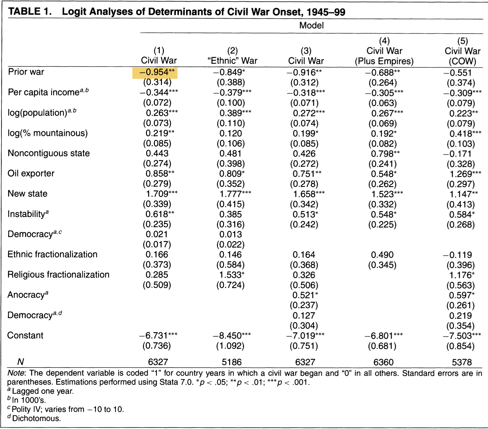

```{r setup, include=FALSE}
options(htmltools.dir.version = FALSE)
knitr::opts_chunk$set(
  fig.width=9, 
  fig.height=3.5, 
  fig.retina=3,
  out.width = "100%",
  cache = FALSE,
  echo = FALSE,
  message = FALSE, 
  warning = FALSE,
  hiline = TRUE
)
```


```{r packages}
library(tidyverse)
library(socviz)
library(fivethirtyeight)
library(patchwork)
library(gapminder)
library(broom)
library(equatiomatic)
library(juanr)
library(kableExtra) 


# dubois colors
red = "#dc354a"
yellow = "#ecb025"
blue = "#213772"


# theme
theme_nice = function() {
  theme_minimal(base_family = "Fira Sans Condensed", base_size = 14) +
    theme(panel.grid.minor = element_blank(),
          plot.background = element_rect(fill = "white", color = NA),
          plot.title = element_text(face = "bold"),
          axis.title = element_text(face = "bold"),
          strip.text = element_text(face = "bold"),
          strip.background = element_rect(fill = "grey80", color = NA),
          legend.title = element_text(face = "bold"), 
          plot.subtitle = element_text(hjust = .5, face = "italic"))
}
theme_set(theme_nice())


# set seed
set.seed(1990)

```


class: left, middle
background-image: url("images/dubois-spiral-2.png")
background-position: right
background-size: contain

# `r rmarkdown::metadata$title`

### *`r rmarkdown::metadata$subtitle`*

### Professor `r rmarkdown::metadata$author` 

#### University of California, Davis

---


class: center
.large[
# Today's agenda
]

--
.box-1.large.sp-after[Modeling with `lm`]

--
.box-2.large.sp-after[Modeling with numbers]

--
.box-3.large.sp-after[Modeling with categories]

---


# The big picture: modeling

.pull-left[
What we want out of our model:

Does TV news make people more energized to vote? Or does it turn them off from politics? 

**How much** does an additional hour of TV increase (or decrease) the likelihood that someone votes? 

**What level** of Y (voter turnout) should we expect for a given level of X (exposure to the news)? 

]

.pull-right[
```{r,out.width="70%"}
knitr::include_graphics("images/big-picture.jpeg")
```

]


---


class: center, middle, inverse
# Modeling with lm
---


# How does car weight impact fuel efficiency?

Remember, we want the underlying model from this line

$mpg = \beta_0 + \beta1 \times weight$


```{r, out.width="80%"}
ggplot(mtcars, aes(x = wt, y = mpg)) + 
  geom_point(color = blue, alpha = .8) + 
  theme_nice() + labs(x = "Weight (1000 lbs)", 
                     y = "Miles/gallon (mpg)") + 
  geom_smooth(method = "lm", fullrange = TRUE)
```

---


# Modeling in R

--

We can use the `lm()` function to create models in R, using this formula:

> lm(.red[Outcome] ~ .blue[Treatment_1 + Treatment_2 + ...], data = DATA)


--

```{r,echo = TRUE}
weight_model = lm(mpg ~ wt, data = mtcars) #<<
```

Notice! Saved as a model object

---


# Extract the model

We can extract the model equation with `tidy()`, from the `broom` package

```{r,echo = TRUE}
tidy(weight_model)
```

---

# Making sense of the table


$mpg = \beta_0 + \beta_1 \times weight$

```{r,echo = TRUE}
tidy(weight_model)
```

--

The `estimate` column gives us $\beta_0$ (intercept) and $\beta_1$ (slope for weight)

--

Note! We only care about the first two columns of `tidy()` so far

---


# Extract the model


$mpg = \beta_0 + \beta_1 \times weight$


```{r}
tidy(weight_model) %>%
  kableExtra::kbl(digits = 2) %>% 
  column_spec(2, background = "yellow")
```

--

The intercept ( $\beta_0$ ) = 37.29

--

The slope ( $\beta_1$ ) = -5.3

--

The model: $mpg = 37.29 + -5.3 \times weight$

---

class: center, middle, inverse
# Modeling with numbers
---


# Back to the cars

The model: $mpg = 37.29 + -5.3 \times weight$

How do we interpret the slope on *weight*? 

```{r, out.width="80%"}
ggplot(mtcars, aes(x = wt, y = mpg)) + 
  geom_point(color = blue, alpha = .8) + 
  theme_nice() + labs(x = "Weight (1000 lbs)", 
                     y = "Miles/gallon (mpg)") + 
  geom_smooth(method = "lm", fullrange = TRUE)
```


---


# Interpretation: continuous variables


.pull-left[
As you turn the dimmer (*treatment variable*) the light (*outcome variable*) changes

Turn the dimmer up, the light increases by SLOPE amount

Turn the dimmer down, the light decreases by SLOPE amount

The change is **gradual**
]

.pull-right[
```{r}

```
]

---

# Interpretation: the slope

$mpg = 37.2 + \color{red}{-5.3} \times weight$


```{r}
tidy(weight_model) %>%
  knitr::kable(digits = 2)
```


--

**General**: for every *unit increase* in X (weight), Y (mpg) changes by $\color{red}{5.3}$ *units*

--

**Specific**: for every *ton of weight* you add to a car, you lose $\color{red}{5.3}$ *miles per gallon* of fuel efficiency


---


# Interpretation: the intercept


$mpg = \color{red}{37.2} + -5.3 \times weight$

--

Remember that the Y-intercept is the *value of Y when X = 0*


$$
\begin{aligned}
Y = 6 + 2x \\
X = 0 \\
Y = 6 + 2 \times 0 \\
Y = 6
\end{aligned}
$$
---


# Interpretation: the intercept


Take the formula: $mpg = \color{red}{37.2} + -5.3 \times weight$

--

Set X (weight) equal to 0 $\rightarrow$ $\color{red}{37.2} + (-5.3 \times 0) = \color{red}{37.2}$

--


**General**: The estimated value of Y (mpg), when X (weight) equals zero, is $\color{red}{37.2}$ units

--

**Specific**: The estimated fuel efficiency for a car that weighs *0 tons* is $\color{red}{37.2}$ miles per gallon

---


# Spot the intercept

$mpg = 37.29 + -5.3 \times weight$

```{r, out.width="80%"}
ggplot(mtcars, aes(x = wt, y = mpg)) +
  coord_cartesian(xlim = c(0, 7), ylim = c(0, 40)) +
  geom_point(color = blue, alpha = .8) +
  theme_nice() + labs(x = "Weight (1000 lbs)",
                     y = "Miles/gallon (mpg)") +
  geom_smooth(method = "lm", fullrange = TRUE) +
  geom_abline(data = NULL, intercept = coef(weight_model)[1],
              slope = coef(weight_model)[2], lty = 2, color = "black")
```

We can confirm we're not crazy if we zoom out; the line crosses y-axis at 37.2

---


# Nonsense intercepts


$mpg = 37.2 + -5.3 \times weight$


Interpretation of the intercept:

> The average fuel efficiency for a car that weighs nothing is 37.2 miles per gallon

--

Note that this is **nonsense**: a car cannot weigh zero tons

--

You will run into this often: don't let it confuse you!

--

the intercept will rarely be useful on its own; But we **need** it to draw the line!


---


# Another example: gapminder


Say we want to estimate the relationship between **GDP per capita** and **life expectancy**


```{r}
ggplot(gapminder, aes(x = gdpPercap, y = lifeExp)) +
  geom_point(color = red, alpha = .8)
```

---


# The model

We fit the model using `lm()`

```{r,echo = TRUE}
wealth_mod = lm(lifeExp ~ gdpPercap, data = gapminder)
```

--


We extract the coefficient estimates using `tidy()`

```{r, echo = TRUE}
tidy(wealth_mod)
```


---

# Interpreting the model

$LifeExp = \beta_0 + \beta1 \times gdpPercap$

```{r}
tidy(wealth_mod)
```

--

$\beta_1$, the slope = for every additional dollar of GDP, a country's life expectancy rises by .0007 years

--

$\beta_0$, the intercept = the average life expectancy for a country with no economic activity (GDP = 0) is 54 years

---


# The scale of the coefficients


$LifeExp = 54 + .0007 \times gdpPercap$


Slope: for every **dollar** increase in GDP, life expectancy increases by 0.0007 years

--

Tiny! Does this mean a country's wealth has little to do with their health?

--

No! It is a problem with the **scale** that GDP is in

--

one dollar differences in GDP are tiny, meaningless; GDP changes by much more from year to year


---

# Variable scales


We can rescale GDP so that it's in 10s of thousands of dollars:

```{r,echo = TRUE}
gapminder = gapminder %>%
  mutate(gdp_10k = gdpPercap/10000)
```

---


# Variable scales

Note the variable is the same; only thing that has changed is the scale!

```{r}
gapminder %>%
  select(`GDP (in dollars)` = gdpPercap, 
         `GDP (in tens of thousands of dollars)` = gdp_10k) %>%
  pivot_longer(everything()) %>%
  ggplot(aes(x = value)) +
  geom_histogram(fill = red, alpha = .8, color = "white", bins = 30) +
  facet_wrap(vars(name), scales = "free") +
  theme_nice() + scale_x_continuous(labels = scales::dollar)
```

---


# Re-fit the model


```{r,echo = TRUE}
wealth_mod_10k = lm(lifeExp ~ gdp_10k, data = gapminder)
tidy(wealth_mod_10k)
```

--

for every additional $10,000 of GDP, a country gains about 7.65 years

--

Mind your *scales*: if a coefficient is tiny, ask yourself if the scale makes sense


---

# 🚨 🚢 Why do some countries export more than others? 🚢 🚨

--

1. For a year of your choosing, make a scatterplot of imports (x-axis) and exports (y-axis) with a trend-line. Add labels so you can see which countries are the outliers. 

--

2. Estimate a model that models how much a country exports, using a treatment variable of your choosing. Interpret the model output. 


```{r}
countdown::countdown(minutes = 10L)
```


---


class: center, middle, inverse
# Regression with categorical variables
---


# Categorical variables


We can also use categorical variables in our models

--

The simplest categorical variable is a *binary variable*: Men vs. women, young vs. old, has a policy in place (vs. not), TRUE/FALSE

--

Dummy variables (1/0) are a common type of binary variable

--

Let's say I wanted to look at the relationship between a country's .blue[organ donation policy] and its .red[organ donation rate]


---


# Binary variables in models


I can include the binary variable in a regression model:

```{r, echo = TRUE}
donor_mod = lm(donors ~ opt, data = organdata)
```

--

And look at the output:

```{r}
tidy(donor_mod)
```


But how do we interpret the "slope" of a binary variable?


---


# Binary variables


Remember, with categorical variables we are **comparing groups**

```{r}
ggplot(drop_na(organdata, opt), aes(x = opt, y = donors, 
                                    color = opt)) + 
  ggbeeswarm::geom_beeswarm(alpha = .8) + 
  scale_color_manual(values = c(blue, red)) + 
  theme(legend.position = "none") + 
  labs(x = "Organ donation: opt in or out?", 
       y = "Average donation rate\n(donors per million residents)")
```

---

# Binary variables: line of best fit


For these variables, each group has "its own" line of best fit

```{r}
lines = organdata %>% 
  drop_na(opt) %>% 
  group_by(opt) %>% 
  summarise(mean = mean(donors, na.rm = TRUE))

ggplot(drop_na(organdata, opt), aes(x = opt, y = donors, 
                                    color = opt)) + 
  ggbeeswarm::geom_beeswarm(alpha = .8) + 
  scale_color_manual(values = c(blue, red)) + 
  theme(legend.position = "none") + 
  labs(x = "Organ donation: opt in or out?", 
       y = "Average donation rate\n(donors per million residents)") + 
  geom_segment(data = lines, aes(x = c(.75, 2.25), y = mean,
                                 xend = c(1.25, 1.75), 
                                 yend = mean, color = opt), 
               size = 2)
```

---


# Binary variables: the slope


What we want to know is how much higher or lower one group is, on average, than the other; this is the difference between the .red[red line] and the .blue[blue line]

```{r, out.width="80%"}
ggplot(drop_na(organdata, opt), aes(x = opt, y = donors, 
                                    color = opt)) + 
  ggbeeswarm::geom_beeswarm(alpha = .8) + 
  geom_segment(data = lines, aes(x = c(.75, 2.25), y = mean,
                                 xend = c(1.25, 1.75), 
                                 yend = mean, color = opt), 
               size = 2) + 
  scale_color_manual(values = c(blue, red)) + 
  theme(legend.position = "none") + 
  labs(x = "Organ donation: opt in or out?", 
       y = "Average donation rate\n(donors per million residents)") + 
  annotate(geom = "rect", xmin = 1.25, xmax = 1.75, 
           ymin = lines$mean[lines$opt == "In"], 
           ymax = lines$mean[lines$opt == "Out"], 
           fill = yellow, alpha = .8)
```

--

In this case it is `r round(lines$mean[2] - lines$mean[1], 2)` $\rightarrow$ how many more organ donors countries with an "opt out" policy have, on average, than countries with an "opt in" policy


---


# Back to the regression output

Note that this is exactly what the model output is giving us:

```{r}
tidy(donor_mod)
```

--

The model is picking one of the categories ("Opt in") and treating it as a **baseline category**

--

It then tells us how much **higher**/**lower** on average, the other category is ("Opt out")


---

exclude: true
# Back to the plot


```{r}
organdata %>% 
  drop_na(opt) %>% 
  mutate(donors = donors - lines$mean[lines$opt == "In"]) %>% 
  ggplot(aes(x = opt, y = donors, 
                                    color = opt)) + 
  ggbeeswarm::geom_beeswarm(alpha = .8) + 
  geom_segment(data = lines, aes(x = c(.75, 2.25), 
                                 y = mean - lines$mean[lines$opt == "In"],
                                 xend = c(1.25, 1.75), 
                                 yend = mean - lines$mean[lines$opt == "In"], color = opt), 
               size = 2) + 
  scale_color_manual(values = c(blue, red)) + 
  theme(legend.position = "none") + 
  scale_x_discrete(labels = c("In\n(BASELINE)", "Out")) + 
  labs(x = "Organ donation: opt in or out?", 
       y = "Average donation rate\n(donors per million residents)") + 
  annotate(geom = "rect", xmin = 1.25, xmax = 1.75, 
           ymin = lines$mean[lines$opt == "In"] - lines$mean[lines$opt == "In"], 
           ymax = lines$mean[lines$opt == "Out"] - lines$mean[lines$opt == "In"], 
           fill = yellow, alpha = .8)
```


---

# How to interpret categorical variables?


.pull-left[

Turn the light on (`opt` goes from "In" to "Out"), the light *increases* by SLOPE

Turn the light off (`opt` goes from "Out" to "In"), the light *decreases* by SLOPE

The change is **instant**
]

.pull-right[
```{r}

```
]

---


# Interpreting categories

.small[
$\operatorname{\widehat{donors}} = \color{red}{14.31} + \color{blue}{5.5}(\operatorname{opt}_{\operatorname{Out}})$
]

```{r}
tidy(donor_mod)
```

.small[
Slope: Country-years where people have to OPT OUT of donating their organs have, on average, .blue[5.5] more donations per million residents than country-years where people have to OPT IN

]

--

.small[
Intercept (set `optOut` = 0 or "off", i.e., countries where `opt == "in"`): Country-years where people have to OPT IN to organ donation have, on average, .red[14.31] donations per million residents
]


---


# More complicated categorical variables


Most of the variables we care about are not just binary

--

They take on many values

--

E.g., education levels, sex, race, religion, etc.

--

What happens when we include one of these in a model? 

--

Say we wanted to look at how .blue[life expectancy] varies across .red[continents]

---

# The model

We can estimate the model, same as before:

```{r, echo = TRUE}
continent_mod = lm(lifeExp ~ continent, data = gapminder)
tidy(continent_mod)
```


Now we get more coefficients! What do they mean?


---


# The plot


With complex categorical variables, we are also comparing across groups

```{r, out.width="80%"}
lines = 
  gapminder %>% 
  group_by(continent) %>% 
  summarise(lifeExp = mean(lifeExp, na.rm = TRUE))

ggplot(gapminder, aes(x = continent, y = lifeExp, color = continent)) + 
  ggbeeswarm::geom_quasirandom() + 
  geom_segment(data = lines, aes(x = c(.5, 1.5, 2.5, 3.5, 4.5), 
                                 y = lifeExp,
                                 xend = c(1.5, 2.5, 3.5, 4.5, 5.5), 
                                 yend = lifeExp), 
               size = 2, color = "black") + 
  theme(legend.position = "none") + 
  labs(x = "Continent", y = "Life expectancy (in years)")
```

What is the "slope"? We have multiple groups, what are we comparing each group to?

---


# Multiple categories


Just like before, R will pick one of the groups to treat as the "**baseline**"

--

It will then tell us how much higher/lower the other categories are, on average, .shout[relative to that baseline]

--

```{r}
tidy(continent_mod)
```

What group is the baseline here?

---


exclude: true
# Multiple categories


R treats Africa as the baseline and tells us how much higher (or lower) life expectancy is in the other continents, on average

```{r}
lines = 
  gapminder %>% 
  group_by(continent) %>% 
  summarise(lifeExp = mean(lifeExp, na.rm = TRUE))

gapminder %>% 
  mutate(lifeExp = lifeExp - lines$lifeExp[lines$continent == "Africa"]) %>% 
  ggplot(aes(x = continent, y = lifeExp, color = continent)) + 
  ggbeeswarm::geom_quasirandom() + 
  stat_summary(fun.data = "mean_cl_boot", color = "black", size = 1.2) + 
  theme(legend.position = "none") + 
  labs(x = "Continent", y = "Life expectancy (in years)") + 
  geom_hline(yintercept = 0, lty = 2, size = 1.2)
```


---


# Interpretation

```{r}
tidy(continent_mod)
```

.small[

* `continentAmericas` = countries in the Americas have, on average, 15.8 years more life expectancy than countries in *Africa* (the baseline)

* `continentAsia` = countries in Asia have, on average, 11.2 years more life expectancy than countries in *Africa*

* `Intercept` = (set Americas = 0, Asia = 0, Europe = 0, Oceania = 0) $\rightarrow$ the average life expectancy in **Africa** is 48.9 years

]


---

# Interpretation formula


```{r}
tribble(~Type, ~Approach, ~Intercept,
        "Continuous", "A one unit increase in X, SLOPE unit change in Y", "Average value of Y when X = 0",
        "Category", "The category is SLOPE units higher/lower than the intercept", "Average value of Y for baseline (missing) category") %>% 
  knitr::kable()
```


Interpreting coefficients is pretty confusing; it just requires practice


---


# We're on our way


We now know (sorta) how to interpret the coefficients on those big tables in the political science papers:

--

```{r}

```

???
Imagine that `prior war` is a binary variable for whether the country had a war in the previous year (or not); how to interpret?

---


# 🚨 Your turn: 👨‍👧‍👦 Kids 👨‍👧‍👦 🚨


Using the `gss_sm` dataset:

--

1. Do happier people tend to have more or fewer kids than less happy people? Regress `childs` (outcome) against `happy` (treatment). Interpret the output.

--

2. How does religious belief affect the decision to have bigger or smaller families? Regress the number of siblings `sibs` (outcome) against respondent religion `relig`. Based on the output: which religion has the largest families, on average?

--

.small[
Hint: to figure out what values a categorical variable takes on, use the `distinct()` function, like so: `data %>% distinct(variable)`
]


```{r}
countdown::countdown(minutes = 10L)
```


