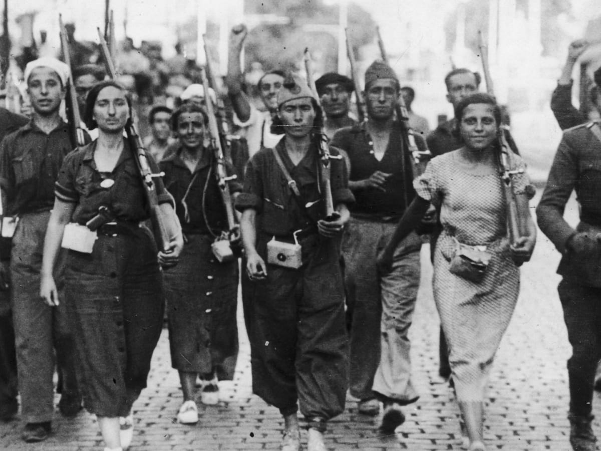

```{r setup, include=FALSE}
options(htmltools.dir.version = FALSE)
knitr::opts_chunk$set(
  fig.width=9, 
  fig.height=3.5, 
  fig.retina=3,
  out.width = "100%",
  cache = FALSE,
  echo = FALSE,
  message = FALSE, 
  warning = FALSE,
  hiline = TRUE
)
```


```{r packages}
library(tidyverse)
library(socviz)
library(broom)
library(equatiomatic)
library(gapminder)
library(juanr)

# dubois colors
red = "#dc354a"
yellow = "#ecb025"
blue = "#213772"

theme_nice = function() {
  theme_minimal(base_family = "Fira Sans Condensed") +
    theme(panel.grid.minor = element_blank(),
          plot.background = element_rect(fill = "white", color = NA),
          plot.title = element_text(face = "bold"),
          axis.title = element_text(face = "bold"),
          strip.text = element_text(face = "bold"),
          strip.background = element_rect(fill = "grey80", color = NA),
          legend.title = element_text(face = "bold"), 
          plot.subtitle = element_text(hjust = .5, face = "italic"))
}

theme_set(theme_nice())


# set seed
set.seed(1990)

```


class: left, middle
background-image: url("images/dubois-spiral-2.png")
background-position: right
background-size: contain

# `r rmarkdown::metadata$title`

### *`r rmarkdown::metadata$subtitle`*

### Professor `r rmarkdown::metadata$author` 

#### University of California, Davis

---


class: center
.large[
# Today's agenda
]

--
.box-1.large.sp-after[What if the outcome is binary?]

--
.box-2.large.sp-after[Predicting whether something happens <br>(or not)]

--
.box-3.large.sp-after[Classification]

---


## So far


We know how to model and predict when the outcome is **continuous**


```{r, echo = TRUE, eval = FALSE}
health_mod = lm(lifeExp ~ gdpPercap + pop + continent, data = gapminder) # fit model
tidy(health_mod) # interpret results
```


But what if the outcome is **binary**?


---


```{r}

```

---

class: center, middle, inverse
# ⚠️ WARNING ⚠️

## We should mostly not use `lm()` when the outcome is binary

## We should instead use another type of model (a *logit* model)

## But we will illegally use `lm()` to build **intuition**

---
