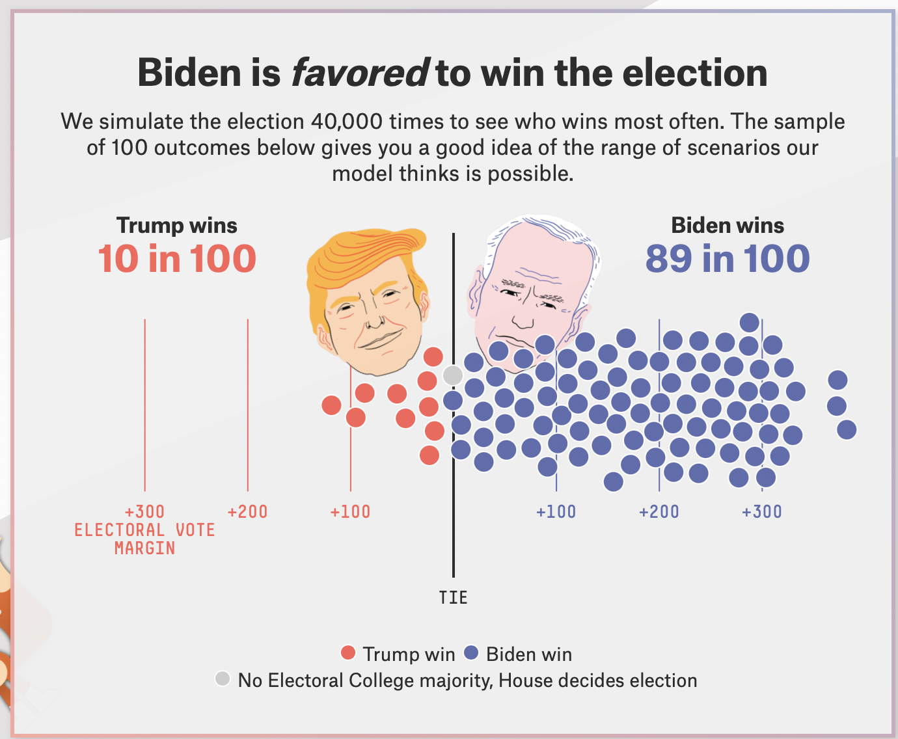
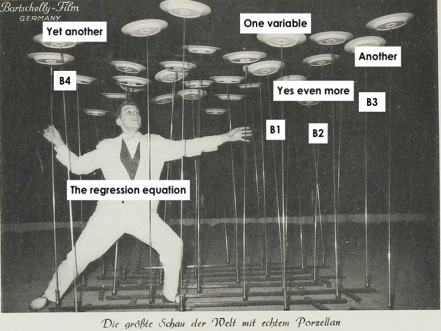
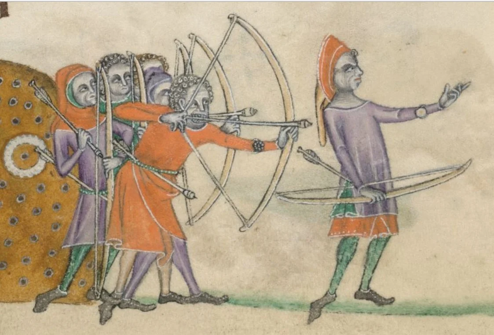
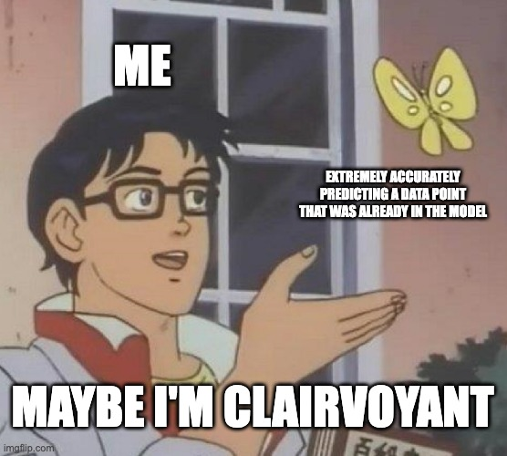

```{r setup, include=FALSE}
options(htmltools.dir.version = FALSE)
knitr::opts_chunk$set(
  fig.width=9, 
  fig.height=3.5, 
  fig.retina=3,
  out.width = "100%",
  cache = FALSE,
  echo = FALSE,
  message = FALSE, 
  warning = FALSE,
  hiline = TRUE
)
```


```{r packages}
library(tidyverse)
library(socviz)
library(fivethirtyeight)
library(patchwork)
library(gapminder)
library(broom)
library(equatiomatic)
library(juanr) 

# dubois colors
red = "#dc354a"
yellow = "#ecb025"
blue = "#213772"


# theme
theme_nice = function() {
  theme_minimal(base_family = "Fira Sans Condensed", base_size = 14) +
    theme(panel.grid.minor = element_blank(),
          plot.background = element_rect(fill = "white", color = NA),
          plot.title = element_text(face = "bold"),
          axis.title = element_text(face = "bold"),
          strip.text = element_text(face = "bold"),
          strip.background = element_rect(fill = "grey80", color = NA),
          legend.title = element_text(face = "bold"), 
          plot.subtitle = element_text(hjust = .5, face = "italic"))
}
theme_set(theme_nice())

# set seed
set.seed(1990)

```


class: left, middle
background-image: url("images/dubois-spiral-2.png")
background-position: right
background-size: contain

# `r rmarkdown::metadata$title`

### *`r rmarkdown::metadata$subtitle`*

### Professor `r rmarkdown::metadata$author` 

#### University of California, Davis

---


class: center
.large[
# Today's agenda
]

--
.box-1.large.sp-after[Review of modeling]

--
.box-2.large.sp-after[Making predictions]

--
.box-3.large.sp-after[How right are we?]

---

class: middle, center, inverse
# What are we doing?
---


# Modeling

We're using models to estimate the relationship between one variable (.blue[the treatment]) and another (.red[the outcome])

--

We follow this two-step formula, using `lm` and `tidy`

--

1) Estimate the model:

```{r, echo = TRUE, eval = FALSE}
example_model = lm(outcome ~ treatment, data = data_where_these_variables_live)
```


2) Examine the output: 

```{r, echo = TRUE, eval = FALSE}
tidy(example_model)
```

---

# How to make sense of the output?

There are two scenarios: 

--

1. The treatment variable is **continuous** (takes on many, numerical values, like age) $\rightarrow$ as the .blue[treatment] gradually increases, the .red[outcome] gradually increases by **slope** amount

--

2. The treatment variable is **categorical** (takes on a few, "text" values, like race) $\rightarrow$ we are comparing **groups**. How much higher (or lower) are observations with .blue[one category] than the **baseline category**


---


class: center, middle, inverse
# Why predict?
---

# Why predict?

.pull-left[
Companies, policymakers, and academics want to predict: 
- who will win an election
- whether UN peacekeepers can reduce conflict
- whether you'll get the vaccine or not

At stake is what decision to take under uncertainty about the future
]

.pull-right[
```{r}

```
]

---


# Making predictions

.pull-left[
The basics of prediction are pretty straightforward:

* Take/collect existing data
* Fit a model to it
* Use model output to produce estimates
]

.pull-right[
```{r}

```

]

---

# Prediction (by hand)

```{r, echo = TRUE}
weight_model = lm(mpg ~ wt, data = mtcars)
```

Remeber our model is an equation: 

--

$\widehat{mpg} = 37.29 - 5.34(\color{red}{wt})$

--

To get an estimate of `mpg`, we simply plug in the value of "weight" we are interested in:

--

Estimate for weight = .red[3.25]

$\widehat{mpg} = 37.29 - 5.34 \times \color{red}{3.25} = 19.935$

---

# Prediction (in R)

First **define the scenario** we want a prediction for, using `crossing()`

--

```{r, echo = TRUE}
weight_scenario = crossing(wt = 3.25) #<<
weight_scenario
```

--

Note that `crossing` creates a dataframe, and that **the variables in `crossing` have to have the same name as the variables in the model**

---

# Prediction (in R)

We can then combine our scenario with our model using `augment()`:

```{r, echo = TRUE}
augment(weight_model, newdata = weight_scenario)
```

--

Note that we tell `augment` what our new scenario is using the `newdata = ` argument

Note too that we got the same answer as when we did it by hand

---

# Prediction (in R)

We can also look at multiple scenarios, maybe a light, medium, and heavy car:


--

.scroll-output[
```{r, echo = TRUE}
weight_scenario = crossing(wt = c(1.5, 3, 5)) #<<
weight_scenario
augment(weight_model, newdata = weight_scenario)
```
]


---

# Prediction (in R)

Or we can look at a *sequence* of scenarios using the `seq()` function

Here, we tell R to look at every weight between 2 and 6 tons, in .1 ton increments

--


.scroll-output[
```{r, echo = TRUE}
seq_weights = crossing(wt = seq(from = 2, to = 6, by = .1)) #<<
seq_weights
```
]


---


# Prediction (in R)


And then get predictions for all these scenarios:

.scroll-output[
```{r, echo = TRUE}
augment(weight_model, newdata = seq_weights)
```
]


---


# Trivial

Do we really need a model to predict MPG when weight = 3.25? Probably not

```{r}
ggplot(mtcars, aes(x = wt, y = mpg)) + 
  geom_point() + geom_smooth(method = "lm") + 
  theme_nice()
```


---


# Multiple regression

The real power of modeling and prediction comes with using multiple explanatory variables

--

Many factors influence a car's fuel efficiency; we can use that information to make more precise predictions

--

.scroll-output[
```{r}
mtcars %>% 
  knitr::kable()
```
]

---

# Multiple regression

Here, a car's fuel efficiency is a function of its weight (`wt`), number of cylinders (`cyl`), horse power (`hp`), and whether its transmission is manual or automatic (`am`)

```{r, echo = TRUE}
big_model = lm(mpg ~ wt + cyl + hp + am, data = mtcars)
```


The model equation we want in the end is this one: 

$$\operatorname{mpg} = \alpha + \color{red}{\beta_{1}}(\operatorname{wt}) + \color{red}{\beta_{2}}(\operatorname{cyl}) + \color{red}{\beta_{3}}(\operatorname{hp}) + \color{red}{\beta_{4}}(\operatorname{am})$$


---

# Multiple regression


.pull-left[
* Just as when we had one variable, our model is trying to find the values of  $\color{red}{\beta}$ that best fits the data

* best = smallest sum of squared residuals
]


.pull-right[
```{r}

```
*`lm()` hard at work*
]

---

# Interpretation


.pull-left[
```{r, echo = TRUE}
tidy(big_model) %>% 
  select(term, estimate)
```
]

--

.pull-right[
.small[
* wt = every additional ton of weight is associate with a 2.61 decrease in mpg
* cyl = every additional cylinder is associated with a .7 decrease in mpg
* hp = every additional unit of horse power is associated with a .02 decrease in mpg
* am = on average, cars with manual transmissions (`am = 1`) have 1.48 more mpg than cars with automatic transmissions (`am = 0`)
]
]

--

.small[Note how the estimate on weight changed as we added more variables; the relationship between weight and mpg, *after adjusting for other factors*. More on this later...]


---

# Prediction (by hand)

We can make predictions just as before, plugging in values for our .blue[treatment variables]

$$
\operatorname{\widehat{mpg}} = 36.15 - 2.61(\operatorname{wt}) - 0.75(\operatorname{cyl}) - 0.02(\operatorname{hp}) + 1.48(\operatorname{am})
$$

--

For example: a car that weighs .blue[3 tons], has .blue[4 cylinders], .blue[120 horse power], and has a .blue[manual transmission]

--

$$
\operatorname{\widehat{mpg}} = 36.15 - 2.61 \times \color{blue}{3} - 0.75 \times  \color{blue}{4} - 0.02 \times  \color{blue}{120} + 1.48 \times  \color{blue}{1}
$$
--

$$
\operatorname{\widehat{mpg}} = 24
$$
---

# Prediction (in R)

We can do this in R with `crossing()` and `augment()`

```{r, echo = TRUE}
big_scenario = crossing(wt = 3, cyl = 4, hp = 120, am = 1)

augment(big_model, newdata = big_scenario)
```

---

# Holding all else constant

We can also look at what happens when one variable changes a lot, while the others are *held constant*, using the `seq()` function

.scroll-output[
```{r, echo = TRUE}
varying_hp = crossing(wt = 3, cyl = 4, am = 1,
                      hp = seq(from = 50, to = 340, by = 5))

augment(big_model, newdata = varying_hp)
```
]


---

# Visualizing predictions

We could then store our estimate, and use it for plotting

```{r, echo = TRUE, out.width="70%"}
hp_pred = augment(big_model, newdata = varying_hp)
ggplot(hp_pred, aes(x = hp, y = .fitted)) + geom_point() + 
  labs(x = "Horsepower", y = "Predicted fuel efficiency")
```

---

# Troubleshooting

Note that your scenario needs to include every variable in your model, otherwise you will get an error

--

The one below is missing cylinders, which is in `big_model`, and won't run:

--

```{r, echo = TRUE, eval = FALSE}
bad_scenario = crossing(wt = 3, 
                      hp = 120,
                      am = 1)

augment(big_model, newdata = bad_scenario)
```

---


# Pick scenarios that make sense

--

Note that to make predictions that make sense, we have to look through our data and see what values are plausible for the variables

--

For example, a 20 cylinder car doesn't make sense; neither does setting `am` = 3, since `am` is a dummy variable that takes two values (0 = automatic, 1 = manual)

--

But R doesn't know that, and will give you (nonsensical) estimates:

```{r}
crazy_car = crossing(wt = 3, cyl = 20, hp = 120, am = 3)
augment(big_model, newdata = crazy_car)
```

---

# One more example: Gapminder

Say we wanted to predict a country's life expectancy, using population, GDP per capita, the year, and what continent it is in:

--

```{r, echo = TRUE}
life_model = lm(lifeExp ~ gdpPercap + pop + year + continent, data = gapminder)
tidy(life_model)
```

---

# Predicting health

What if we wanted to predict the life expectancy of a country with a GDP per capita of $7,000, a population of 20 million, in the year 2005, in Asia?

--

```{r, echo = TRUE}
life_scenario = crossing(gdpPercap = 7000, 
                       pop = 20000000, year = 2005, 
                       continent = "Asia")
augment(life_model, newdata = life_scenario)
```

---


# Imaginary changes

What if we could "dial up" this country's GDP slowly? How would its life expectancy change? We can vary GDP and keep all else constant
--

.scroll-output[
```{r, echo = TRUE}
life_scenario = crossing(gdpPercap = seq(from = 5000, to = 100000, by = 5000), #<<
                       pop = 20000000, year = 2005, 
                       continent = "Asia")
augment(life_model, newdata = life_scenario)
```
]


---

# Imaginary scenarios

How different would this all look in different continents? We can vary continents too:

--

.scroll-output[
```{r, echo = TRUE}
life_continent_scenario = crossing(gdpPercap = seq(from = 5000, to = 100000, by = 5000), 
                       pop = 20000000, year = 2005, 
                       continent = c("Asia", "Africa", "Americas", "Europe")) #<<
augment(life_model, newdata = life_continent_scenario)
```

]


---

# Predicting health

We can then save our predictions as an object, and plot them: 


```{r, echo = TRUE, out.width="70%"}
pred_health = augment(life_model, newdata = life_continent_scenario)
ggplot(pred_health, aes(x = gdpPercap, y = .fitted, color = continent)) + 
  geom_point() + labs(x = "GDP per capita", y = "Estimated life expectancy", color = "Continent") + scale_color_brewer(palette = "Dark2")
```

---


# Your turn: 🤴 Colonial fire sale 🤴


.pull-left[
* During the 1600s and 1700s the Spanish Crown would sell colonial governorships to raise money
* Governorships were valuable because you could tax / exploit the local population
]

.pull-right[
```{r}

```
Charles II. His wife: *"The Catholic King is so ugly as to cause fear and he looks ill."*
]


---


# Your turn: 🤴 Colonial fire sale 🤴


.scroll-output[
```{r}
colony %>% 
  knitr::kable()
```
]


---


# Your turn: 🤴 Colonial fire sale 🤴


.small[

Using `colony`: 


1. How much would a noble (`noble`), without military experience (`military`) expect to pay (`rprice1`) for a governorship with a suitability index of .8 (`suitindex`) that also had a forced labor system (`mita`)?

2. About how much or less would you have to pay for a governorship in a year when Spain was fighting a war in Europe? Estimate the cost for a province with a bishiop (`bishop`), 200 km from Lima (`distlima`), with an indigenous population of 10k (`ind54`), but varying whether or not Spain is at war (`war`). 

3. How valuable was it to have a *repartimiento system* in place? And how different was this for places with and without mines? Estimate the cost of the governorship, varying both: 1) whether or not the place has a mine (`mine`) and 2) the assigned repartimiento quota from its minimum to its maximum (`reparto2`), in increments of 100. Make a plot. 

]

```{r}
countdown::countdown(minutes = 10L, font_size = 3)
```

---

class: center, middle, inverse
# How right are we?
---


# Prediction accuracy


.pull-left[
* The question with prediction is always: how accurate were we?
* If our model is predicting the outcome accurately that might be:
    * a good sign that we are modeling the process that generates the outcome well 
    * useful for forcasting the future, or situations we don't know about
]


.pull-right[
```{r}

```

]


---

# Comparing to reality

How good are our predictions? We could compare our estimate to a real country, say Jamaica in 2007:

--

```{r}
gapminder %>% 
  filter(country == "Jamaica", year == 2007) %>% 
  knitr::kable()
```

--

We can use Jamaica's values as our scenario, and see what our model predicted:

```{r, echo = TRUE}
jamaica = crossing(continent = "Americas", year = 2007, 
                   pop = 2780132, gdpPercap = 7321)
```

---

# Pretty close


Actual:

```{r}
gapminder %>% 
  filter(country == "Jamaica", year == 2007) %>% 
  knitr::kable()
```

Estimate:

```{r, echo = TRUE}
augment(life_model, newdata = jamaica)
```

---

# Is this really a prediction?


.pull-left[
Our estimate of Jamaica is not *really* prediction, since we *used* that observation to fit our model


This is an **in-sample** prediction $\rightarrow$ seeing how well our model does at predicting the data that we used to generate it


True prediction is **out-of-sample** $\rightarrow$ using a model to generate predictions about something that *hasn't happened yet*
]

.pull-right[
```{r}

```

]


---


# Out of sample prediction


Imagine the year was 2002, so we don't have any data after that:

--

```{r, echo = TRUE}
gap_2002 = gapminder %>% filter(year <= 2002)
mod_2002 = lm(lifeExp ~ gdpPercap + pop + continent, data = gap_2002)
```

--

How well would our model predict life expectancy **in-sample** (up to 2002)? What about **out-of-sample**, in the **future** (2007)?

---

# Out of sample prediction


As a general rule, models will tend to perform **worse** out-of-sample than in-sample

--


This is because the model is **over-fitting** the data $\rightarrow$ tailoring the model equation too closely to the data we have


.pull-left[
```{r}
augment(mod_2002, newdata = filter(gapminder, year != 2007)) %>% 
  summarise(`Overall inaccuracy (RMSE):` = sqrt(mean((.resid)^2))) %>% 
  knitr::kable(caption = "Years: 1952 - 2002.", digits = 2)
```
]


.pull-left[
```{r}
augment(mod_2002, newdata = filter(gapminder, year == 2007)) %>% 
  summarise(`Overall inaccuracy (RMSE):` = sqrt(mean((.resid)^2))) %>% 
  knitr::kable(caption = "Years: 2007.", digits = 2)
```
]


---


# 🚨 Your turn: 🎥 The movies 🎥🚨


Using `movies`:


1. Fit a model that predicts profit (outcome) using genre1, duration, budget, imdb_score, whether or not it's color and it's content rating. 

2. Look up a movie in the dataset. How well does the model predict that movie?

3. Look up a movie on IMDB that came out after the data ends (2016). How well does your model predict that movie's profit level? 

