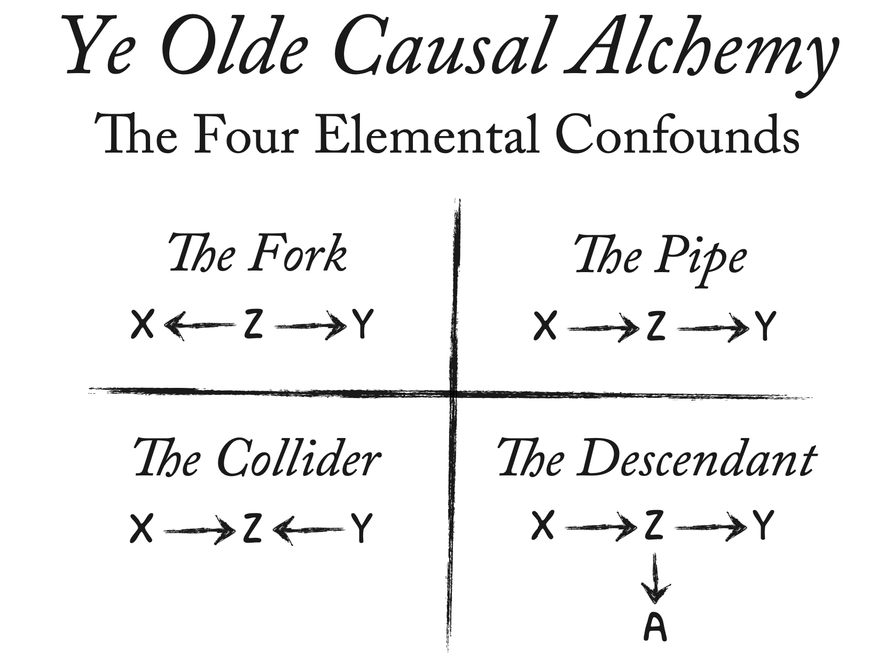
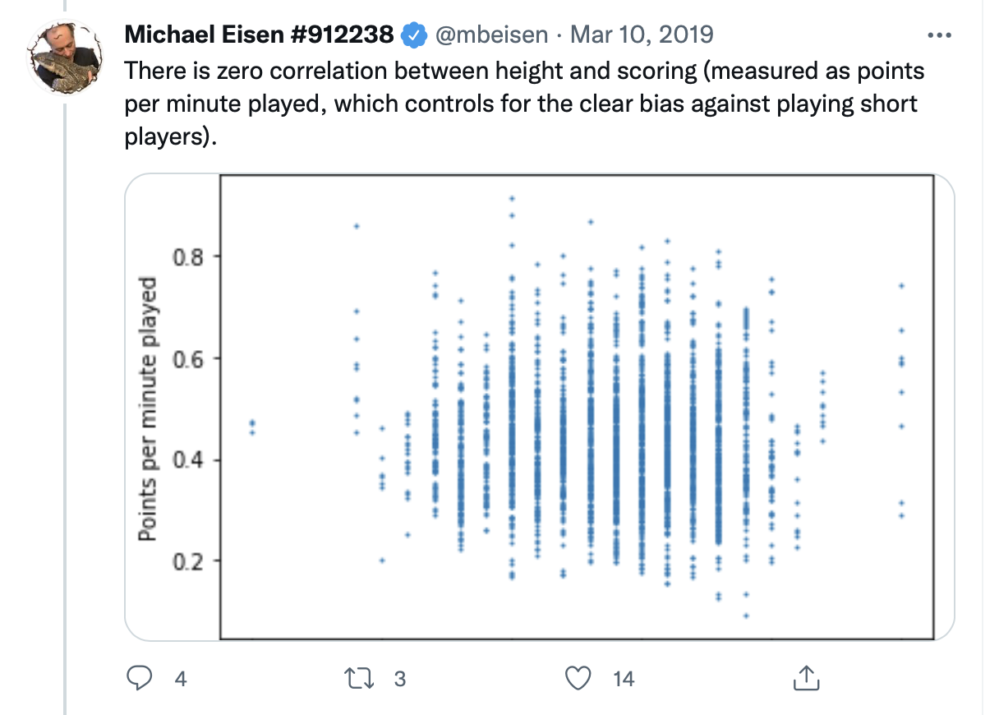
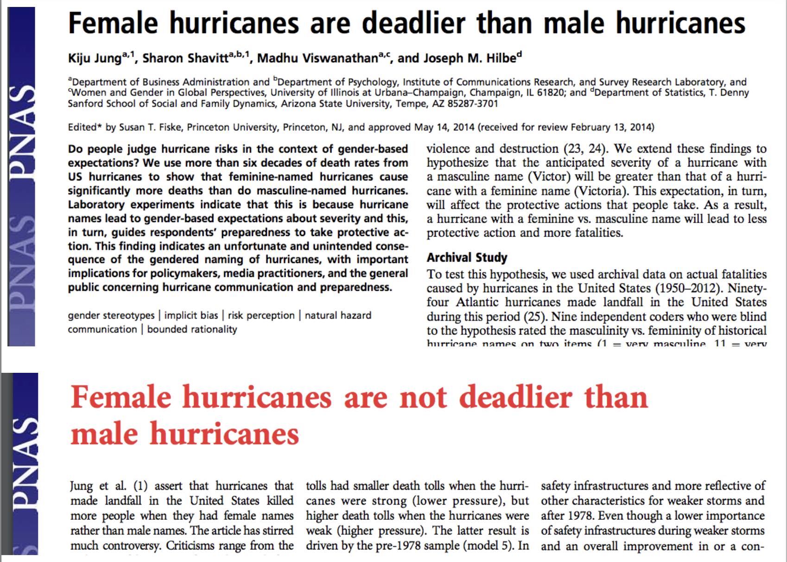
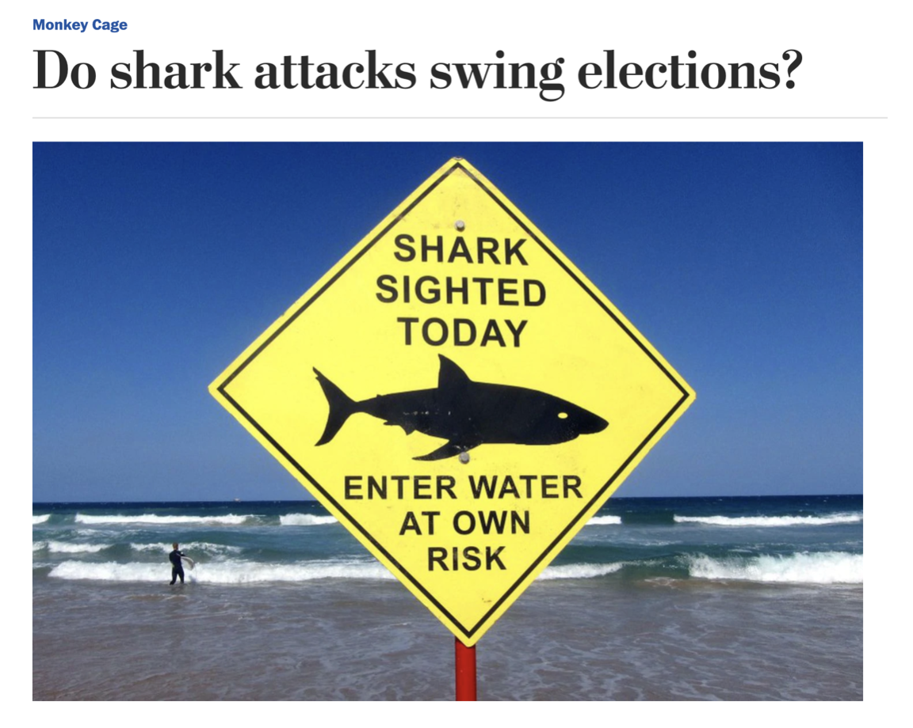

```{r setup, include=FALSE}
xaringanExtra::use_editable(id = "causal2")
options(htmltools.dir.version = FALSE)
knitr::opts_chunk$set(
  fig.width=9, 
  fig.height=3.5, 
  fig.retina=3,
  fig.align = 'center',
  out.width = "100%",
  cache = FALSE,
  echo = FALSE,
  message = FALSE, 
  warning = FALSE,
  hiline = TRUE
)
```


```{r packages}
library(tidyverse)
library(ggdag)
library(rethinking)
library(broom)
data("WaffleDivorce")

# dubois colors
red = "#dc354a"
yellow = "#ecb025"
blue = "#213772"


# theme
theme_nice = function() {
  theme_minimal(base_family = "Fira Sans Condensed", base_size = 14) +
    theme(panel.grid.minor = element_blank(),
          plot.background = element_rect(fill = "white", color = NA),
          plot.title = element_text(face = "bold"),
          axis.title = element_text(face = "bold"),
          strip.text = element_text(face = "bold"),
          strip.background = element_rect(fill = "grey80", color = NA),
          legend.title = element_text(face = "bold"), 
          plot.subtitle = element_text(hjust = .5, face = "italic"))
}
theme_set(theme_nice())

# Make all geom_dag_text() layers use these settings automatically
update_geom_defaults(ggdag:::GeomDagText, list(family = "Fira Sans Condensed", 
                                               fontface = "bold",
                                               color = "black"))

# set seed
set.seed(1990)

```


class: left, middle
background-image: url("images/dubois-spiral-2.png")
background-position: right
background-size: contain

# `r rmarkdown::metadata$title`

### *`r rmarkdown::metadata$subtitle`*

### Professor `r rmarkdown::metadata$author` 

#### University of California, Davis

---


class: center
.large[
# Today's agenda
]

--
.box-1.large.sp-after[DAGs]

--
.box-2.large.sp-after[Waffles and Divorce]

--
.box-3.large.sp-after[Elemental Confounds]

---


class: center, middle, inverse
# Last class

--


We want to know if X **causes** Y, using data

--


We *can* use models to capture the effect of X on Y, if in fact X does affect Y

--


Problem is some correlations are causal, others aren't

--

How can we tell?


---


# Causal diagram

.pull-left[
We need a *causal model*


The model is our idea of how the data came to be (the **data-generating process**)


The model tells us how to *identify* a causal effect (if it's possible!)

]

.pull-right[
```{r}

```
]

---


# Directed Acyclical Graphs (DAGs)

A popular modeling tool for thinking about causality is the **DAG**

Nodes (points) = variables; Edges (arrows) = direction of *causality*


```{r}
dagify(Y ~ X + Z + A + B, 
       X ~ Z + W, 
       Z ~ B, 
       A ~ B + W, 
       exposure = "X", outcome = "Y") %>% 
  ggdag_status(stylized = TRUE) + 
  theme_dag(legend.position = "none") + 
  scale_color_manual(values = c(blue, red))
```


---


class: center
# DAGs


Nodes = variables; Arrows = direction of *causality*

--

```{r,out.width="80%", fig.align='center'}
dagify(Y ~ X1, 
       coords = c(list(x = c(X1 = 1, Y = 1.5), 
                       y = c(X1 = 1, Y = 1)))) %>% 
  ggdag(node_size = 20, text_size = 5, stylized = TRUE) + theme_dag()
```


Read: X1 has an effect on Y

---


# DAGs


```{r, out.width = "80%"}
dagify(Y ~ X1, 
       X1 ~ X2) %>% 
  ggdag(node_size = 18, text_size = 4.5, stylized = TRUE) + theme_dag()
```

--

X1 has an effect on Y; X2 has an effect on X1; X2 affects Y *only through* X1

*Missing* arrows matter!

???
Example of x2 - x1 - y?

---


# DAGs


```{r, out.width="80%"}
dagify(Y ~ X1 + X3, 
       X1 ~ X2 + X3) %>% 
  ggdag(node_size = 20, text_size = 5, stylized = TRUE) + theme_dag()
```

--


X1 has an effect on Y; X2 has an effect on X1 and Y (via X1); X3 has an effect on X1 and Y


---


# Example: ideology


Where does (liberal) ideology come from?

--

Variables in the literature: Income (I), Liberal (L), Age (A), Media (M), Parents (P)

--


```{r, out.width="80%"}
dag = dagify(L ~ M + P + A + I, 
             M ~ P, 
             exposure = "M", 
             outcome = "L")
ggdag(dag, stylized = TRUE) + theme_dag() + theme(legend.position = "none")
```

???
What are our assumptions? What's this DAG saying?


---

class: middle, center, inverse
# DAGs

DAGs encode everything we know about some process

--


We can see all of our assumptions and how they fit together

--


For example: the effect of Parents on how Liberal someone is happens *directly* and *indirectly* (through Media)

--

Missing arrows also matter: we are assuming that Age has *no effect* on Media diet


---


# 🚨 Our turn: let's make our own DAG 🚨


On [daggity.net](http://www.dagitty.net/dags.html#) about why people choose to vote (or not)

---


# Identification


Why do this? As we will see, DAGs help us figure out how to estimate the effect of one variable on another

--

While at the same time being mindful of all the other variables that we need to **adjust**, or **control** for

--


For instance, we might want to estimate the effect of Media consumption (M) on how Liberal (L) someone is

--


This process is called "identification" $\rightarrow$ to **identify** the effect of X on Y


---


class: center, middle, inverse
# Waffles and Divorce
---


```{r}

```


---


# Waffle House Index

.pull-left[
```{r}

```

]

--


.pull-right[
```{r}

```

]


---


# Does Waffle House cause divorce?

--


States with many Waffle Houses per person also have some of the highest divorce rate

--

```{r}
WaffleDivorce %>% 
  mutate(`Waffles per Person` = WaffleHouses/Population) %>% 
  select(Location, Marriage, Divorce, `Waffles per Person`) %>% 
  knitr::kable(digits = 2)
```

---


# Does Waffle House cause divorce?


Do cheap, delicious waffles put marriages at risk? 

--

```{r}
ggplot(WaffleDivorce, aes(x = WaffleHouses/Population, y = Divorce)) + 
  geom_point(size = 3, fill = red, alpha = .8, shape = 21, color = "white") + 
  geom_smooth(method = "lm", color = red, fill = red) + 
  theme_nice() + 
  labs(x = "Waffle Houses per million residents", 
       y = "Divorce rate per 1,000 adults")
```

???
Speculate on underlying mechanism

---

class: middle, center, inverse
# Does Waffle House cause divorce?

--

Almost certainly *not*

--

No one thinks there is a *plausible* way in which Waffle House causes divorce

--

When we see a correlation of this kind we wonder about other variables that are **actually** driving the relationship

--

You've likely thought about this before: *a "lurking" variable, "other factors", that "matter"*

--

But what might that *variable* be? And *how* exactly does it lead us astray?


---


# The lurking variable


It turns out that Waffle Houses originated in the South (Georgia), and most of them are still there

--

The South also happens to have some of the highest divorce rates in the country

---


# The DAG


So the DAG might look something like this: South **has an effect on** Waffle Houses and Divorce, but Waffles **do not cause** Divorce


```{r, out.width="80%"}
dagify(Divorce ~ South, 
       Waffle ~ South, 
       exposure = "Waffle",
       outcome = "Divorce", 
       coords = list(x = c(Waffle = 0, Divorce = 2, South = 1), 
                      y = c(Waffle = 0, Divorce = 0, South = 1))) %>% 
  ggdag_status(text = FALSE, use_labels = "name", stylized = TRUE) + theme_dag_blank() + 
  theme(legend.position = "none") + scale_color_manual(values = c(blue, red)) + 
  scale_fill_manual(values = c(blue, red))
```

---


# The problem


```{r, out.width="60%"}
dagify(Divorce ~ South, 
       Waffle ~ South, 
       exposure = "Waffle",
       outcome = "Divorce", 
       coords = list(x = c(Waffle = 0, Divorce = 2, South = 1), 
                      y = c(Waffle = 0, Divorce = 0, South = 1))) %>% 
  ggdag_status(text = FALSE, use_labels = "name", stylized = TRUE) + theme_dag_blank() + 
  theme(legend.position = "none") + scale_color_manual(values = c(blue, red)) + 
  scale_fill_manual(values = c(blue, red))
```

--


A DAG like this will produce a *correlation* between Waffles and Divorce, even when there is no **causal** relationship

--


This is called **confounding**: the South is **confounding** the relationship between Waffles and Divorce


---


# How does this happen?


Let's make up data to convince ourselves this is true

--

fifty states, about half of them are in the South

--

```{r, echo  = TRUE}
tibble(south = sample(c(0, 1), size = 50, replace = TRUE))
```

---


# Simulate the treatment


Step 2: make Waffle houses, let's say about 20 per million residents, +/- 4

```{r, echo = TRUE}
tibble(south = sample(c(0, 1), size = 50, replace = TRUE), 
       waffle = rnorm(n = 50, mean = 20, sd = 4)) #<<
```

---

# Make Waffles more common in the South


Step 3: The arrow from South to Waffles, let's say Southern states have about 10 more Waffles, on average

```{r, echo = TRUE}
tibble(south = sample(c(0, 1), size = 50, replace = TRUE), 
       waffle = rnorm(n = 50, mean = 20, sd = 4) + 10 * south) #<<
```

---


# Simulate the outcome


Step 4: make a divorce rate, let's say about 20 divorces per 1,000 adults

```{r, echo = TRUE}
fake = tibble(south = sample(c(0, 1), size = 50, replace = TRUE), 
              waffle = rnorm(n = 50, mean = 20, sd = 4) + 10 * south,
              divorce = rnorm(n = 50, mean = 20, sd = 2)) #<<
```


---


# Make the South have more divorce


Step 5: the arrow from South to divorce, let's say southern states have about 8 more divorces per 1,000 residents

```{r, echo = TRUE}
fake = tibble(south = sample(c(0, 1), size = 50, replace = TRUE), 
              waffle = rnorm(n = 50, mean = 20, sd = 4) + 10 * south,
              divorce = rnorm(n = 50, mean = 20, sd = 2) + 8 * south) #<<
```

**NOTICE!** Waffles have no effect on divorce in our fake data

---

# A totally confounded relationship


The South's **effect** on Waffle House and on Divorce creates a **confounded** correlation between the two


```{r}
ggplot(fake, aes(x = waffle, y = divorce)) + 
  geom_point(size = 3, fill = red, alpha = .8, shape = 21, color = "white") + 
  geom_smooth(method = "lm", color = red, fill = red) + 
  theme_nice() + 
  labs(title = "Our fake waffle data", 
       x = "Waffle Houses per million residents", 
       y = "Divorce rate per 1,000 adults")
```


---


# A totally confounded relationship


The DAG on the left will produce an association like the one on the right

.pull-left[
```{r}
dagify(Divorce ~ South, 
       Waffle ~ South, 
       exposure = "Waffle",
       outcome = "Divorce", 
       coords = list(x = c(Waffle = 0, Divorce = 2, South = 1), 
                      y = c(Waffle = 0, Divorce = 0, South = 1))) %>% 
  ggdag_status(text = FALSE, use_labels = "name", stylized = TRUE) + theme_dag_blank() + 
  theme(legend.position = "none") + scale_color_manual(values = c(blue, red)) + 
  scale_fill_manual(values = c(blue, red))
```
]


.pull-right[
```{r}
ggplot(fake, aes(x = waffle, y = divorce)) + 
  geom_point(size = 3, fill = red, alpha = .8, shape = 21, color = "white") + 
  geom_smooth(method = "lm", color = red, fill = red) + 
  theme_nice() + 
  labs(title = "Our fake waffle data", 
       x = "Waffle Houses per million residents", 
       y = "Divorce rate per 1,000 adults")
```
]


Even if Waffles and Divorce are **causally** unrelated

---


# 🧇 Your turn: confounded waffles 🧇


Make up data where a lurking variable creates a confounded relationship between two other variables that isn't truly causal:

.small[
1. Change the .yellow[confound], .blue[treatment] and .red[outcome] variables in the code to ones of your choosing

2. Alter the parameters in `rnorm()` so the values make sense for your variables

3. Make a scatterplot with a trend line -- use `labs()` to help us make sense of the plot axes and tell us what the confound is with the `title = ` argument in `labs()`
]


```{r}
countdown::countdown(minutes = 15L)
```


---


# What's going on here? 


.pull-left[
Think of causality as water flowing in the direction of the arrows


We want look at water flowing **directly** from a **treatment** to an **outcome**

But **account** for the fact that there is often *indirect* flow that *contaminates* our estimates


]

.pull-right[

<video width="100%" height="100%" controls id="my_video">
    <source src="images/confound-heiss.mp4" type="video/mp4">
</video>

Source: the mighty Andrew Heiss
]


---


# What's going on here?


To **identify** the effect of Waffles on Divorce we need to **account**, or **control for**, the indirect flow resulting from South

Otherwise we will be *confounded*


```{r, out.width="80%"}
dagify(Divorce ~ South, 
       Waffle ~ South, 
       exposure = "Waffle",
       outcome = "Divorce", 
       coords = list(x = c(Waffle = 0, Divorce = 2, South = 1), 
                      y = c(Waffle = 0, Divorce = 0, South = 1))) %>% 
  ggdag_status(text = FALSE, use_labels = "name", stylized = TRUE) + theme_dag_blank() + 
  theme(legend.position = "none") + scale_color_manual(values = c(blue, red)) + 
  scale_fill_manual(values = c(blue, red))
```

---


# The formula


1. Make a DAG of what we think is going on with our treatment and outcome

2. Figure out where the *indirect flows* are

3. Account for those in our analysis


---


# What do we need to control? 


```{r}
dagify(Y ~ X, 
       exposure = "X", 
       outcome = "Y") %>% 
  ggdag_status(text = FALSE, use_labels = "name", stylized = TRUE) + theme_dag_blank() + 
  theme(legend.position = "none") + scale_color_manual(values = c(blue, red)) + 
  scale_fill_manual(values = c(blue, red))
```

--

Nothing

---


# What do we need to control? 


```{r}
dagify(Y ~ X + Z, 
       exposure = "X", 
       outcome = "Y") %>% 
  ggdag_status(text = FALSE, use_labels = "name", stylized = TRUE) + theme_dag_blank() + 
  theme(legend.position = "none") + scale_color_manual(values = c(blue, red)) + 
  scale_fill_manual(values = c(blue, red))
```

--

Nothing! No indirect flow to X

---

# What do we need to control? 


```{r}
dagify(Y ~ X + Z + A + B, 
       X ~ G + H + J + K, 
       exposure = "X", 
       outcome = "Y") %>% 
  ggdag_status(text = FALSE, use_labels = "name", stylized = TRUE) + theme_dag_blank() + 
  theme(legend.position = "none") + scale_color_manual(values = c(blue, red)) + 
  scale_fill_manual(values = c(blue, red))
```

--

Nothing! No indirect flow to X!

---


# What do we need to control to identify...


Media consumption (M) $\rightarrow$ Liberal (L)


```{r}
dag = dagify(L ~ M + P + A + I, 
             M ~ P, 
             exposure = "M", 
             outcome = "L")
ggdag_status(dag, text = FALSE, use_labels = "name", stylized = TRUE) + theme_dag_blank() + 
  theme(legend.position = "none") + scale_color_manual(values = c(blue, red)) + 
  scale_fill_manual(values = c(blue, red))
```

---


```{r,out.width="70%",fig.align='center'}

```


---


# The confounding fork 🍴

Y $\leftarrow$ Z $\rightarrow$ X

--

There is a third variable, Z, that is a **common cause** of X and Y

--

```{r, out.width="90%"}
dagify(Y ~ Z, 
       X ~ Z, 
       exposure = "X",
       outcome = "Y", 
       coords = list(x = c(Y = 0, X = 2, Z = 1), 
                      y = c(Y = 0, X = 0, Z = 1))) %>% 
  ggdag_status(text = FALSE, use_labels = "name", stylized = TRUE) + theme_dag_blank() + 
  theme(legend.position = "none") + scale_color_manual(values = c(blue, red)) + 
  scale_fill_manual(values = c(blue, red))
```


---

# The confounding fork


We've already seen this!


.pull-left[
```{r}
dagify(Divorce ~ South, 
       Waffle ~ South, 
       exposure = "Waffle",
       outcome = "Divorce", 
       coords = list(x = c(Waffle = 0, Divorce = 2, South = 1), 
                      y = c(Waffle = 0, Divorce = 0, South = 1))) %>% 
  ggdag_status(text = FALSE, use_labels = "name", stylized = TRUE) + theme_dag_blank() + 
  theme(legend.position = "none") + scale_color_manual(values = c(blue, red)) + 
  scale_fill_manual(values = c(blue, red))
```

Creates an association between X and Y that isn't causal

]

.pull-right[
```{r}
dagify(Divorce ~ South + Waffle, 
       Waffle ~ South, 
       exposure = "Waffle",
       outcome = "Divorce", 
       coords = list(x = c(Waffle = 0, Divorce = 2, South = 1), 
                      y = c(Waffle = 0, Divorce = 0, South = 1))) %>% 
  ggdag_status(text = FALSE, use_labels = "name", stylized = TRUE) + theme_dag_blank() + 
  theme(legend.position = "none") + scale_color_manual(values = c(blue, red)) + 
  scale_fill_manual(values = c(blue, red))
```

Distorts the true causal relation between X and Y

]

Note that **both** of these fork scenarios will mess us up!


---


# The second scenario


Say that Waffles do cause Divorce, but the effect is tiny: .0001

```{r, echo = TRUE}
fake = tibble(south = sample(c(0, 1), size = 50, replace = TRUE), 
              waffle = rnorm(n = 50, mean = 20, sd = 4) + 10*south,
              divorce = rnorm(n = 50, mean = 20, sd = 2) + 8*south + .0001 * waffle) #<<
```


---

# The second scenario


The effect of Z (South) on X (Waffles) and Y (Divorce) will **distort** our estimates:

```{r, echo = TRUE}
lm(divorce ~ waffle, data = fake) %>% tidy()
```


--

Estimate is `r .504/.0001` times larger than the true effect!


---

# Dealing with forks


We need to figure out what Z is, measure it, and **adjust for it** in our analysis


```{r, out.width="90%"}
dagify(Y ~ Z, 
       X ~ Z, 
       exposure = "X",
       outcome = "Y", 
       coords = list(x = c(Y = 0, X = 2, Z = 1), 
                      y = c(Y = 0, X = 0, Z = 1))) %>% 
  ggdag_dseparated() + theme_dag_blank() + 
  theme(legend.position = "none")
```


---

# The perplexing pipe 🪠


X $\rightarrow$ Z $\rightarrow$ Y

X causes Z, which causes Y (or: Z *mediates* the effect of X on Y)

--


```{r, out.width="70%"}
dagify(Y ~ Z, 
       Z ~ X, 
       coords = list(x = c(X = -.5, Z = 0, Y = .5), 
                     y = c(Y = 0, Z = 0, X = 0))) %>% 
  ggdag() + theme_dag()
```


What happens if we **adjust for Z**?  We **block** the effect of X on Y


---


# An example: foreign intervention


What effect does .blue[US foreign intervention] have on .red[US support abroad]?

--

Say the DAG looks like this:

```{r, out.width = "70%"}
dagify(Sentiment ~ Casualties, 
       Casualties ~ Intervention, 
       exposure = "Intervention",
       outcome = "Sentiment") %>% 
  ggdag_status(text = FALSE, use_labels = "name", stylized = TRUE) + theme_dag_blank() + 
  theme(legend.position = "none") + scale_color_manual(values = c(blue, red)) + 
  scale_fill_manual(values = c(blue, red))
```


If we control for *casualties* we are *blocking* the effect of intervention on support

---


# An example: foreign intervention


What if the DAG instead looked like this:

```{r}
dagify(Sentiment ~ Casualties + Intervention, 
       Casualties ~ Intervention, 
       exposure = "Intervention",
       outcome = "Sentiment") %>% 
  ggdag_status(text = FALSE, use_labels = "name", stylized = TRUE) + theme_dag_blank() + 
  theme(legend.position = "none") + scale_color_manual(values = c(blue, red)) + 
  scale_fill_manual(values = c(blue, red))
```

???
What does it mean

---


# An example: foreign intervention


Two ways that Intervention affects US sentiment: directly and indirectly

Adjusting for **casualties** blocks the *indirect* effect; if that's what we want, fine -- But if we want the full effect then we'll be wrong!


```{r, out.width="80%"}
dagify(Sentiment ~ Casualties, 
       Casualties ~ Intervention, 
       exposure = "Intervention",
       outcome = "Sentiment") %>% 
  ggdag_status(text = FALSE, use_labels = "name", stylized = TRUE) + theme_dag_blank() + 
  theme(legend.position = "none") + scale_color_manual(values = c(blue, red)) + 
  scale_fill_manual(values = c(blue, red))
```

???
What does it mean

---


# Pipes: why are they even a problem?


Just leave pipes alone! It's a problem of "over-adjusting"

--

Bad social science: sometimes we are so afraid of **forks** that we control for everything we have data on

--

Especially when a process seems very complicated


---


# Example: where pipes go wrong


The effects of **smoking** on **heart problems** might be complex; lots of potential confounds to worry about

--


Researcher might think they need to control for a study subject's **cholesterol**

--

"We should compare people who smoke but have similar levels of cholesterol, because cholesterol affects heart health"

---

# Example: where pipes go wrong


If the DAG looks like this, **cholesterol** is a pipe and controlling is bad!

--

```{r, out.width="80%"}
smoking_ca_dag = dagify(cardiacarrest ~ cholesterol,
                         cholesterol ~ smoking + weight,
                         smoking ~ unhealthy,
                         weight ~ unhealthy,
                         labels = c("cardiacarrest" = "Cardiac\n Arrest", 
                                    "smoking" = "Smoking",
                                    "cholesterol" = "Cholesterol",
                                    "unhealthy" = "Unhealthy\n Lifestyle",
                                    "weight" = "Fat content"),
                         exposure = "smoking",
                         outcome = "cardiacarrest")

ggdag_status(smoking_ca_dag, text = FALSE, use_labels = "name", stylized = TRUE) + theme_dag_blank() + 
  theme(legend.position = "none") + scale_color_manual(values = c(blue, red)) + 
  scale_fill_manual(values = c(blue, red))
```


---

# The explosive collider 💥

$X \rightarrow Z \leftarrow Y$

--

X and Y have a common **effect**

--

Left alone, it's no problem; but **controlling for Z** creates strange patterns

--


```{r, out.width="70%"}
collider_triangle(x = "X", y = "Y", m = "Z") %>% 
  ggdag(use_labels = "label", text = FALSE, stylized = TRUE) + theme_dag()
```


---

# Example: the NBA


```{r,out.width="50%"}

```

--


Should the NBA stop worrying about height when drafting players? 


---


# No!


Obviously, height helps in basketball

--

But **among NBA players** there might be no relationship between height and scoring, because shorter players have other advantages

--

**Among NBA players** = adjusting, or controlling for, being in the NBA

--

```{r, out.width="70%"}
dagify(Scoring ~ Height, 
       NBA ~ Scoring + Height, 
       exposure = "Height", 
       outcome = "Scoring",
       coords = list(x = c(Height = -.5, NBA = 0, Scoring = .5), 
                     y = c(Height = 0, NBA = -.5, Scoring = 0))) %>% 
  ggdag_status(text = FALSE, use_labels = "name", stylized = TRUE) + theme_dag_blank() + 
  theme(legend.position = "none") + scale_color_manual(values = c(blue, red)) + 
  scale_fill_manual(values = c(blue, red))
```


---


# Another example: bad findings

.pull-left[
Richard McElreath asks: why are surprising findings so often untrustworthy? 

]

.pull-right[
```{r}

```
]


---

# Another example: bad findings


```{r, out.width="60%"}

```


---


# It's a collider


Imagine that in the world there is no relationship between how **surprising** a finding is and how **trustworthy** it is

--

```{r}
# simulate fake study selection data
n = 500 # number of studies
p = 0.1 # proportion of studies that get chosen
df = tibble(newsworthy = rnorm(n), 
            trustworthy = rnorm(n), 
            total = newsworthy + trustworthy, 
            top10 = quantile(total, probs = 1 - p), 
            published = ifelse(total >= top10, TRUE, FALSE))


ggplot(df, aes(x = newsworthy, y = trustworthy)) + 
  geom_point(size = 3, fill = red, alpha = .8, shape = 21, color = "white") + 
  theme_nice() +
  labs(x = "How Surprising the Study is", 
       y = "How Trustworthy the Study is") + 
  theme(legend.position = "none") + 
  scale_x_continuous(breaks = c(-2, 2), labels = c("Very unsurprising", "Very surprising")) + 
  scale_x_continuous(breaks = c(-2, 2), labels = c("Very untrustworthy", "Very trustworthy"))

```


---


# It's a collider


But now imagine that studies are only published **either** if they're *very trustworthy* OR *very surprising*


```{r}
ggplot(df, aes(x = newsworthy, y = trustworthy, fill = published)) + 
  geom_point(size = 3, alpha = .8, shape = 21, color = "white") + 
  theme_nice() +
  labs(x = "How Surprising the Study is", 
       y = "How Trustworthy the Study is") + 
  theme(legend.position = "none") + 
  scale_x_continuous(breaks = c(-2, 2), labels = c("Very unsurprising", "Very surprising")) + 
  scale_x_continuous(breaks = c(-2, 2), labels = c("Very untrustworthy", "Very trustworthy")) +
  scale_fill_manual(values = c(red, blue)) + 
  theme(legend.position = "top")
```


---


# It's a collider


By only looking at *published papers* (e.g., **controlling for publication**), we create a negative relationship that doesn't exist


```{r}
ggplot(df, aes(x = newsworthy, y = trustworthy, fill = published)) + 
  geom_point(size = 3, alpha = .8, shape = 21, color = "white") + 
  theme_nice() +
  labs(x = "How Surprising the Study is", 
       y = "How Trustworthy the Study is") + 
  theme(legend.position = "none") + 
  scale_x_continuous(breaks = c(-2, 2), labels = c("Very unsurprising", "Very surprising")) + 
  scale_x_continuous(breaks = c(-2, 2), labels = c("Very untrustworthy", "Very trustworthy")) +
  scale_fill_manual(values = c(red, blue)) + 
  theme(legend.position = "top") + 
  geom_smooth(data = filter(df, published == TRUE), method = "lm")
```


---


# Exploding colliders


Like pipes, colliders are a problem of controlling for the wrong thing

They are often the result of a **sample selection** problem

They can **obscure** actual relationships or **fabricate** non-existent ones

We need to avoid controlling for colliders; but they are everywhere!


.pull-left[
```{r}
dagify(Scoring ~ Height, 
       NBA ~ Scoring + Height, 
       exposure = "Height", 
       outcome = "Scoring",
       coords = list(x = c(Height = -.5, NBA = 0, Scoring = .5), 
                     y = c(Height = 0, NBA = -.5, Scoring = 0))) %>% 
  ggdag_status(text = FALSE, use_labels = "name", stylized = TRUE) + theme_dag_blank() + 
  theme(legend.position = "none") + scale_color_manual(values = c(blue, red)) + 
  scale_fill_manual(values = c(blue, red))
```
]


.pull-right[
```{r}
dagify(Published ~ Trustworth + Surprising, 
       exposure = "Surprising", 
       outcome = "Trustworth",
       coords = list(x = c(Surprising = -.5, Published = 0, Trustworth = .5), 
                     y = c(Surprising = 0, Published = -.5, Trustworth = 0))) %>% 
  ggdag_status(text = FALSE, use_labels = "name", stylized = TRUE) + theme_dag_blank() + 
  theme(legend.position = "none") + scale_color_manual(values = c(blue, red)) + 
  scale_fill_manual(values = c(blue, red))
```
]


---


# 💥 Your turn: colliders 💥


How are the following examples of colliders?


1. Say that, on average, Google pays women less than men. But *comparing employees in the same type of job* (title, seniority, skills, etc.) the difference goes away, so there is no bias.

2. A study by Fryer (2019) on racial bias in policing finds that, *among people who are stopped by police*, white and non-white citizens are killed at the same rates, so there is no bias.


