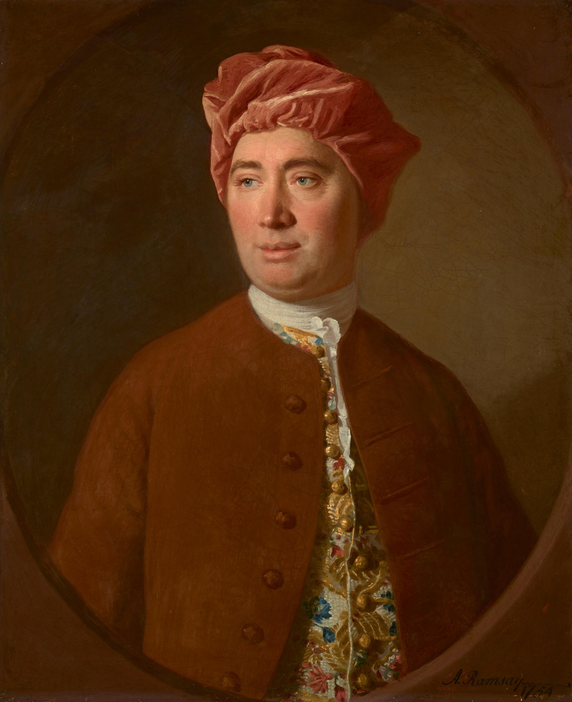

```{r setup, include=FALSE}
options(htmltools.dir.version = FALSE)
xaringanExtra::use_editable(id = "causal1")
knitr::opts_chunk$set(
  fig.width=9, 
  fig.height=3.5, 
  fig.retina=3,
  out.width = "100%",
  cache = FALSE,
  echo = FALSE,
  message = FALSE, 
  warning = FALSE,
  hiline = TRUE
)
```


```{r packages}
library(tidyverse)
library(socviz)
library(fivethirtyeight)
library(patchwork)
library(gapminder)
library(broom)
library(moderndive)
library(ggrepel)


# dubois colors
red = "#dc354a"
yellow = "#ecb025"
blue = "#213772"


# theme
theme_nice = function() {
  theme_minimal(base_family = "Fira Sans Condensed", base_size = 14) +
    theme(panel.grid.minor = element_blank(),
          plot.background = element_rect(fill = "white", color = NA),
          plot.title = element_text(face = "bold"),
          axis.title = element_text(face = "bold"),
          strip.text = element_text(face = "bold"),
          strip.background = element_rect(fill = "grey80", color = NA),
          legend.title = element_text(face = "bold"), 
          plot.subtitle = element_text(hjust = .5, face = "italic"))
}
theme_set(theme_nice())

# set seed
set.seed(1990)

```


class: left, middle
background-image: url("images/dubois-spiral-2.png")
background-position: right
background-size: contain

# `r rmarkdown::metadata$title`

### *`r rmarkdown::metadata$subtitle`*

### Professor `r rmarkdown::metadata$author` 

#### University of California, Davis

---


class: center
.large[
# Today's agenda
]

--
.box-1.large.sp-after[Why causality? And what is it?]

--
.box-2.large.sp-after[Fake data]

--
.box-3.large.sp-after[The problem with causality]

---

class: middle, center, inverse
# Why predict?
---


# Why predict


We don't know what's going to happen in the **future**

--

Or in places/cases where we don't have data

--

Even if in cases where we have data -- what's our *best guess*? 

--


We can use **models** to make decisions informed by patterns in the data


---


# Prediction is for making decisions


World Bank: what would happen to Jamaica if their GDP went up by 10k?

--

Who the hell knows, but we can use models to make an educated **guess**

--


```{r, out.width="90%"}
ggplot(filter(gapminder, year == 2007), aes(x = gdpPercap, y = lifeExp)) + 
  geom_point() + theme_nice() + 
  labs(x = "GDP per capita", 
       y = "Life expectancy") + 
  geom_point(data = filter(gapminder, country == "Jamaica", 
                           year == 2007), 
             color = red, size = 4) + 
  geom_label_repel(data = filter(gapminder, country == "Jamaica", 
                           year == 2007), label = "Jamaica in 2007",
             color = red, size = 4, nudge_x = 2e3, nudge_y = -10) + 
  geom_point(data = tibble(gdpPercap = 17321, lifeExp = 75.5), 
             color = yellow, size = 4) + 
  geom_label_repel(data = tibble(gdpPercap = 17321, lifeExp = 75.5), 
             color = yellow, size = 4, nudge_x = 5e3, nudge_y = -10,
             label = "Our estimate for Jamaica when GDP = 17k/person") + 
  annotate(geom = "rect", xmin = 7000, xmax = 8000, 
           ymin = -Inf, ymax = Inf, fill = red, alpha = .2) + 
  annotate(geom = "rect", xmin = 17000, xmax = 18000, 
           ymin = -Inf, ymax = Inf, fill = yellow, alpha = .2)
```

---


# Moving forward


.pull-left[
* There are lots of prediction resources online
* [Kaggle](http://kaggle.com) hosts prediction competitions with interesting data
* Give it a shot!
]


.pull-right[
```{r}
knitr::include_graphics("images/kaggle.png")
```
]


---

class: middle, center, inverse
# A turning point
---


# First half of course


.pull-left[
How to program, visualize data, modeling, relationships, etc.

Look at all the functions you learned:
> `group_by`, `tally`, `summarise`, `filter`, `mutate`, `%>%`, `distinct`, `lm`, `augment`, `tidy`, `ggplot`, `facet_wrap`...

There are thousands more!
]


.pull-right[
```{r}
knitr::include_graphics("images/learning-R.png")
```
]

---

# First half of course


Use models to estimate the relationship between X and Y:

```{r, echo = TRUE}
mod = lm(lifeExp ~ gdpPercap, data = gapminder)
tidy(mod)
```

--

But is this relationship **causal**? Would an increase in GDP **cause** an increase in life expectancy, on average? 

---


# Second half of the course

.pull-left[

"How do we know if X **causes** y?"

Are our estimates **causal**? Academics fight about this all day!

This question is at center of **causal inference**

We will learn why it is so difficult to establish causality with data

We will also learn potential solutions

]


.pull-right[
```{r, fig.cap="Pictured: audience at a research presentation"}
knitr::include_graphics("images/the-thing.png")
```
]

---

class: center, middle, inverse
# Many interesting questions are causal

--

International relations: do peace-keepers **reduce conflict** in countries emerging from civil war? Does democracy make countries more **peaceful**?

--

Comparative politics: do elections reduce or increase **corruption**? Does repression increase or decrease **dissent**? 


--


American politics: do voter ID laws hurt general **turnout**? Do elites move **public opinion** or does public opinion move elites? 


---


# But not all


**Many** of the interesting questions people want to answer with data are causal

--

Some are not: 

Instagram might want to know: "Is there a person in this photo?"

But not care about what factors **cause** the picture to be a photo of a person

Depends on the question; most **why** questions are causal


---


# The value of causality


.pull-left[
One of our comparative advantages

Not just academic; companies, governments, NGOs also need to answer "why" questions

Does this policy work (or not)? Did it do what was intended? How effective or counterproductive was it? 
]

.pull-right[
```{r}
knitr::include_graphics("images/causal-job.png")
```
]

---


# What do we mean by causality?


.pull-left[
In this class, we say **X causes Y** if...

An **intervention** that changes the value of X produces a **probabilistic** change in Y

* .blue[Intervention] = X is being **changed** or altered

* .red[Probabilistic] = Y should change, *on average*, but need not in every instance

]

.pull-right[
```{r,out.width="70%"}

```
]


---

# Interventions and probability


How do the two parts of our definition fit here?

> Aspirin causes a reduction in fever symptoms

--

.blue[Intervention] = someone **takes** aspirin, we administer aspirin, we sneak it into someone's food, etc. 

--

.red[Probabilistic] = Taking aspirin doesn't work 100% of the time; but *in general*, *on average*, *more often than not*, etc., taking aspirin $\rightarrow$ less fever

--

What about this example?

.can-edit.key-democracy[Instructions.]

???
Democratic institutions reduce the incidence of interstate war

---


# Terminology


We've seen this before:

```{r}
tribble(~Variable, ~Meaning, ~Examples, 
        "Y", "The thing that is affected by a treatment", "Employment, turnout, violence", 
        "X", "The thing changing an outcome", "Min. wage laws, voter ID laws, peacekeepers") %>% 
  knitr::kable()
```


---


class: center, middle, inverse
# The problem with causality
---

# Obviously causal relationships


A heavier car has to work harder to get from A to B

```{r}
ggplot(mtcars, aes(x = wt, y = mpg)) + 
  geom_point(color = blue, alpha = .8, size = 3) + 
  geom_smooth(method = "lm") + 
  theme_nice() + labs(x = "Car weight (in tons)", y = "Fuel efficiency (MPG)")
```


---


# Obviously causal relationships


A bigger house is more desirable


```{r}
ggplot(house_prices, aes(x = sqft_living, y = price)) + 
  geom_point(color = blue, alpha = .8, size = 3) + 
  geom_smooth(method = "lm") + 
  theme_nice() + 
  labs(x = "Square feet of living space", 
       y = "Price", subtitle = "Data from moderndive::house_prices") + 
  scale_y_continuous(labels = scales::dollar)
```


---


# Not obvious: education and earnings

.pull-left[
People who are already wealthy (or likely to become wealthy) get more education than people who are poor
]


.pull-right[
```{r}
knitr::include_graphics("images/education.png")
```
]


---


# Not obvious: voter ID and turnout

States that pass these laws are different from states that don't pass these laws

```{r,out.width="70%"}
knitr::include_graphics("images/vote-id.png")
```

---


# Spurious correlation


To make matters worse, correlation is common-place in nature:

--


```{r}
knitr::include_graphics("images/spurious-cheese.png")
```

---

class: middle, center, inverse
# The trouble with causality

--

We can't directly observe a change in X **causing** a change in Y

--

This is true even in **experiments**, where we directly manipulate stuff

--

All we can see are **correlations** between X and Y

--

Some of those correlations **are** causal; some **are not**; how can we tell?

---


# First step: yes, we can tell (sometimes)

--

Students are obsessed with *"correlation does not mean causation"*

But sometimes it does! that's the tricky part

```{r,out.width="50%",fig.align='center'}
knitr::include_graphics("images/sponge-cause.jpeg")
```


---


## Make up (simulate) data to convince ourselves


A good way to see that we correlation **can** equal causation is to make up (**simulate**) data where we know that X causes Y

--


We can make up data in R with the `rnorm()` function

--

`rnorm()` draws random numbers from a **normal distribution**

--

This means: the numbers it makes up are pretty close to some **mean**, plus or minus a **standard deviation**

--

> rnorm(n = 100, mean = 10, sd = 2)

Generate 100 random numbers, most of which are +/- 2 away from 10

---


# Do winners keep winning?

--

Say we wanted to simulate data to show that doing well in .blue[elections] (treatment) **causes** increases in .red[campaign funding] (outcome). That is, that funders seek out winners

--

First step is generating the .blue[treatment variable] (performance in elections). 

--

Let's say 500 fake elections that are pretty close to 50 (a tie), plus or minus 5 points


---

# Faking (simulating) the treatment


We can use `tibble()` to make a data object and `rnorm()` to generate the variables

--

.blue[Treatment variable] 500 elections, vote share is 50% of the vote on average, +/- 5%

--

.scroll-output[
```{r, echo = TRUE}
fake_election = tibble(party_share = rnorm(n = 500, mean = 50, sd = 5)) #<<
fake_election
```
]

---

# And we can plot it


```{r}
ggplot(fake_election, aes(x = party_share)) + 
  geom_histogram(fill = red, color = "white", alpha = .8)
```


---


# Making the outcome


Next we want to make up the .red[outcome] (how much each party raises in funding)

--

Let's say parties raise about 20k on average, plus or minus 4k

--

.scroll-output[
```{r, echo = TRUE}
fake_election = tibble(party_share = rnorm(n = 500, mean = 50, sd = 5), 
                       funding = rnorm(n = 500, mean = 20000, sd = 4000)) #<<
fake_election
```
]


---


# Making X cause Y

--

Now let's say we wanted to make it so that getting more votes **increased** campaign donations (winners attract funding)

--

Say for every percent of the vote a party gets, they get 2,000 (USD) more in donations $\rightarrow$ this is the causal effect of .blue[vote share] on .red[donations]

--

We can do that in R like so: 

.scroll-output[
```{r, echo = TRUE}
fake_election = tibble(party_share = rnorm(n = 500, mean = 50, sd = 5), 
                       funding = rnorm(n = 500, mean = 20000, sd = 4000) + 2000*party_share) #<<
fake_election
```
]


---

# Eyeballing it


Is our fake data convincing? We can plot it to see:

```{r}
ggplot(fake_election, aes(x = party_share, y = funding)) + 
  geom_point(shape = 21, color = "white", fill = red, size = 2.3) + 
  geom_smooth(method = "lm", color = blue) + 
  labs(x = "Party's share of the vote", 
       y = "Amount of money raised") + 
  scale_x_continuous(labels = scales::percent_format(scale = 1)) + 
  scale_y_continuous(labels = scales::dollar)

```

---

# Can we get the causal estimate back?

We **know** the effect of vote share on campaign donations: it's 2k per percent of the vote

--

Can we use a model to get that estimate back?

--

Yes!

```{r, echo = TRUE}
lm(funding ~ party_share, data = fake_election) %>% tidy()
```


---


# Hope?

.pull-left[

* There are at least *some* scenarios where X causes Y, and 
    * This effect will be reflected in the data
    * And we can **estimate** the effect with a model
]

.pull-right[
```{r}
ggplot(fake_election, aes(x = party_share, y = funding)) + 
  geom_point(shape = 21, color = "white", fill = red, size = 2.3) + 
  geom_smooth(method = "lm", color = blue) + 
  labs(x = "Party's share of the vote", 
       y = "Amount of money raised") + 
  scale_x_continuous(labels = scales::percent_format(scale = 1)) + 
  scale_y_continuous(labels = scales::dollar)

```
]

---

# 🕵️ Your turn: Michael Lacour 🕵️

--

.pull-left[
* Lacour published a big study in *Science*
* Study showed talking to LGBT canvasser $\rightarrow$ huge improvements in attitudes towards LGBT policy (gay marriage)
* Data was completely **fabricated**, using some of the same functions I showed you
]

.pull-right[
```{r}
knitr::include_graphics("images/lacour.png")
```
]


---

# 🕵️ Your turn: Michael Lacour 🕵️


Using the steps I just went through above, make up some data that pre-confirms some pattern about the world you wish were true:

--
.small[
1. Change the .blue[treatment] and .red[outcome] variables in the code to ones of your choosing

2. Alter the parameters in `rnorm()` so the values make sense for your variables

3. Make a scatterplot with a trend line -- use `labs()` to help us make sense of the plot axes!
]

--

Some ideas: 


* Amount of alcohol consumption and your overall health
* Time spent studying for Prof. Tellez’s class and future income


```{r}
countdown::countdown(minutes = 15L, font_size = "1.5em")
```


---


class: middle, center, inverse
## So we (sometimes) *can* estimate causal effects
--

## Where does it all go wrong then? 
---

# An example from IR

Does democracy reduce international conflict?

Theory: war is costly and the costs are borne by citizens; countries where citizens have more input $\rightarrow$ less conflict

--

X here is .blue[whether the country is a democracy] (versus autocracy)

Y is .red[the number of wars the country is involved in]

--

Ideal, imaginary approach: take a country, look at Y when democracy = 1, and then when democracy = 0


--

Do this for all countries, take the average

---


# Potential outcomes


This magical world where we can compare the number of wars when a country is a democracy versus when it is not is called the **potential outcomes**

```{r}
dem_peace = crossing(country = c("USA", "Canada", "China"), 
         democracy = c(1, 0)) %>% 
  mutate(war = rpois(n = n(), lambda = 4 + -2*I(democracy==1)))

knitr::kable(dem_peace)
```


---


# The fundamental problem of causality


.pull-left[

In reality, we can only *observe* democracy at *one value* for each country

The US is a democracy, we can observe wars when democracy = 1, **but not when democracy = 0**

China is not a democracy, we can observe wars when democracy = 0, **but not when democracy = 1**
]

.pull-right[
```{r}
knitr::kable(dem_peace)
```

]

---


# Potential vs. observed


We only **observe** the world on the right, but not the left

.pull-left[
```{r}
knitr::kable(dem_peace, caption = "Potential outcomes world")
```
]

.pull-left[
```{r}
observed = dem_peace %>% 
  mutate(war = case_when((country %in% c("Canada", "USA") &
                           democracy == 0) | 
                           (country == "China" & democracy == 1) ~ NA_integer_, 
                         TRUE ~ war))

knitr::kable(observed, caption = "Observed outcomes world")
```
]


---


# The fundamental problem of causality

--

We have missing data on "what would have happened" had the US been an autocracy

--

"what would have happened" $\rightarrow$ the **counterfactual**

--


Our goal in causal inference is to make as good a guess as possible as to what Y would have been had democracy = 0 instead of 1 (and vice versa)


---

# Comparing apples and oranges


Why not just compare the number of wars for countries where democracy = 0 (autocracies) versus the countries where democracy = 1 (democracies)?

--

If democracies fight less, then democracy **reduces** conflict

--

```{r, echo = TRUE}
observed %>% 
  group_by(democracy) %>% 
  summarise(wars = mean(war, na.rm = TRUE))
```

---


# Comparing apples and oranges


Implicitly, this means we are saying the countries that are *autocracies* are good **counterfactuals** for the countries that are democracies (and vice versa)

--

For instance, that China is a good counterfactual for the US

--

But China and the US are different in so many ways! They are not good **counterfactuals** of one another

--


We will see *exactly why* this is a problem in the following weeks

---

# Why experiments work

In an experiment, we *randomly* expose participants to some treatment, while others are exposed to nothing (or a placebo)

--

```{r}
experiment = tibble(Person = 1:5, 
       `Shown an ad?` = c("Yes", "No", "Yes", "No", "No"), 
       `Democrats thermometer` = round(runif(n = 5, min = 0, max = 100) + 10*I(`Shown an ad?` == "Yes"), 2))

knitr::kable(experiment, digits = 2)
```

--

We then compare the outcome of those who did and didn't get the treatment


---


# Why experiments work


Experiments have the same "problem" as the democracy and war example: we can't observe *the same person* seeing and not seeing the ad

```{r}
knitr::kable(slice(experiment, 1:2), digits = 2)
```


--

But since the experimental ad was *randomly* assigned, the people that did and didn't see the ad are good **counterfactuals** of one another

--

it is, **by definition**, just as likely a person who received treatment could have instead received the control/placebo (note how this differs from .blue[democracy] $\rightarrow$ .red[war])


---

# The gold standard


This is why experiments are known as the **gold standard** of research

--

We have control over **treatment**, and we **randomize** it

--

With **observational data** that already exists in the world, we *don't* have control over treatment, and we *can't* randomize it

--

Experiments are great, but not feasible or ethical in most cases

--

So we'll have to take other measures to try to overcome these problems with observational data


---


# 🧩 Your turn: counterfactuals 🧩


With neighbor, think through the counterfactual scenarios in these examples. What are the comparisons being made? And are they good counterfactuals? 

--

1. A study on whether international trade between two countries makes them more likely to form a defensive alliance.


2. A study on whether being a victim of a crime makes someone more supportive of authoritarian leaders


3. A study on whether those who served in the military are more likely to vote for "dovish" or "hawkish" candidates


```{r}
countdown::countdown(minutes = 10L)
```

---

