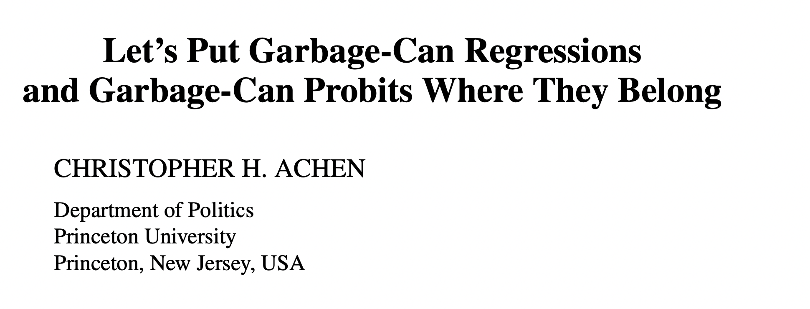
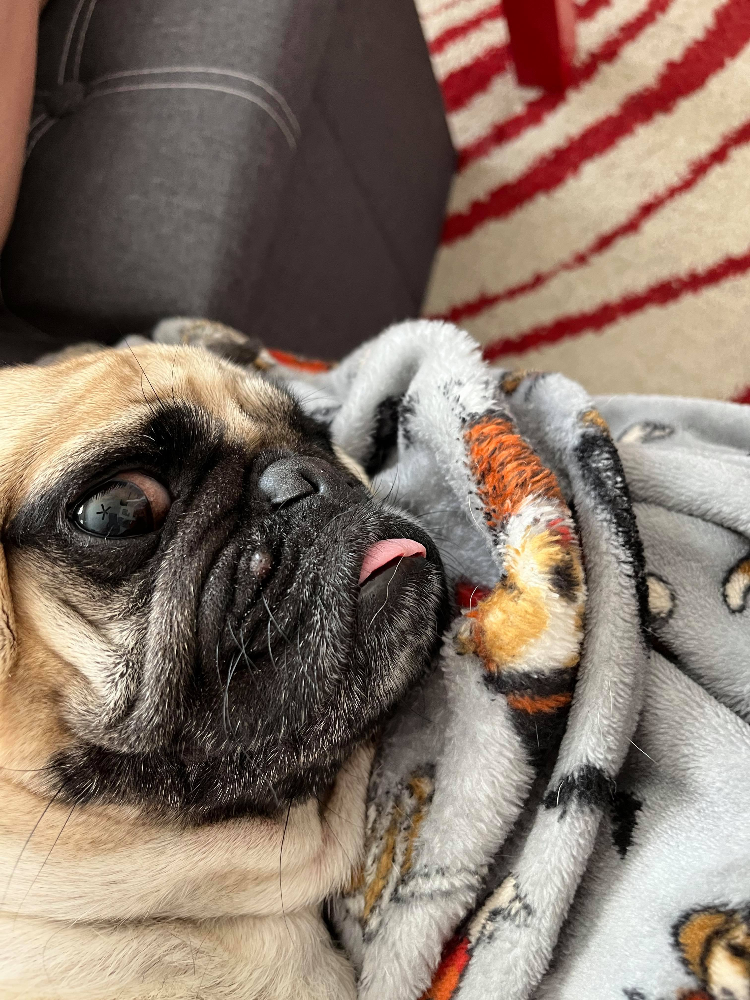
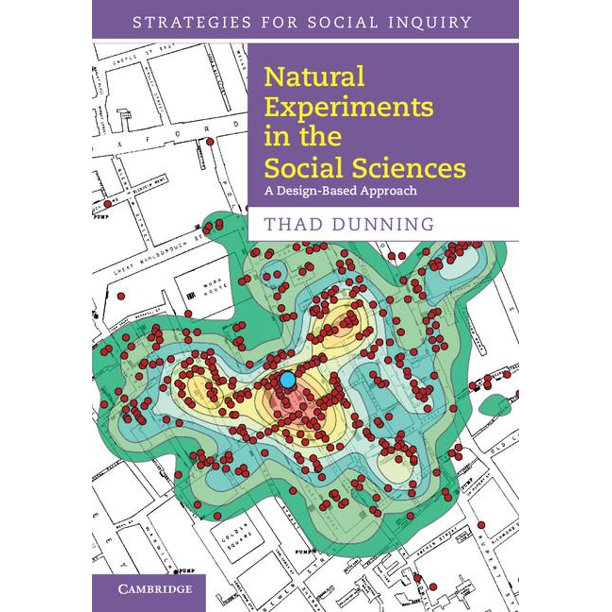
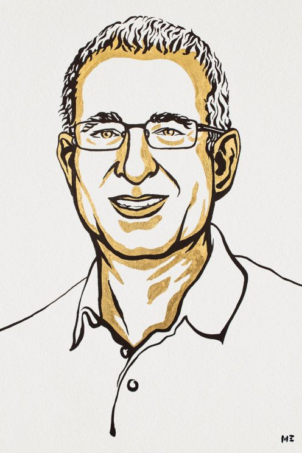
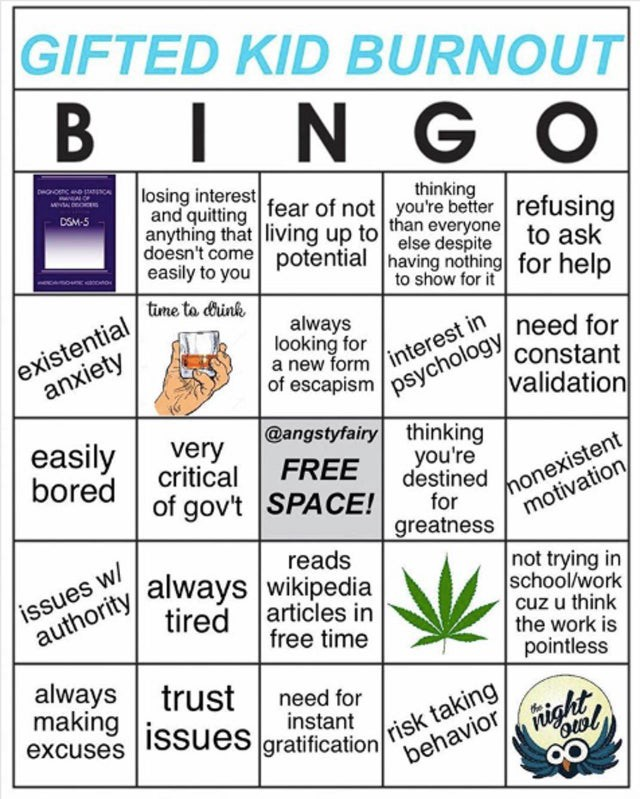
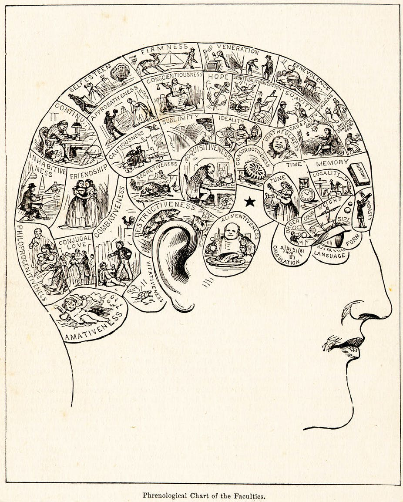
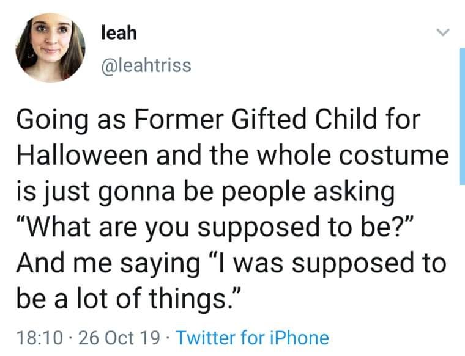
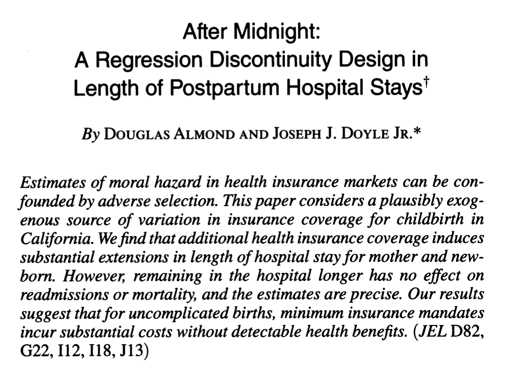
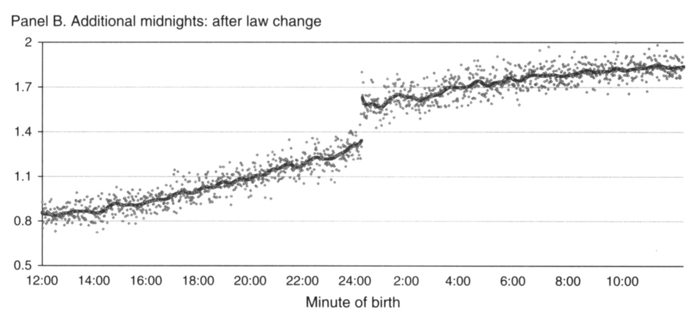

```{r setup, include=FALSE}
options(htmltools.dir.version = FALSE)
knitr::opts_chunk$set(
  fig.width=9, 
  fig.height=3.5, 
  fig.retina=3,
  out.width = "100%",
  cache = FALSE,
  echo = FALSE,
  message = FALSE, 
  warning = FALSE,
  hiline = TRUE
)
```


```{r packages}
library(tidyverse)
library(ggdag)
library(paletteer)
library(ggrepel)
library(wakefield)
library(huxtable)


# dubois colors
red = "#dc354a"
yellow = "#ecb025"
blue = "#213772"

# custom ggplot theme
theme_nice = function() {
  theme_minimal(base_family = "Archivo Narrow") +
    theme(panel.grid.minor = element_blank(),
          plot.background = element_rect(fill = "white", color = NA),
          plot.title = element_text(face = "bold"),
          axis.title = element_text(face = "bold"),
          strip.text = element_text(face = "bold", size = rel(0.8), hjust = 0),
          strip.background = element_rect(fill = "grey80", color = NA),
          legend.title = element_text(face = "bold"))
}

theme_set(theme_nice())

# palette
palette = MetBrewer::met.brewer(name = "Cross")

# stupid geom_label_repel problem
update_geom_defaults("label", list(family = "Fira Sans"))
update_geom_defaults("label_repel", list(family = "Fira Sans"))


# set seed
set.seed(1990)

```


class: left, middle
background-image: url("images/dubois-spiral-2.png")
background-position: right
background-size: contain

# `r rmarkdown::metadata$title`

### *`r rmarkdown::metadata$subtitle`*

### Professor `r rmarkdown::metadata$author` 

#### University of California, Davis

---


class: center
.large[
# Today's agenda
]

--
.box-1.large.sp-after[The causal revolution]

--
.box-2.large.sp-after[Natural experiments]

--
.box-3.large.sp-after[Regression discontinuities]

---


class: center, middle, inverse
# A brief, unfair history of social science research
---


# Garbage can models


.pull-left[
* for a long time there was a tendency to estimate **"garbage can" models**
* throw every variable under the sun into regression model, hope for the best
* in some cases, no pre-meditated *treatment* variable
]

.pull-right[
```{r}

```
]

---


# An empty-garbage-can model
  
  
.pull-left[
Some studies don't even control for confounds


From the dog ownership improves health article in the homework: 
      
["*A possible limitation was that the analyses were not adjusted for confounders.*"](https://www.ahajournals.org/doi/10.1161/CIRCOUTCOMES.119.005554)

]

.pull-right[
```{r, out.width="80%"}

```

]

---


# Causal inference


.pull-left[
* More recently: a greater emphasis on worrying about **causality**
* Recognition that confounds are lurking everywhere, and we should worry about them
* Recognition that **pipes** and **colliders** means we *shouldn't* just throw every variable into a model
]

.pull-right[
```{r}

```
]


---

# Improvements but obvious limits

--

.large[**IF**] we can correctly specify our model (i.e., control for all backdoors, leave front-doors open) we will identify the effect of X on Y

--

Easier said than done! Often there is some confound (like W) that we **know exists but can't measure**, or worse, **don't know exists at all**


```{r, out.width="70%", fig.align='center'}
dagify(Y ~ X + W + Z + G, 
       X ~ W + G, 
       Z ~ G,
       outcome = "Y", 
       exposure = "X", 
       latent = "W") %>% 
  ggdag_status() + theme_dag() + theme(legend.position = "none")
```


---


# The causal revolution


Hard to correctly specify the DAG and measure all the variables; what can we do?

--

Ideal - an experiment -- where *treatment is randomly assigned*; where *nothing causes treatment assignment* -- but this is rarely feasible


```{r,out.width="70%"}
dagify(Support ~ Ad + Age + Income + Race + Region + Religion +
         Parents + Media, 
       Income ~ Region + Parents, 
       Religion ~ Parents, 
       Media ~ Parents + Religion + Age + Region, 
       exposure = "Ad", 
       outcome = "Support") %>% 
  ggdag_status(text = FALSE, use_labels = "name") + theme_dag() + 
  theme(legend.position = "none") + 
  scale_fill_manual(values = wesanderson::wes_palettes$Darjeeling1, 
                     na.value = "grey20") + 
  scale_color_manual(values = wesanderson::wes_palettes$Darjeeling1, 
                     na.value = "grey20")
```

---

# Natural experiments


.pull-left[
Alternative - find moments, situations, or weird, freak occurrences where some group is exposed to some *treatment* .shout[by chance] while another group was not

These weird moments in history are called **natural experiments**
]


.pull-right[
```{r, out.width="80%"}

```

]


---


# A good (last) year for causality


2021 Nobel Prize winners in economics pioneered **quasi-experimental methods** -- using research designs that leverage *natural experiments*

.pull-left[
```{r, out.width="60%", fig.align='center'}
knitr::include_graphics("images/card-nobel.jpeg")
```

]

.pull-right[
```{r, out.width="60%", fig.align='center'}

```
]

---


class: center, middle, inverse
# Regression discontinuity
---


# Do gifted programs pay off? 


.pull-left[
* Millions of kids across the US placed in gifted programs
* Parents/society have to weigh pros and cons; is this worth doing? 
* For instance: does being in gifted program **increase** your chances of success later in life? 
]


.pull-right[
```{r,out.width="80%"}

```

]

???
Explain gifted
What does it mean to cause here?

---
  

# The (fake) data


Go out and collect data on people who were and were not in gifted:


```{r}
fake_students = r_data_frame(n = 1000, name, age, grade) %>% 
  mutate(test = runif(n = n())*100) %>% 
  mutate(gifted = ifelse(test >= 75, "yes", "no")) %>% 
  mutate(earnings = rgamma(n = n(), 2) * 20000 - 25000 * I(gifted == "yes") + 
           1000 * test)
knitr::kable(select(fake_students, Name, Age, Grade, gifted, earnings))
```


---


# The results


Big gifted program premium: `r scales::dollar(coef(lm(earnings ~ gifted, data = fake_students))[2])` more in earnings


```{r}
avgs = 
  fake_students %>% 
  group_by(gifted) %>% 
  summarise(earnings = round(mean(earnings), 0))
ggplot(fake_students, aes(x= gifted, y = earnings, 
                          color = gifted)) + 
  ggbeeswarm::geom_quasirandom(size = 2, alpha = .9) + 
  coord_flip() + 
  scale_y_continuous(labels = scales::dollar) + 
  scale_color_paletteer_d(palette = "nationalparkcolors::BlueRidgePkwy", 
                          direction = -1) + 
  theme_nice() + 
  theme(legend.position = "none") + 
  labs(y = "Current salary", x = "Was the respondent in gifted?") + 
  geom_label_repel(data = avgs, aes(label = paste0("Avg: ", scales::dollar(earnings))), 
                   size = 5, fontface = "bold", nudge_y = 30000, 
                   nudge_x = .2)
  
```

???
Does this mean gifted caused this, or even some of it?

---


# The problem


So many potential confounds, including ones that are really, really hard to measure (like .shout[ability]) and others that are .shout[unknown]


```{r}
dagify(earnings ~ gifted + family + location + ability + unknown, 
       gifted ~ family + location + ability + unknown, 
       exposure = "gifted", 
       outcome = "earnings", 
       latent = "ability") %>% 
  ggdag_status(text = FALSE, use_labels = "name") + theme_dag() + 
  theme(legend.position = "none")
```


---


# The solution

.pull-left[
To get into gifted you typically need a certain score on an aptitude/IQ test

Imagine that the **cutoff** score is 75/100; above you're in gifted, below you are not

How was that cutoff chosen?

]

.pull-right[
```{r, out.width="70%",fig.align='center'}

```

]


---


# The solution


The precise **cutoff** is completely arbitrary; could have been 74.5, or 76, or 80, or whatever

--

The *arbitrary* nature of the cutoff creates a **natural experiment**

--

A student who a 76 and a student who got a 34 are probably very different; if one makes more money than the other today, is that because of gifted? or other factors (.shout[ability]?)

--

But a student who got a 76 and one who got a 74 are probably interchangeable

--

Few points difference might be function of: .shout[random] error, luck, whatever


---


# The natural experiment


If we look *only* at students who scored close to the 75 cutoff we have the makings of a **natural experiment**

--

Around cutoff, essentially random whether you get treatment (gifted program) or not

--

“Natural experiments”: situations where some *thing* (often a rule) creates random assignment of treatment


---


# Looking around the cutoff


In analysis terms, (can be) simple: look only at students who scored close to 75, let's say +/- 2:

```{r, echo = TRUE}
subset_students = fake_students %>% 
  filter(test >= 73 & test <= 77) #<<
```


--

Then we estimate model on this group; let's also estimate in the full (confounded!) sample


```{r, echo = TRUE}
wrong_model = lm(earnings ~ gifted, data = fake_students)
discon_model = lm(earnings ~ gifted, data = subset_students)

```


---


# The results


Ouch! Looks like being in gifted actually **hurts** students in the long-run:

.scroll-output[
```{r}
huxreg("all students" = wrong_model, "students near cutoff" = discon_model, 
       statistics = "nobs")
```
]

---


# Visualize it


People with higher aptitude/training/ability/etc. better off today:

```{r}
ggplot(fake_students, aes(x = test, y = earnings)) + 
  geom_point(size = 2, alpha = .8) + 
  theme_nice() + 
  labs(x = "Score on IQ test", y = "Current salary") + 
  scale_y_continuous(labels = scales::dollar)
```


---


# The cutoff


```{r}
ggplot(fake_students, aes(x = test, y = earnings, 
                          color = gifted)) + 
  geom_point(size = 2, alpha = .8) + 
  theme_nice() + 
  labs(x = "Score on IQ test", y = "Current salary", 
       color = "Gifted?") + 
  scale_y_continuous(labels = scales::dollar) + 
  scale_color_paletteer_d(palette = "nationalparkcolors::BlueRidgePkwy", 
                          direction = -1) + 
  geom_vline(xintercept = 75, lty = 2, size = 2, color = "red")
```


---


# The natural experiment


```{r}
ggplot(fake_students, aes(x = test, y = earnings, 
                          color = gifted)) + 
  geom_point(size = 2, alpha = .8) + 
  theme_nice() + 
  labs(x = "Score on IQ test", y = "Current salary", 
       color = "Gifted?") + 
  scale_y_continuous(labels = scales::dollar) + 
  scale_color_paletteer_d(palette = "nationalparkcolors::BlueRidgePkwy", 
                          direction = -1) + 
  annotate(geom = "rect", xmin = 73, xmax = 77, ymin = -Inf, ymax = Inf, 
           fill = "coral3", alpha = .4)
```


---


# The discontinuity


These are the students who, **by chance**, just barely made it (or not) into gifted

```{r}
ggplot(fake_students, aes(x = test, y = earnings, 
                          color = gifted)) + 
  geom_point(size = 2, alpha = .8) + 
  theme_nice() + 
  labs(x = "Score on IQ test", y = "Current salary", 
       color = "Gifted?") + 
  scale_y_continuous(labels = scales::dollar) + 
  scale_color_paletteer_d(palette = "nationalparkcolors::BlueRidgePkwy", 
                          direction = -1) +
  coord_cartesian(xlim = c(73, 77))
```


---


# The discontinuity


On average, the students who *by chance* made it in make **less money**

```{r}
ggplot(fake_students, aes(x = test, y = earnings, 
                          color = gifted)) + 
  geom_point(size = 2, alpha = .8) + 
  theme_nice() + 
  labs(x = "Score on IQ test", y = "Current salary", 
       color = "Gifted?") + 
  scale_y_continuous(labels = scales::dollar) + 
  scale_color_paletteer_d(palette = "nationalparkcolors::BlueRidgePkwy", 
                          direction = -1) +
  coord_cartesian(xlim = c(73, 77)) + 
  geom_label_repel(data = tibble(test = 73.5, earnings = coef(discon_model)[1], 
                                 gifted = "no"), 
                   aes(label = paste("Avg earnings: ", scales::dollar(earnings)))) + 
  geom_label_repel(data = tibble(test = 76.5, 
                                 earnings = coef(discon_model)[1] + coef(discon_model)[2], 
                                 gifted = "yes"), 
                   aes(label = paste("Avg earnings: ", scales::dollar(earnings))))
```


---


# The payoff


.pull-left[
In the **naive** estimate we think gifted programs help students in the long-run; 

With the **discontinuity** we see the opposite: gifted hurts


*Arbitrary cutoff* gets us unconfounded estimates for free: no need to worry about backdoor paths
]

.pull-right[
```{r}

```

]

---

class: center, middle, inverse
# Other examples
---


# Moral hazard


* How much **moral hazard** is there in insurance? E.g., if your insurance covers 10k in services, will provider charge you $10k even if you only need 8k in services?

--

* Naive estimate: `lm(cost of service ~ insurance_coverage)`

--

* What's wrong with the naive estimate?


---


```{r, out.width="60%", fig.align='center'}

```


---

# Baby problems


* Insurance will cover two nights in a hospital after delivery

--

* But how long is "**a night**"? 

--

* Nights counted by number of *midnights* (*arbitrary cutoff*)

--

* 👶 born on Monday at 11:59pm = gets Tue + Wed in hospital

--

* 👶 born on Tuesday at 12:01am = gets Tue + Wed + Thur in hospital (by chance, get extra minimum coverage)


---


# Finding


1 in 4 babies born after midnight spend an *extra night in hospital* (💵💵💵), even when there is *no health benefit to doing so*


```{r, fig.align='center', out.width="70%"}

```


---


## Other examples: McNamara and the Whiz Kids


.pull-left[
What effect did bombing raids in Vietnam have on development? Problem: the places that *were* bombed are **very different** from the places that were never bombed

Decision to bomb based on scoring system. A **discontinuity** due to rounding: hamlet with score of 4.4999 gets a 4, hamlet with 4.5001 gets a 5
]

.pull-right[
```{r}

```

]

???
McNamara and whiz kids

---


# Big picture


Natural experiments are "strongest" causal tool, and regression discontinuity designs are probably the most convincing approach


--

Easy to implement; less worry about confounding; the tough part? Finding one! And collecting the data

--

Often the result of some rule, boundary, or some other random, **arbitrary** process having a sudden impact in the world

--


Premium on: *specific* knowledge of a particular region/area/issue


---


# 🚨 Your turn: 🧠🧠🧠 🚨


With the person to your right (or whatever):

.small[
1. Write down as many rules, demarcations, cutoffs, etc., out there in the world that you can think of. 

2. Can any of these create an opportunity for a natural experiment, where *something* happens to some people/countries/places but not to others as a result of this rule/cutoff/thing? 

3. What problem could that natural experiment help solve? In the gifted program case: the IQ test cutoff helps solve the problem of estimating the effect of gifted programs on future success. 

4. Post a summary in the Slack and if the idea is good enough I will steal it and publish it. 

]


```{r}
countdown::countdown(minutes = 15L, font_size = "2em")
```

---


class: center, middle, inverse
# No free lunch

--

Natural experiments are great but there is still reason to worry

--

If we find a good one, the thing we are trying to estimate might *unexpectedly* change (is this bad? depends)

--

People are **strategic**; if there's a rule out there that has consequences, they will do what they can to end up on the right side of it

---


# Limitations: changing estimates


By focusing on units near cutoff, our estimate subtly changes: 

--

* ~~effect of putting *a child* in gifted on future earnings~~

--

* effect of putting a child *with roughly 75 IQ* in gifted on earnings ✅


```{r, out.width="70%"}
ggplot(fake_students, aes(x = test, y = earnings, 
                          color = gifted)) + 
  geom_point(size = 2, alpha = .8) + 
  theme_nice() + 
  labs(x = "Score on IQ test", y = "Current salary", 
       color = "Gifted?") + 
  scale_y_continuous(labels = scales::dollar) + 
  scale_color_paletteer_d(palette = "nationalparkcolors::BlueRidgePkwy", 
                          direction = -1) + 
  annotate(geom = "rect", xmin = 73, xmax = 77, ymin = -Inf, ymax = Inf, 
           fill = "coral3", alpha = .4)
```


---

# Limitations: "sorting around the cutoff"


There is also a risk that if people *know* about the cutoff they will behave strategically in ways that **confound our estimate** 

--

Imagine that there is room to pressure/bully the school psychologist into turning a 74.9 into a 75 so little Timmy can be gifted

--


And image wealthier/better-connected/etc parents are better bullies than poor parents

--

In that case, being gifted is no longer as-if random for those close to the cutoff -- wealthy parents **cause** you to get over the cutoff


---


# Sorting around the cut-off


If parents can force almost-there kids into gifted, parents become a **backdoor path to earnings** (since your parents likely affect your earnings directly, or in other ways)


```{r, out.width="90%"}
dagify(earnings ~ gifted + parents, 
       gifted ~ parents, 
       exposure = "gifted", 
       outcome = "earnings") %>% 
  ggdag_status(text = FALSE, use_labels = "name") + theme_dag() + 
  theme(legend.position = "none")
```


---


# 🚨 Your turn: sorting around the cutoff 🚨


Think back to the arbitrary cutoff you came up with in the last exercise. Discuss again with your neighbor:


1. Could someone "game" or sort around that cutoff? 
2. What would that look like? 
3. And how could it confound your estimate / ruin the natural experiment? 


```{r}
countdown::countdown(minutes = 10L, font_size = "2em")
```
