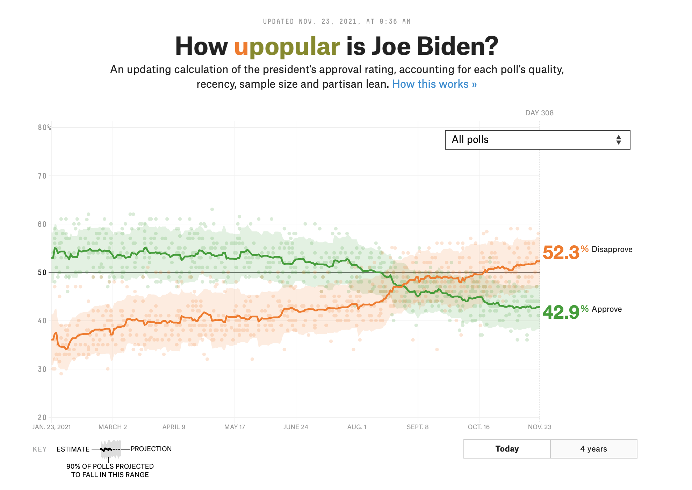
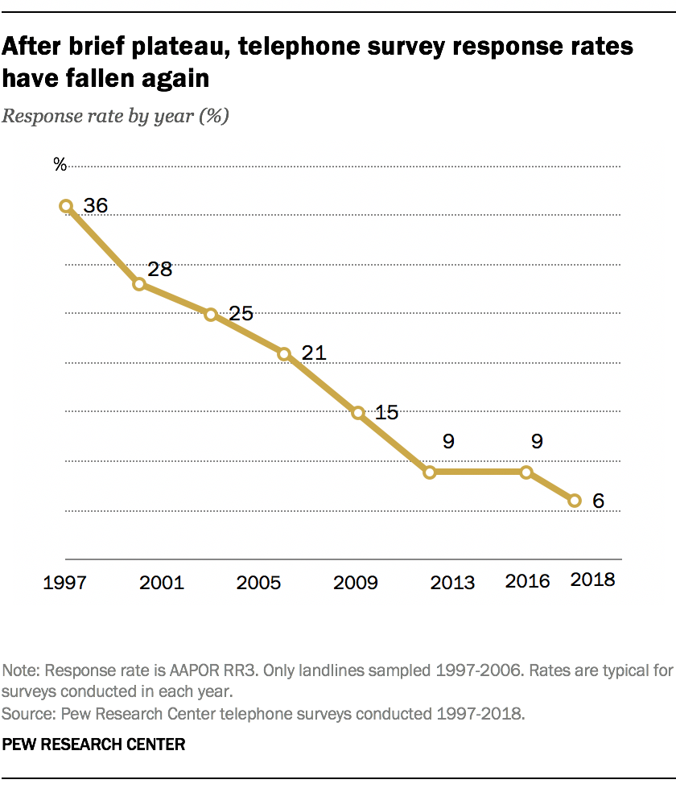

```{r setup, include=FALSE}
options(htmltools.dir.version = FALSE)
knitr::opts_chunk$set(
  fig.width=9, 
  fig.align = "center",
  fig.height=3.5, 
  fig.retina=3,
  out.width = "100%",
  cache = FALSE,
  echo = FALSE,
  message = FALSE, 
  warning = FALSE,
  hiline = TRUE
)
```


```{r packages}
library(tidyverse)
library(paletteer)
library(ggrepel)
library(huxtable)
library(socviz)
library(moderndive)

# dubois colors
red = "#dc354a"
yellow = "#ecb025"
blue = "#213772"

# custom ggplot theme
theme_nice = function() {
  theme_minimal(base_family = "Archivo Narrow") +
    theme(panel.grid.minor = element_blank(),
          plot.background = element_rect(fill = "white", color = NA),
          plot.title = element_text(face = "bold"),
          axis.title = element_text(face = "bold"),
          strip.text = element_text(face = "bold", size = rel(0.8), hjust = 0),
          strip.background = element_rect(fill = "grey80", color = NA),
          legend.title = element_text(face = "bold"))
}

theme_set(theme_nice())

# palette
palette = MetBrewer::met.brewer(name = "Cross")

# stupid geom_label_repel problem
update_geom_defaults("label", list(family = "Fira Sans"))
update_geom_defaults("label_repel", list(family = "Fira Sans"))


# set seed
set.seed(1990)

```


class: left, middle
background-image: url("images/dubois-spiral-2.png")
background-position: right
background-size: contain

# `r rmarkdown::metadata$title`

### *`r rmarkdown::metadata$subtitle`*

### Professor `r rmarkdown::metadata$author` 

#### University of California, Davis

---


class: center
.large[
# Today's agenda
]

--
.box-1.large.sp-after[Why are we uncertain?]

--
.box-2.large.sp-after[Sampling]

--
.box-3.large.sp-after[Good and bad samples]

---


class: center, middle, inverse
# Where things stand

--

So far: worrying about causality -- how can we *know* the effect of X on Y is not being confounded by something else?


--

Last bit: how **confident** are we in our estimates given that they *vary* from sample to sample? 


---


# Uncertainty in the wild


```{r, out.width="80%"}

```


???
uncertainty

---


# Uncertainty in the wild


```{r, out.width="80%"}
knitr::include_graphics("images/margin-of-error.jpeg")
```

???

---


# Uncertainty in the wild


The "bounds" in `geom_smooth` tells us something about how confident we should be in the line:

```{r}
ggplot(gapminder::gapminder, aes(x = gdpPercap, y = lifeExp)) + 
  geom_point(size = 2, alpha = .8, color = red) +
  geom_smooth(color = blue, fill = blue) + theme_nice() + 
  labs(x = "GDP per capita", y = "Life expectancy") + 
  scale_x_continuous(labels = scales::dollar)
```

---


class: center, middle, inverse
# Uncertainty

Polling error, margin of error, uncertainty bounds, etc., all help to *quantify* how uncertain we feel about some estimate

--

Vague sense that we are **uncertain** about what we are estimating


--

But *why* are we uncertain? And how can uncertainty be *quantified*? 


---


class: center, middle, inverse
# Why are we uncertain?
---


# Why are we uncertain?


.pull-left[
We rarely have all the data we care about

Instead, we have a **sample**, such as a survey, or a poll


Problem - each sample will look different, and give us a different answer to the question we are trying to answer
]

.pull-right[
```{r, fig.cap="Sample locations in Guatemala"}
knitr::include_graphics("images/MPP_map1.jpeg")
```

]


---


# Boring example: kids


How many children does the average American adult have?

--


Let's pretend there were only 2,867 people living in the USA, and they were all *perfectly* sampled in the `gss_sm` dataset

--

.scroll-output[
```{r}
gss_sm %>% 
  select(1, 3, 4, 5, 6, 7) %>% 
  sample_n(10) %>% 
  knitr::kable()
```
]


---


# Boring example: kids


How many children does the average American adult have? 

--

We can get the exact answer, since there are only 2,867 Americans, and they're all in our data: 

```{r, echo = TRUE}
gss_sm %>% 
  summarise(avg_kids = mean(childs, na.rm = TRUE)) #<<
```


---


# Sampling


Now imagine that instead of having data on every American, we only have a **sample** of 10 Americans

--

Why do we have a sample? Because interviewing every American is prohibitively costly

--

Same way a poll works: a **sample** to *estimate* American public opinion


---


# Sampling

We can pick one sample of 10 people from `gss_sm` using the `rep_sample_n()` function from `moderndive`:

--

`size` = size of the sample; `reps` = number of samples

--

.scroll-output[
```{r, echo = TRUE}
gss_sm %>% 
  rep_sample_n(size = 10, reps = 1) #<<
```
]


---

# Sample estimate


We can then calculate the average number of kids *among that sample of 10 people* (our **sample estimate**)

--

```{r, echo = TRUE}
gss_sm %>% 
  rep_sample_n(size = 10, reps = 1) %>% 
  summarise(avg_kids = mean(childs, na.rm = TRUE)) #<<
```


---

# The trouble with samples


Problem: each **sample** will give you a different **estimate**

```{r, echo = TRUE}
gss_sm %>% 
  rep_sample_n(size = 10, reps = 1) %>% 
  summarise(avg_kids = mean(childs, na.rm = TRUE)) #<<
```


---


# The trouble with samples


How much will these sample estimates vary from sample to sample? Instead of taking one sample of 10, let's take 1,000 samples of 10:

--

.scroll-output[
```{r, echo = TRUE}
kids_10 = gss_sm %>% 
  rep_sample_n(size = 10, reps = 1000) %>% #<<
  summarise(avg_kids = mean(childs, na.rm = TRUE))
kids_10
```
]

---


# The trouble with samples

Across 1,000 samples of 10 people each, the *estimated* average number of kids can vary between `r min(kids_10$avg_kids)` and `r max(kids_10$avg_kids)`!! Remember, the true average is `r round(mean(gss_sm$childs, na.rm = TRUE), 2)`

```{r}
kids_10 = gss_sm %>% 
  rep_sample_n(size = 10, reps = 1000) %>% #<<
  summarise(avg_kids = mean(childs, na.rm = TRUE)) %>% 
  mutate(size = "10")

ggplot(kids_10, aes(x = avg_kids)) + 
  geom_histogram(fill = red, color = "white") + 
  theme_nice() + 
  labs(x = "Average number of kids in sample") + 
  geom_vline(xintercept = mean(gss_sm$childs, na.rm = TRUE), lty = 2, color = blue, 
             size = 3)
```


---


# 🚨 Your turn: Views on abortion 🚨


Pretend the `gss_abortion` dataset from `stevedata` captures how every American feels about abortion:

--

1. Find the average level of support for one of the abortion questions. 

--

2. Now, take 1,000 samples each of size 10 and calculate the average for each sample. How much do your estimates vary from sample to sample? What's the min/max?

--

3. Plot your sample estimates as a `geom_histogram` or `geom_density`.


```{r}
countdown::countdown(minutes = 10L, font_size = "2em")
```


---


class: center, middle, inverse
# Why are we **uncertain**?

--

We only ever have a *sample* (10 random Americans), but we’re interested in something bigger: a *population* (the whole of `gss_sm`)

--

Polls often ask a couple thousand people (if that!), and try to infer something bigger

--

The problem: Each sample is going to give us different results!

--

Especially worrisome: some estimates will be **way** off, totally by chance


---


# Not just boring examples

--

This is also a problem for **regression**, since every regression estimate is based on a sample

--

What's the relationship between sex and vote choice among all Americans?

.scroll-output[
```{r, echo = TRUE}
mod1 = lm(obama ~ sex, data = gss_sm)
tidy(mod1)
```
]


---


# Regression estimates vary too


Estimated relationships can vary a lot from population relationship: `r round(coef(mod1)[2],3)`

This means our effect estimates could be wrong not just from *confounding* but also from *sampling*


```{r}
gss_sm %>% 
  rep_sample_n(size = 30, reps = 10) %>% 
  nest(-replicate) %>% 
  mutate(model = map(data, ~lm(obama ~ sex, data = .)),
         tidied = map(model, tidy)) %>%
  unnest(tidied) %>% 
  filter(term == "sexFemale") %>% 
  select(replicate, term, estimate) %>% 
  knitr::kable()
```


---

# What's going on here? terminology


```{r}
tribble(~Term, ~Meaning, ~Example,
        "Population", "All of the instances of the thing we care about", "American adults",
        "Population parameter", "The thing about the population we want to know", "Average number of kids",
        "Sample", "A subset of the population", "A survey",
        "Sample estimate", "Our estimate of the population parameter", "Average number of kids in survey") %>% 
  knitr::kable()
```


---


# The solution


So how do we know if our **sample estimate** is close to the **population parameter**?

--

How do we know we didn't get one of those extremely-off estimates?

--

Turns out that if a sample is random, representative, and large...

--

...then the **sample estimate** will be pretty close to the **population parameter**


---


# Law of large numbers


With a small sample, estimates can vary a lot:

```{r}
reps = tibble(samples = c(20, 100, 500, 1000)) %>% 
  mutate(reps = map(.x = samples, .f = ~ 
                      rep_sample_n(tbl = gss_sm, size = .x, reps = 1e3))) %>% 
  unnest(reps) %>% 
  group_by(samples, replicate) %>% 
  summarise(avg_kids = mean(childs, na.rm = TRUE))


ggplot(filter(reps, samples == 20), 
       aes(x = avg_kids, fill = factor(samples))) +  
  geom_density(alpha = .8, color = "white") +
  labs(x = "Average number of kids in sample", 
       y = NULL, fill = "Size of sample:") + 
  theme(axis.text.y = element_blank(), 
        legend.position = "bottom") + 
  scale_fill_viridis_d(option = "rocket", end = .8) + 
  geom_vline(xintercept = mean(gss_sm$childs, na.rm = TRUE), 
             lty = 1, color = red, size = 3, alpha = .9) + 
  coord_cartesian(ylim = c(0, 7)) + 
  geom_label(aes(x = 2.25, y = 6, label = "Population average = 1.85"), 
             fill = "white", color = red, fontface = "bold")

```


---

# Law of large numbers


As the sample size (N) increases, estimates begin to converge:

```{r}
ggplot(filter(reps, samples == 20), 
       aes(x = avg_kids, fill = factor(samples))) +  
  geom_density(alpha = .8, color = "white") +
  labs(x = "Average number of kids in sample", 
       y = NULL, fill = "Size of sample:") + 
  theme(axis.text.y = element_blank(), 
        legend.position = "bottom") + 
  scale_fill_viridis_d(option = "rocket", end = .8) + 
  geom_vline(xintercept = mean(gss_sm$childs, na.rm = TRUE), 
             lty = 1, color = red, size = 3, alpha = .9) + 
  coord_cartesian(ylim = c(0, 7)) + 
  geom_label(aes(x = 2.25, y = 6, label = "Population average = 1.85"), 
             fill = "white", color = red, fontface = "bold") + 
  geom_density(data = filter(reps, samples == 100),
               alpha = .8, color = "white") 
```

---

# Law of large numbers


They become more concentrated around the population average...

```{r}
ggplot(filter(reps, samples == 20), 
       aes(x = avg_kids, fill = factor(samples))) +  
  geom_density(alpha = .8, color = "white") +
  labs(x = "Average number of kids in sample", 
       y = NULL, fill = "Size of sample:") + 
  theme(axis.text.y = element_blank(), 
        legend.position = "bottom") + 
  scale_fill_viridis_d(option = "rocket", end = .8) + 
  geom_vline(xintercept = mean(gss_sm$childs, na.rm = TRUE), 
             lty = 1, color = red, size = 3, alpha = .9) + 
  coord_cartesian(ylim = c(0, 7)) + 
  geom_label(aes(x = 2.25, y = 6, label = "Population average = 1.85"), 
             fill = "white", color = red, fontface = "bold") + 
  geom_density(data = filter(reps, samples == 100),
               alpha = .8, color = "white") +
  geom_density(data = filter(reps, samples == 500),
               alpha = .8, color = "white")
```

---


# Law of large numbers

And eventually it becomes very unlikely the sample estimate is way off

```{r}
ggplot(filter(reps, samples == 20), 
       aes(x = avg_kids, fill = factor(samples))) +  
  geom_density(alpha = .8, color = "white") +
  labs(x = "Average number of kids in sample", 
       y = NULL, fill = "Size of sample:") + 
  theme(axis.text.y = element_blank(), 
        legend.position = "bottom") + 
  scale_fill_viridis_d(option = "rocket", end = .8) + 
  geom_vline(xintercept = mean(gss_sm$childs, na.rm = TRUE), 
             lty = 1, color = red, size = 3, alpha = .9) + 
  coord_cartesian(ylim = c(0, 7)) + 
  geom_label(aes(x = 2.25, y = 6, label = "Population average = 1.85"), 
             fill = "white", color = red, fontface = "bold") + 
  geom_density(data = filter(reps, samples == 100),
               alpha = .8, color = "white") +
  geom_density(data = filter(reps, samples == 500),
               alpha = .8, color = "white") + 
  geom_density(data = filter(reps, samples == 1000),
               alpha = .8, color = "white")
```


---


# This works for regression estimates, too


Coefficient estimates *also* become more precise as sample size increases:

```{r}
obama_50 = gss_sm %>% 
  select(obama, sex, id) %>% 
  rep_sample_n(size = 50, reps = 1000) %>% 
  nest(-replicate) %>% 
  mutate(model = map(data, ~lm(obama ~ sex, data = .)),
         tidied = map(model, tidy)) %>%
  unnest(tidied) %>% 
  filter(term == "sexFemale") %>% 
  select(replicate, term, estimate) %>% 
  mutate(size = "N = 50")

obama_300 = gss_sm %>% 
  select(obama, sex, id) %>% 
  rep_sample_n(size = 300, reps = 1000) %>% 
  nest(-replicate) %>% 
  mutate(model = map(data, ~lm(obama ~ sex, data = .)),
         tidied = map(model, tidy)) %>%
  unnest(tidied) %>% 
  filter(term == "sexFemale") %>% 
  select(replicate, term, estimate) %>% 
  mutate(size = "N = 300")

bind_rows(obama_50, obama_300) %>% 
  mutate(size = fct_rev(size)) %>% 
  ggplot(aes(x = estimate)) + 
  geom_density(fill = red, color = "white") + 
  theme_nice() + 
  facet_wrap(vars(size)) +
  labs(x = NULL, 
       title = "Sample coefficient estimates for lm(obama ~ sex)") + 
  geom_vline(xintercept = coef(mod1)[2], lty = 2, color = blue, 
             size = 3) + 
  coord_cartesian(xlim = c(-1, 1))
```


---

# What's going on?


The larger our sample, the less likely it is that our estimate (average number of kids, the effect of sex on vote choice, etc.) is way off

--

This is because as sample size increases, sample estimates tend to converge on the population parameter

--

Next week = we'll see how to quantify uncertainty based on this tendency

--

Intuitive = the more data we have, the less *uncertain* we should feel

--

But .shout[this only works if we have a *good* sample]


---


# Good and bad samples

.pull-left[
There are good and bad samples in the world


Good sample = representative of the population and unbiased

Bad sample = the opposite of a good sample

What does this mean?
]


.pull-right[
```{r, fig.cap="Good samples"}
knitr::include_graphics("images/samples.jpg")
```
]


---


# When sampling goes wrong


Imagine that in our quest to find out how many kids the average American has, we do telephone surveys

--

Imagine that younger people are less likely to have a landline than older people, so few young people make it onto our survey

--

what happens to our estimate? 


---


# When sampling goes wrong


We can simulate this by again pretending `gss_sm` is the whole of the US

--

Let's imagine the extreme scenario where no one under 25 makes it into the survey:


```{r, echo = TRUE, eval = FALSE}
gss_sm %>% 
  filter(age >= 25) %>% #<<
  rep_sample_n(size = 10, reps = 1000) %>% 
  summarise(avg_kids = mean(childs, na.rm = TRUE))
```


---


# When sampling goes wrong


```{r}
gss_sm %>% 
  filter(age >= 25) %>% #<<
  rep_sample_n(size = 50, reps = 1000) %>% 
  summarise(avg_kids = mean(childs, na.rm = TRUE)) %>% 
  ggplot(aes(x = avg_kids)) + 
  geom_density(fill = red, color = "white") + 
  theme_nice() + 
  labs(x = "Average number of kids in sample", 
       title = "Sample size: 50") + 
  geom_vline(xintercept = mean(gss_sm$childs, na.rm = TRUE), lty = 2, color = blue, 
             size = 3) + 
  coord_cartesian(xlim = c(0, 4))
```

---


# When sampling goes wrong

As sample size increases, variability of estimates will still decrease

```{r}
gss_sm %>% 
  filter(age >= 25) %>% #<<
  rep_sample_n(size = 500, reps = 1000) %>% 
  summarise(avg_kids = mean(childs, na.rm = TRUE)) %>% 
  ggplot(aes(x = avg_kids)) + 
  geom_density(fill = red, color = "white") + 
  theme_nice() + 
  labs(x = "Average number of kids in sample", 
       title = "Sample size: 500") + 
  geom_vline(xintercept = mean(gss_sm$childs, na.rm = TRUE), lty = 2, color = blue, 
             size = 3) + 
  coord_cartesian(xlim = c(0, 4))
```

---


# When sampling goes wrong

But estimates will be **biased**, regardless of sample size

```{r}
gss_sm %>% 
  filter(age >= 25) %>% #<<
  rep_sample_n(size = 1000, reps = 1000) %>% 
  summarise(avg_kids = mean(childs, na.rm = TRUE)) %>% 
  ggplot(aes(x = avg_kids)) + 
  geom_density(fill = red, color = "white") + 
  theme_nice() + 
  labs(x = "Average number of kids in sample", 
       title = "Sample size: 1000") + 
  geom_vline(xintercept = mean(gss_sm$childs, na.rm = TRUE), lty = 2, color = blue, 
             size = 3) + 
  coord_cartesian(xlim = c(0, 4))
```

---

# What's going on?


The sample is *not representative* of the population 
(the young people are missing)

--

This *biases* our estimate of the population parameter

--

*Randomness* is key = not everyone has a similar chance of ending up in the sample


---


# A big problem!


```{r, out.width="50%",fig.align='center'}

```

---


# 🚨 Your turn: bias the polls 🚨


Using the `gss_abortion` data again, imagine you are an evil pollster: 


1. Think about who you would have to exclude from the data to create estimates that benefit the pro-choice and pro-life side of the abortion debate. 


2. Show that even as the sample size increases and estimate variability decreases, we still get biased results.


```{r}
countdown::countdown(minutes = 10L)
```


---


# Key takeaways

There is reason to worry that estimates based on samples could be wrong, since even good samples can produce way-out-there estimates

--

The tendency for sample estimates to approach the population parameter as sample size increases (the *law of large numbers*) saves us

--

This makes sense: more data, more certain of the pattern

--

But it all depends on whether we have a random, representative (good) sample; no amount of data in the world will correct for sampling bias
