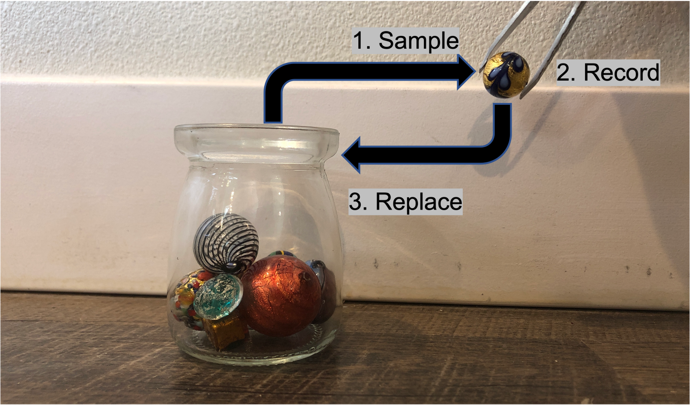
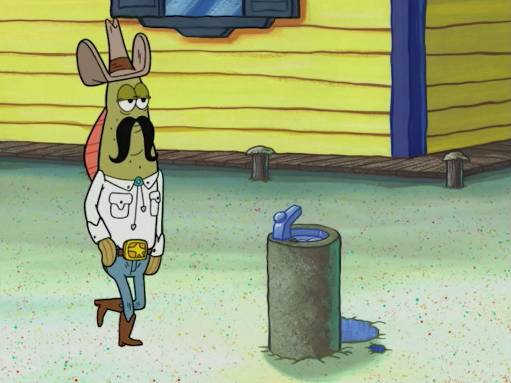

```{r setup, include=FALSE}
options(htmltools.dir.version = FALSE)
knitr::opts_chunk$set(
  fig.width=9, 
  fig.height=3.5, 
  fig.retina=3,
  out.width = "100%",
  cache = FALSE,
  echo = FALSE,
  message = FALSE, 
  warning = FALSE,
  hiline = TRUE
)
```


```{r packages}
library(tidyverse)
library(paletteer)
library(ggrepel)
library(huxtable)
library(socviz)
library(moderndive)

# dubois colors
red = "#dc354a"
yellow = "#ecb025"
blue = "#213772"

# custom ggplot theme
theme_nice = function() {
  theme_minimal(base_family = "Archivo Narrow") +
    theme(panel.grid.minor = element_blank(),
          plot.background = element_rect(fill = "white", color = NA),
          plot.title = element_text(face = "bold"),
          axis.title = element_text(face = "bold"),
          strip.text = element_text(face = "bold", size = rel(0.8), hjust = 0),
          strip.background = element_rect(fill = "grey80", color = NA),
          legend.title = element_text(face = "bold"))
}

theme_set(theme_nice())

# palette
palette = MetBrewer::met.brewer(name = "Cross")

# stupid geom_label_repel problem
update_geom_defaults("label", list(family = "Fira Sans"))
update_geom_defaults("label_repel", list(family = "Fira Sans"))


# set seed
set.seed(1990)

```


class: left, middle
background-image: url("images/dubois-spiral-2.png")
background-position: right
background-size: contain

# `r rmarkdown::metadata$title`

### *`r rmarkdown::metadata$subtitle`*

### Professor `r rmarkdown::metadata$author` 

#### University of California, Davis

---


class: center
.large[
# Today's agenda
]

--
.box-1.large.sp-after[Quantifying uncertainty]

--
.box-2.large.sp-after[The confidence interval]

--
.box-3.large.sp-after[Are we sure it's not zero?]

---


class: center, middle, inverse
# Where are we at? 
---


# The problem

We know our analysis is based on samples, and different samples give different answers: 


```{r}
gss_sm %>% 
  rep_sample_n(size = 10, reps = 1000) %>% 
  group_by(replicate) %>% 
  summarise(childs = mean(childs, na.rm = TRUE)) %>% 
  select(`Sample` = replicate, `Avg. num of kids in sample` = childs) %>% 
  knitr::kable(digits = 2)
```


---


# The way out


Turns out that if our samples are **representative** of the population, then estimates from **large** samples will tend to be pretty damn close

--

So if sample is good ✅ and "big" ✅ then most of the time we'll be OK ✅


```{r, out.width="80%"}
kids = crossing(n = c(10, 20, 50, 100, 200, 500)) %>% 
  mutate(samples = map(.x = n, ~rep_sample_n(tbl = gss_sm, size = .x, reps = 1000))) %>% 
  unnest(samples) %>% 
  group_by(n, replicate) %>% 
  summarise(childs = mean(childs, na.rm = TRUE))

ggplot(kids, aes(x = childs)) + 
  geom_density(fill = red, alpha = .9, color = "white") + 
  facet_wrap(vars(n)) + 
  theme_nice() + 
  geom_vline(xintercept = mean(gss_sm$childs, na.rm = TRUE), 
             lty = 1, size = 1, color = blue) + 
  labs(x = "Distribution of sample average # of kids")
```


---


class: center, middle, inverse
# But this is weird

--

We’ve shown that if we take many (large) samples, most of the averages of those samples will be close to population mean

--

But in real life we only ever have one sample (e.g., one poll)

--

How do we get a sense for uncertainty in **our one sample**?


---


# Two approaches


.pull-left[
❌ ~~Statistical theory~~

* Make assumptions about distribution of samples from population
* Design test based on those assumptions (t-test, z-test, etc.)
]

.pull-right[
✅ Simulation

* Simulate different samples that **look like ours**
* Use distribution of simulated samples to quantify uncertainty
]

**Simulation** often get you to the same place as **theory**; but often it is better!

---

# How to simulate

--

Taking lots of samples of size 20 $\rightarrow$ uncertainty in a sample of 20

```{r, echo = TRUE, eval = FALSE}
gss_sm %>%
  rep_sample_n(`size = 20`, reps = 1000) # size is smaller than dataset
```

--

So to simulate uncertainty in our sample of size N, just take many samples of size N, **with replacement**


```{r, echo = TRUE, eval = FALSE}
gss_sm %>% 
  rep_sample_n(`size = nrow(gss_sm)`, reps = 1000, `replace = TRUE`)
```

.small[
Note: `nrow(DATA)` tells you how many observations in data object
]

---

# "With replacement?"


.pull-left[
If we have a dataset of 2,867 observations and take a sample of that size (2,867) we'll just get back the original dataset!


Sampling **with replacement** means once we draw an observation it goes back into the dataset

Each observation can appear **multiple times** in a sample
]

.pull-right[
```{r}

```

]

---


# Sampling with and without replacement

If we were sampling .shout[4] of these delicious fruits: 

```{r}
fruits = c("Mango", "Pineapple", "Banana", "Blackberry")
fruits
```

--


It would look like this, with and without replacement:

```{r}
set.seed(1990)
tibble(`Sample, no replace` = sample(fruits, size = 4),
       `Sample, replace` = sample(fruits, size = 4, replace = TRUE)) %>% 
  t() %>% 
  knitr::kable()
  
```


---


# Bootstrapping


.pull-left[
* Generating many, **same-sized** samples with replacement is called **bootstrapping**
* Replacement lets us generate samples that randomly differ from ours
* Use the distribution of bootstrapped samples to quantify uncertainty
]


.pull-right[
```{r, fig.cap="Only one sample? Pull yourself up by your bootstraps!"}

```
]


---


# Back to the damn kids


How uncertain should we be of our estimate of the avg. number of kids in the US, Given that it's based on our one sample, `gss_sm`? We can bootstrap:

.scroll-output[
```{r, echo = TRUE}
boot_kids = gss_sm %>% 
  rep_sample_n(size = nrow(gss_sm), reps = 1000, replace = TRUE) %>% #<<
  summarise(avg_kids = mean(childs, na.rm = TRUE))

boot_kids
```
]


---


# The distribution of bootstrapped estimates

.blue[Blue] is our estimate, .red[red] is how much estimates might vary across bootstrapped samples that **look like ours**

```{r, out.width="90%"}
ggplot(boot_kids, aes(x = avg_kids)) + 
  geom_histogram(fill = red, color = "white") + 
  theme_nice() + 
  labs(x = "Average number of kids across bootstraps") + 
  geom_vline(xintercept = mean(gss_sm$childs, na.rm = TRUE), size = 2.5, 
             color = blue)
```


---


class: middle, center, inverse
# Quantifying uncertainty
---


# How to quantify uncertainty?

.pull-left[
The red histogram is nice, but how can we communicate uncertainty in our estimates in a pithy, more comparable way?

Three approaches:

* The standard error
* The confidence interval
* Statistical significance
]


.pull-right[
```{r}
ggplot(boot_kids, aes(x = avg_kids)) + 
  geom_histogram(fill = red, color = "white") + 
  theme_nice() + 
  labs(x = "Average number of kids across bootstraps") + 
  geom_vline(xintercept = mean(gss_sm$childs, na.rm = TRUE), size = 2.5, 
             color = blue)
```
]

---

# The standard error

As we learned so long ago, one way to measure the "spread" of a distribution (i.e., how much a variable **varies**), is with the *standard deviation*


--

This is also called the **standard error**, or the **margin of error**

--

.pull-left[
```{r, echo = TRUE}
boot_kids %>% 
  summarise(mean = mean(avg_kids), 
            standard_error = sd(avg_kids)) #<<
```
]

--

.pull-right[
Best guess? About 1.85 kids, +/- 2 standard errors

This is what you see in the news! That +/- polling/margin of error
]


---


# The confidence interval


Another way is to look at where most of the estimates fall; this is called the **confidence interval** and it represents our "best guess" of what we're trying to estimate


```{r, out.width="80%"}
ggplot(boot_kids, aes(x = avg_kids)) + 
  geom_histogram(fill = red, color = "white") + 
  theme_nice() + 
  labs(x = "Average number of kids across bootstraps") +
  annotate(geom = "rect", 
           xmin = quantile(boot_kids$avg_kids, probs = c(.025)), 
           xmax = quantile(boot_kids$avg_kids, probs = c(.975)), 
           ymin = 0, ymax = Inf, 
           alpha = .5, fill = yellow)
```


---


# How big to make the interval?


You could report (for example) where the middle `r kableExtra::text_spec("50%", color = red, bold = TRUE)` of bootstraps fall, or (for example) where the middle `r kableExtra::text_spec("95%", color = yellow, bold = TRUE)` of bootstraps fall, but there are **tradeoffs**!


```{r, out.width="80%"}
ggplot(boot_kids, aes(x = avg_kids)) + 
  geom_histogram(color = "white") + 
  theme_nice() + 
  labs(x = "Average number of kids across bootstraps") +
  annotate(geom = "rect", 
           xmin = quantile(boot_kids$avg_kids, probs = c(.025)), 
           xmax = quantile(boot_kids$avg_kids, probs = c(.975)), 
           ymin = 0, ymax = Inf, 
           alpha = .5, fill = yellow) + 
  annotate(geom = "rect", 
           xmin = quantile(boot_kids$avg_kids, probs = c(.25)), 
           xmax = quantile(boot_kids$avg_kids, probs = c(.75)), 
           ymin = 0, ymax = Inf, 
           alpha = .5, fill = red)
```


---


# The tradeoff

* You are .red[50%] "confident" that avg. number of kids could vary between `r round(quantile(boot_kids$avg_kids, probs = c(.25)), 2)` and `r round(quantile(boot_kids$avg_kids, probs = c(.75)), 2)`. Narrower range! But low confidence!

* You are .blue[95%] "confident" that avg. number of kids could vary between `r round(quantile(boot_kids$avg_kids, probs = c(.025)), 2)` and `r round(quantile(boot_kids$avg_kids, probs = c(.975)), 2)`. Higher range! But higher confidence!


```{r, out.width="60%"}
ggplot(boot_kids, aes(x = avg_kids)) + 
  geom_histogram(color = "white") + 
  theme_nice() + 
  labs(x = "Average number of kids across bootstraps") +
  annotate(geom = "rect", 
           xmin = quantile(boot_kids$avg_kids, probs = c(.025)), 
           xmax = quantile(boot_kids$avg_kids, probs = c(.975)), 
           ymin = 0, ymax = Inf, 
           alpha = .5, fill = yellow) + 
  annotate(geom = "rect", 
           xmin = quantile(boot_kids$avg_kids, probs = c(.25)), 
           xmax = quantile(boot_kids$avg_kids, probs = c(.75)), 
           ymin = 0, ymax = Inf, 
           alpha = .5, fill = red)
```


---


# How big to make the interval?


Convention is to look at the middle **95%** of the distribution, i.e., where do 95% of the bootstrap estimates fall? We can use the `quantile()` function to get here


```{r, echo = TRUE}
boot_kids %>% 
  summarise(low = quantile(avg_kids, .025), # middle 95% means lower bound is .025
            mean = mean(avg_kids), 
            high = quantile(avg_kids, .975)) # middle 95% means upper bound is .975
```


---

# Mirrors of one another

The standard error and confidence interval are actually telling you the same thing -- A 95% confidence interval is roughly equal to the Estimate +/- 1.96 $\times$ standard error

--


.pull-left[
```{r, echo = TRUE}
boot_kids %>% 
  summarise(low = quantile(avg_kids, .025),
            mean = mean(avg_kids), 
            high = quantile(avg_kids, .975))
```
]


.pull-right[
```{r, echo = TRUE}
boot_kids %>% 
  summarise(mean = mean(avg_kids), standard_error = sd(avg_kids)) %>% 
  mutate(low = mean - 1.96 * standard_error, 
         high = mean + 1.96 * standard_error) %>% 
  select(low, mean, high)
```
]

---

# 🚨 Your turn: polling the death penalty 🚨

Use the `issues` data, and: 


1. Pick a state of your choosing. What proportion of respondents support the death penalty in that state? 

2. OK, but how certain are you of that? Generate 1,000 bootstraps and plot the distribution. 

3. Calculate the standard error and the 95% confidence interval of your best guess. Convince yourself the two can be made equivalent. 


```{r}
countdown::countdown(minutes = 10L, font_size = "2em")
```


---


# Bootstrap works for regression, too


Say we wanted to know the relationship between number of kids and age:

--

```{r, echo = TRUE}
lm(childs ~ age, data = gss_sm) %>% 
  huxreg("Number of kids" = .)
```


---


# Bootstrap regression


But our estimate is from a sample; we should be uncertain; bootstrap to the rescue:

--

```{r}
boot_lm_kids = gss_sm %>% 
  rep_sample_n(size = nrow(gss_sm), reps = 1000, replace = TRUE) %>% 
  nest(data = -replicate) %>% 
  mutate(model = data %>% map(.x = ., .f = ~lm(childs ~ age, data = .x))) %>% 
  mutate(results = map(model, tidy)) %>% 
  unnest(results) %>% 
  ungroup() %>% 
  filter(term == "age") 

boot_lm_kids %>% 
  select(`Bootstrap` = replicate, `Coefficient` = term, Estimate = estimate) %>%
  slice(1:10) %>% 
  knitr::kable(digits = 4)
```


---


# Regression uncertainty


How uncertain is our estimate of `childs ~ age` vary? Look at the standard error


```{r, echo = FALSE}
boot_lm_kids %>% 
  summarise(mean = mean(estimate), 
            standard_error = sd(estimate))
```


You might report it is .0345, +/- .002

---


# Connecting the dots


Notice! This is what the (NUMBERS) mean in the regression table; they are the **standard error of the coefficient estimate**


.pull-left[
```{r, echo = FALSE}
boot_lm_kids %>% 
  summarise(mean = mean(estimate), 
            standard_error = sd(estimate))
```
]


.pull-right[
```{r}
lm(childs ~ age, data = gss_sm) %>% 
  huxreg("Number of kids" = ., statistics = "nobs") %>% 
  map_background_color(-(1:3), -1, by_regex(
        "\\(" = "yellow"
      ))
```

]


---


# Regression uncertainty


We can also look at the 95% confidence interval -- so we are 95% "confident" the effect of age on the number of children a person has is between .031 and .038


```{r, out.width="90%"}
low = quantile(boot_lm_kids$estimate, probs = c(.025))
hi = quantile(boot_lm_kids$estimate, probs = c(.975))
ggplot(boot_lm_kids, aes(x = estimate)) + 
  geom_histogram(fill = red, color = "white") + 
  theme_nice() + 
  labs(x = "Estimates of lm(childs ~ age)") +
  annotate(geom = "rect", 
           xmin = low, 
           xmax = hi, 
           ymin = 0, ymax = Inf, 
           alpha = .5, fill = yellow) + 
  geom_label(data = tibble(estimate = .034, 
                                 count = 90, 
                           label = glue::glue("95% CI: ({round(low, 3)}, {round(hi, 3)})")), 
                   aes(y = count, label = label), 
                   family = "Fira Sans", size = 7)
```


---


class: center, middle, inverse
# Is it different from zero?
---


# How much should we worry?


So even if we causally identify the effect of X on Y, we will still have sampling uncertainty

--

How much should we worry about this? 

--


Imagine we run an experiment on TV ads, calculate the effect of the treatment on voter turnout, and the 95% confidence interval for that effect

---


# How much should we worry?


Three scenarios for the results: same effect size, different *uncertainties* 


```{r}
scens = tribble(~scenario, ~low, ~estimate, ~high, 
        "Small range", 8, 10, 12,
        "Big range", 1, 10, 19,
        "Crosses zero", -2, 10, 22) %>% 
  mutate(scenario = fct_rev(fct_relevel(scenario, "Small range", "Big range", "Crosses zero")))

ggplot(scens, aes(x = scenario, 
                  y = estimate, ymin = low, ymax = high, 
                  color = scenario)) + 
  geom_pointrange(size = 1) + 
  coord_flip() + 
  geom_hline(yintercept = 0, lty = 2) + 
  theme_nice() + 
  theme(legend.position = "none", 
        axis.text.y = element_blank(), 
        axis.ticks.y = element_blank()) + 
  labs(y = "Estimated increase in voter turnout", 
       x = NULL) + 
  scale_y_continuous(labels = scales::percent_format(scale = 1)) + 
  scale_color_manual(values = c(red, blue, yellow)) +  
  geom_label_repel(aes(label = scenario), size = 6)
```


---


# How much should we worry?


* `r kableExtra::text_spec("Small range", color = yellow, bold = TRUE)`: great! Effect is precise; ads are worth it!

--

* `r kableExtra::text_spec("Big range", color = blue, bold = TRUE)`: not great! Effect could be *tiny*, or *huge*; are the ads worth it? At least we know they help

--

* `r kableExtra::text_spec("Crosses zero", color = red, bold = TRUE)`: awful! Ads could work (+), they could do nothing (0), or they could be counterproductive (-)


```{r, out.width="60%"}
scens = tribble(~scenario, ~low, ~estimate, ~high, 
        "Small range", 8, 10, 12,
        "Big range", 1, 10, 19,
        "Crosses zero", -2, 10, 22) %>% 
  mutate(scenario = fct_rev(fct_relevel(scenario, "Small range", "Big range", "Crosses zero")))

ggplot(scens, aes(x = scenario, 
                  y = estimate, ymin = low, ymax = high, 
                  color = scenario)) + 
  geom_pointrange(size = 1) + 
  coord_flip() + 
  geom_hline(yintercept = 0, lty = 2) + 
  theme_nice() + 
  theme(legend.position = "none", 
        axis.text.y = element_blank(), 
        axis.ticks.y = element_blank()) + 
  labs(y = "Estimated increase in voter turnout", 
       x = NULL) + 
  scale_y_continuous(labels = scales::percent_format(scale = 1)) + 
  scale_color_manual(values = c(red, blue, yellow)) +  
  geom_label_repel(aes(label = scenario), size = 6)
```

---


# Crossing zero: the worst scenario


An estimate with a 95% confidence interval that cross zero is the worst scenario; we are so uncertain we are unsure whether effect is positive, zero, or negative

--

Researchers worry so much about this that it is **conventional** to report whether the 95% CI of an effect estimate crosses zero

--

When a 95% CI for an estimate **doesn't cross zero**, we say that the estimate is .shout[statistically significant]

--

If the 95% CI crosses zero, the estimate is **not** statistically significant


---


# Statistical significance


```{r, out.width="100%"}
scens = tribble(~scenario, ~low, ~estimate, ~high, 
        "Small range", 8, 10, 12,
        "Big range", 1, 10, 19,
        "Crosses zero", -2, 10, 22) %>% 
  mutate(scenario = fct_rev(fct_relevel(scenario, "Small range", "Big range", "Crosses zero"))) %>%
  mutate(sig = ifelse(scenario == "Crosses zero", "No", "Yes"))

ggplot(scens, aes(x = scenario, 
                  y = estimate, ymin = low, ymax = high, 
                  color = sig)) + 
  geom_pointrange(size = 1) + 
  coord_flip() + 
  geom_hline(yintercept = 0, lty = 2) + 
  theme_nice() + 
  theme(legend.position = "top", 
        axis.text.y = element_blank(), 
        axis.ticks.y = element_blank()) + 
  labs(y = "Estimated increase in voter turnout", 
       x = NULL, color = "Is estimate statistically significant?") + 
  scale_y_continuous(labels = scales::percent_format(scale = 1)) + 
  scale_color_manual(values = c(red, blue)) +  
  geom_label_repel(aes(label = scenario), size = 6)
```


---


class: center, middle, inverse
# Wait...

--

Are you saying that an estimate with a 95% CI that *barely* doesn't cross zero **is** statistically significant, but an estimate that *barely* does cross zero is **not** statistically significant?

--

Yes! Is this stupid? Yes! **Conventions** are sometimes stupid/arbitrary

--

For a more sane approach to this, see: Bayesian statistics

---


# Statistical significance

.pull-left[
* The *stars* (`*`) in regression output tell you about whether an estimate's confidence interval crosses the dreaded zero and at what *level of confidence*

* This is done via the **p-value**, which we don't cover, but is the mirror image of the confidence interval
]


.pull-right[
```{r}
lm(childs ~ age, data = gss_sm) %>% 
  huxreg("Number of kids" = ., statistics = "nobs") %>% 
  map_background_color(by_regex(
        "\\*" = "yellow"
      ))
```
]


---


# Reading the stars


.pull-left[

- (`*`) p < .05 = the 95% confidence interval does not cross zero
- (`**`) p < .01 = the 99% confidence interval does not cross zero
- (`***`) p < .001 = the 99.9% confidence interval does not cross zero
]

.pull-right[
```{r}
lm(childs ~ age, data = gss_sm) %>% 
  huxreg("Number of kids" = ., statistics = "nobs") %>% 
  map_background_color(by_regex(
        "\\*" = "yellow"
      ))
```
]


---


# Another way...


.pull-left[

The estimate is **statistically significant** at the...

- (`*`) p < .05 = 95% confidence level
- (`**`) p < .01 = 99% confidence level
- (`***`) p < .001 = 99.9% confidence level
]

.pull-right[
```{r}
lm(childs ~ age, data = gss_sm) %>% 
  huxreg("Number of kids" = ., statistics = "nobs") %>% 
  map_background_color(by_regex(
        "\\*" = "yellow"
      ))
```
]


---


# From the homework (and the final project!!)

.pull-left[
* In the naive model, the `r kableExtra::text_spec("effect", color = red, bold = TRUE)` of children on affairs is positive and statistically significant

* But once we control for the right confounds, the `r kableExtra::text_spec("effect", color = blue, bold = TRUE)` of children on affairs is negative and **not** statistically significant

* This is one way controls can help; they can "knock out" the statistical significance of confounded estimates
]

.pull-right[
.scroll-box-8[
```{r}
library(AER)
data("Affairs")
m1 = lm(affairs ~ children, data = Affairs)
m2 = lm(affairs ~ children + yearsmarried + religiousness, data = Affairs)

huxreg("Naive model" = m1, "Controls model" = m2, statistics = "nobs") %>% 
  set_text_color(4, 2, red) %>% 
  set_bold(4, 2) %>% 
  set_text_color(4, 3, blue) %>% 
  set_bold(4, 3)
```
]
]

---


# 🚨 Your turn: pulling it all together 🚨


Using any dataset from class:


1. Estimate a model, with and without (appropriate!) controls. 

2. Interpret **all** of the regression output. 


```{r}
countdown::countdown(minutes = 10L)
```

