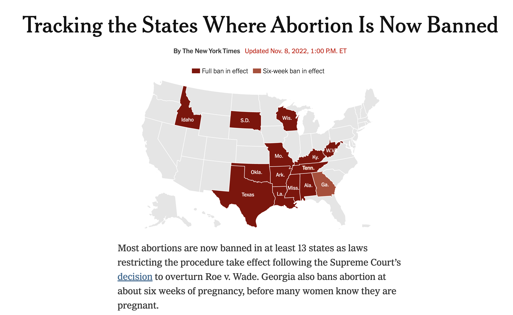
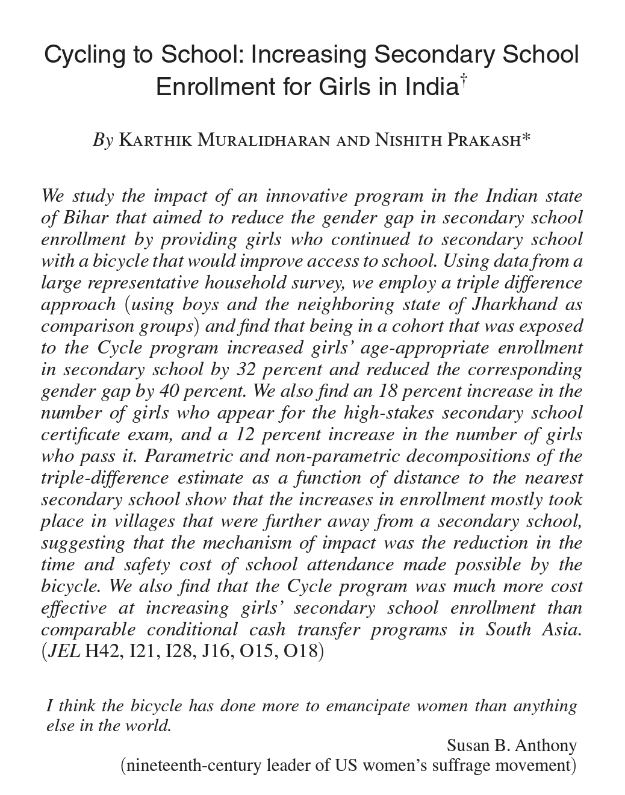
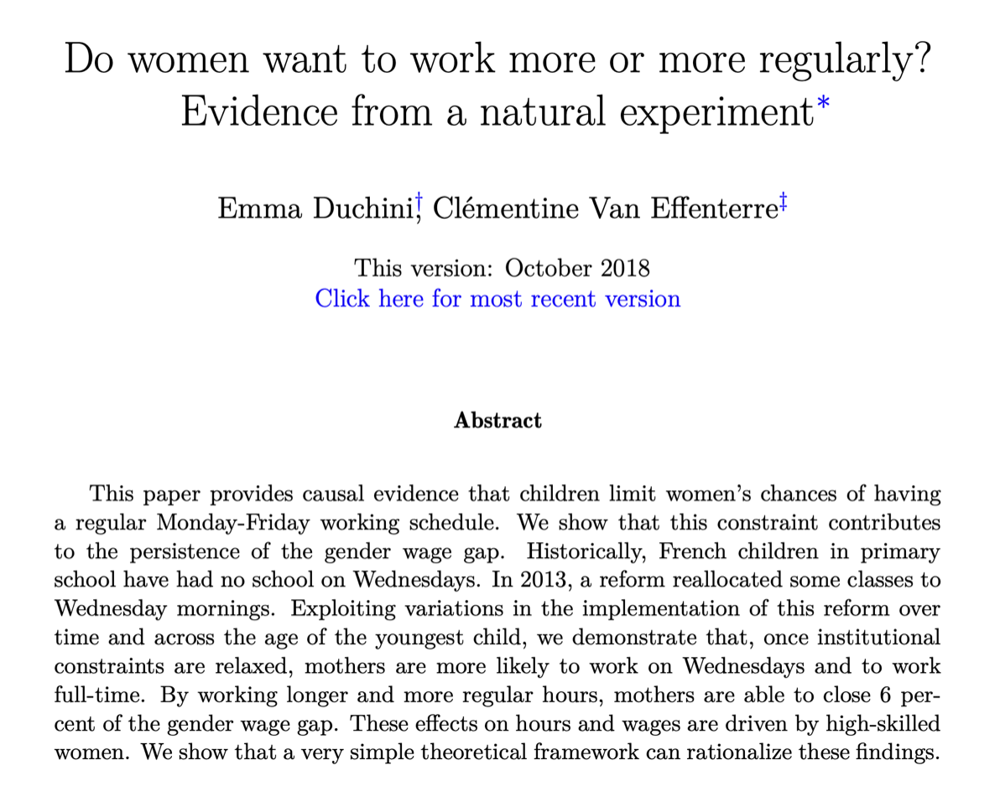
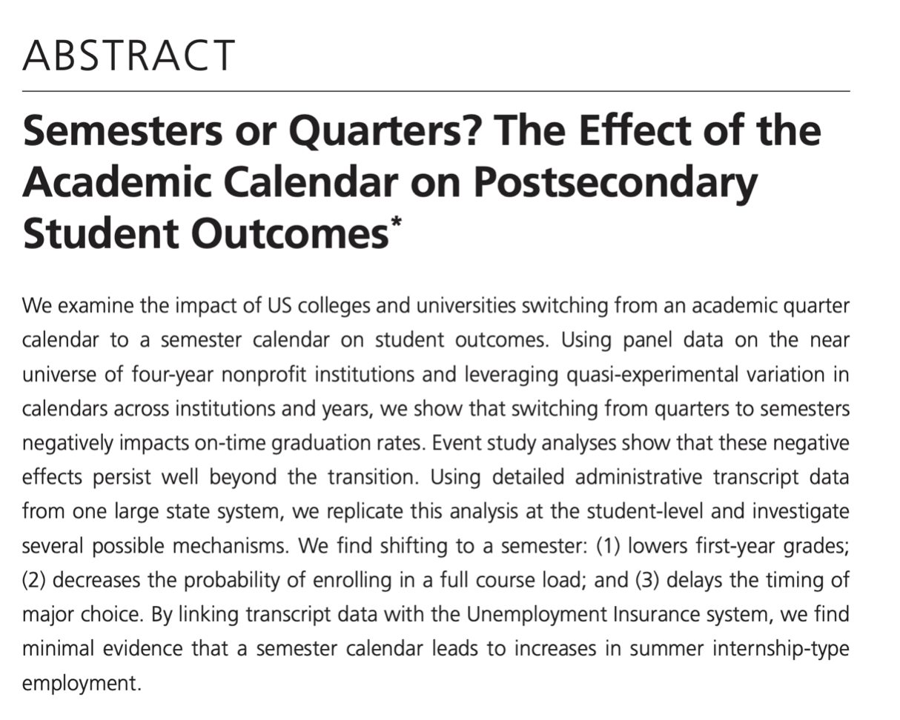
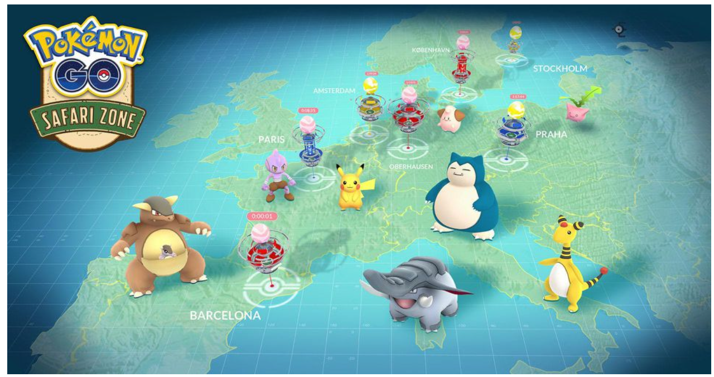

```{r setup, include=FALSE}
xaringanExtra::use_scribble()
options(htmltools.dir.version = FALSE)
knitr::opts_chunk$set(
  fig.width=9, 
  fig.height=3.5, 
  fig.retina=3,
  fig.align="center",
  out.width = "100%",
  cache = FALSE,
  echo = FALSE,
  message = FALSE, 
  warning = FALSE,
  hiline = TRUE
)
```


```{r packages}
library(tidyverse)
library(ggdag)
library(panelView)
library(ggrepel)
library(kableExtra)


# dubois colors
red = "#dc354a"
yellow = "#ecb025"
blue = "#213772"

# custom ggplot theme
theme_nice = function() {
  theme_minimal(base_family = "Archivo Narrow") +
    theme(panel.grid.minor = element_blank(),
          plot.background = element_rect(fill = "white", color = NA),
          plot.title = element_text(face = "bold"),
          axis.title = element_text(face = "bold"),
          strip.text = element_text(face = "bold", size = rel(0.8), hjust = 0),
          strip.background = element_rect(fill = "grey80", color = NA),
          legend.title = element_text(face = "bold"))
}

theme_set(theme_nice())

# palette
palette = MetBrewer::met.brewer(name = "Cross")

# stupid geom_label_repel problem
update_geom_defaults("label", list(family = "Fira Sans"))
update_geom_defaults("label_repel", list(family = "Fira Sans"))


# set seed
set.seed(1990)


# load mariel boatlift data
load("data/mariel.RData")

# clean data
mariel = df %>% 
  #Take out Cubans
  filter(!(ethnic == 5),
         #Remove NILF
         !(esr %in% c(4,5,6,7))) %>%
  #Calculate hourly wage
  mutate(hourwage=earnwke/uhourse,
         #and unemp
         unemp = esr == 3) %>%
  #no log problems
  filter((hourwage > 2 | is.na(hourwage)),(uhourse > 0 | is.na(uhourse))) %>%
  #adjust for inflation to 1980 prices
  mutate(hourwage = case_when(
    year==79 ~ hourwage/.88,
    year==81 ~ hourwage/1.1,
    year==82 ~ hourwage/1.17,
    year==83 ~ hourwage/1.21,
    year==84 ~ hourwage/1.26,
    year==85 ~ hourwage/1.31
  )) %>% 
  #Take the log of wage and create our "after treatment" and "treated group" variables
  mutate(lwage = log(hourwage),
             after = year >= 81,
             miami = smsarank == 26)


```


class: left, middle
background-image: url("images/dubois-spiral-2.png")
background-position: right
background-size: contain

# `r rmarkdown::metadata$title`

### *`r rmarkdown::metadata$subtitle`*

### Professor `r rmarkdown::metadata$author` 

#### University of California, Davis

---


class: center
.large[
# Today's agenda
]

--
.box-1.large.sp-after[Sudden policies]

--
.box-2.large.sp-after[Difference in differences]

--
.box-3.large.sp-after[Parallel trends]

---


# The world's always changing


.pull-left[
Countries, states, local governments, etc., are constantly passing new laws/policies, altering existing ones, etc.

What **effect** do new laws have on people's behaviors, attitudes, etc.?

How can we **estimate** the effect of these laws? 
]


.pull-right[
```{r}

```
]

---


# How to evaluate?


We could compare abortion rates in the states **with** and **without** abortion restrictions -- but that's obviously problematic! Is whatever difference we observe because of the policy, or some lurking confound?

```{r, out.width="60%"}

```


---

# How to evaluate?

We could compare abortion rates **before and after** the policy goes into effect -- also problematic! The abortion rate is always fluctuating -- how do we know whatever difference we see isn't just a normal fluctuation?


```{r, out.width="80%"}
# abortion rates
library(lubridate)
set.seed(1990)
fake = tibble(date = seq(ymd("2021-01-01"), 
                  ymd("2022-09-01"), by = "months")) %>% 
  mutate(rate = rnorm(n = n(), mean = 11.6, sd = .8)) %>% 
  add_row(date = ymd("2022-10-01"), 
          rate = 10)

ggplot(fake, aes(x = date, y = rate)) + 
  geom_line(size = 1.4) + 
  geom_point() +
  scale_y_continuous(limits = c(0, 15)) + 
  geom_vline(xintercept = ymd("2022-07-01"), color = red, 
             size = 2, alpha = .7) + 
  coord_cartesian(xlim = c(ymd("2021-01-01"), ymd("2023-06-01"))) +
  labs(y = "Abortion rate", x = "Date") + 
  geom_label(data = tibble(date = ymd("2022-07-01"), 
                    rate = 8, 
                    label = "Abortion restrictions\ngo into effect"),
             aes(label = label), color = red)
```

---


# New policies: natural experiments?


Can we think of the the passage of a new policy as a kind of **natural experiment**? 

--

In some ways no: the countries/states that adopt a policy (e.g., abortion bans) are **very different** from the states that don't pass them


```{r, out.width="70%"}
dagify(A ~ U + L, 
       L ~ U, 
       exposure = "L", 
       outcome = "A", 
       latent = "U",
       coords = list(x = c(L = 0, U = .5, A = 1), 
                     y = c(L = 0, U = 1, A = 0)), 
       labels = list(A = "Abortion rate", 
                     U = "Unknown confounds", 
                     L = "Law restricting abortion")) %>% 
  ggdag_status(text = FALSE, use_labels = "label", stylized = TRUE) +
  theme_dag_blank() + 
  theme(legend.position = "none") + 
  scale_color_manual(values = c(red, yellow, blue)) + 
  scale_fill_manual(values = c(red, yellow, blue))
```

---

# New policies: natural experiments?


But in some ways maybe *yes*: the policy didn't exist, and then suddenly it does

--

There can be factors that make the policy more likely: e.g., a cash transfer (Biden bucks) are more likely during an economic downturn than during good times

--

But some policies are sudden or unexpected enough where the **exact** moment they go into effect is *arbitrary*

---

# Difference-in-difference

This is where the **difference-in-difference (DiD)** research design comes into play

--

One of the most commonly used (and maybe abused) methods for **estimating the effect of a policy (or sudden change) on an outcome**


--

General idea: try to simulate *what would have happened* in the places that received a policy/shock, using what happened in the places that *didn't* receive the shock over the same time period

---

# The setup

We observe **units** (e.g., states) over **time**


Some units experience some policy or shock (the **treatment group**), and we observe them *before* and *after* the shock


Some units *never* experience the policy (the **control group**) and we also observe them *before* and *after* the shock

---

# The setup

```{r}
set.seed(1990)

tibble(abb = sample(state.name, size = 10)) %>% 
  mutate(treated = rbinom(n = n(), size = 1, prob = .5)) %>% 
  crossing(year = 1990:2010) %>% 
  mutate(onset = year > 2002, 
         treat_onset = treated * onset) %>% 
  mutate(turnout = rnorm(n = n())) %>% 
  panelview(turnout ~ treat_onset, pre.post = TRUE,
            by.timing = TRUE,
            data = ., index = c("abb","year"), 
            main = "Abortion restriction laws")
```


---


```{r, out.width="60%"}

```


---

```{r, out.width="60%"}

```

---


```{r, out.width="60%"}

```

---

class: center, middle, inverse
# Pokemon Go! to the polls
---


```{r, out.width="90%"}

```

---


```{r, out.width="90%"}

```

---

class: center, middle
# The effect of Pokemon Go!

--

Pokemon Go! involves a ton of walking around

--

Did Pokemon Go! meaningfully **increase** Americans' activity levels? 

--

Seems obvious, but by how much exactly?


---


# The setup 

--

We have kids who download the app when it comes out (**treatment**)

--

We have kids who never download the app (**control**)

--

We have data on both of these groups of kids **before** and **after** the app is released

---

# Problems

.pull-left[
If we compare treated against controls, we worry about backdoor paths between having the app and amount of walking

If we compare before and after the app comes out, is this because of the app or random fluctuations in walking?
]


.pull-right[
```{r}
dagify(Y ~ X + H + A,
       X ~ H + A, 
       exposure = "X", outcome = "Y", 
       labels = c(Y = "Walking", X = "PokemonGo!", 
                  H = "Natural changes over time", 
                  A = "Reasons for having app"),
       coords = list(x = c(X = 0, A = .5, H = .5, Y = 1), 
                     y = c(X = 0, A = 1, H = -1, Y = 0))) %>% 
  ggdag_status(text = FALSE, use_labels = "label", stylized = TRUE) +
  theme_dag_blank() + 
  theme(legend.position = "none") + 
  scale_color_manual(values = c(blue, red, yellow)) + 
  scale_fill_manual(values = c(blue, red, yellow))
```

]

---

# The DiD approach

--

One thing we can do is look at what happens to the kids in the treatment group (those who downloaded the app), *before and after* the app was released

--

The change from before to after will include the effect of the app + the time fluctuations we are worried about

--

We can then compare to what happens with the kids in the control group (never download the app) -- change from before to after will **only include** the time fluctuations

--

This is the **DiD** approach: the change in the control group is our counterfactual for *what would have happened* had the treated kids never been treated


---

# Treated units, before and after the app


Among **treated**, kids go from walking 0.8 miles a day to 1.6, so an improvement of 0.8 miles on average. Is this just because of the app?

```{r}
pokemon = crossing(time = c("Before app comes out",
                          "After app comes out"),
                 unit = c("App users", 
                          "Non-app users")) %>% 
  arrange(unit, time) %>% 
  mutate(walking = c(1.6, 0.8, .9, .6),
         time = fct_rev(time))

ggplot(filter(pokemon, unit == "App users"), 
       aes(x = time, y = walking, group = unit)) + 
  geom_point(size = 4, color = red) + 
  geom_line(size = 2, color = red) + 
  coord_cartesian(ylim = c(0, 2)) +
  labs(x = NULL, y = "Average walking distance (miles)") + 
  theme(axis.text = element_text(size = 14)) + 
  geom_label(aes(x = 1.5, y = 1.7, 
                 label = "Change in walking:\n1.6 - 0.8 = 0.8"), 
             color = red, size = 4, fontface = "bold")
```

---


# Control units, before and after app


Among **control**, kids go from walking 0.6 miles a day to 0.9 miles -- and we *know* this isn't because of the app -- this is just the *time trend*

```{r}

ggplot(filter(pokemon, unit == "App users"), 
       aes(x = time, y = walking, group = unit)) + 
  geom_point(size = 4, color = red) + 
  geom_line(size = 2, color = red) + 
  coord_cartesian(ylim = c(0, 2)) +
  labs(x = NULL, y = "Average walking distance (miles)") + 
  theme(axis.text = element_text(size = 14)) + 
  geom_point(data = filter(pokemon, unit == "Non-app users"), 
             aes(x = time, y = walking, group = unit), size = 4, 
             color = blue) + 
  geom_line(data = filter(pokemon, unit == "Non-app users"), 
             aes(x = time, y = walking, group = unit), size = 2, 
            color = blue) + 
  geom_label(aes(x = 1.5, y = .25, 
                 label = "Change in walking:\n0.9 - 0.6 = 0.3"), 
             color = blue, size = 4, fontface = "bold")
```

---

# The counterfactual


So what would have happened to the **treated** kids if they had never downloaded the app? We can use the time trend from the control group as our **counterfactual**


```{r}
ggplot(filter(pokemon, unit == "App users"), 
       aes(x = time, y = walking, group = unit)) + 
  geom_point(size = 4, color = red) + 
  geom_line(size = 2, color = red) + 
  coord_cartesian(ylim = c(0, 2)) +
  labs(x = NULL, y = "Average walking distance (miles)") + 
  theme(axis.text = element_text(size = 14)) + 
  geom_point(data = filter(pokemon, unit == "Non-app users"), 
             aes(x = time, y = walking, group = unit), size = 4, 
             color = blue) + 
  geom_line(data = filter(pokemon, unit == "Non-app users"), 
             aes(x = time, y = walking, group = unit), size = 2, 
            color = blue) + 
  annotate(geom = "segment", x = "Before app comes out", 
           xend = "After app comes out", 
           y = pokemon$walking[2], 
           yend = pokemon$walking[2] + 0.3, size = 2, lty = 2) + 
  geom_point(data = tibble(x = "After app comes out", 
                           y = pokemon$walking[2] + 0.3), 
             aes(x = x, y =y), 
             inherit.aes = FALSE, size = 4)
```


---

# The effect


The effect of the app then is .yellow[the difference] between the amount the kids with the app walked and what they would have walked *had they not downloaded the app*

```{r}
ggplot(filter(pokemon, unit == "App users"), 
       aes(x = time, y = walking, group = unit)) + 
  geom_point(size = 4, color = red) + 
  geom_line(size = 2, color = red) + 
  coord_cartesian(ylim = c(0, 2)) +
  labs(x = NULL, y = "Average walking distance (miles)") + 
  theme(axis.text = element_text(size = 14)) + 
  geom_point(data = filter(pokemon, unit == "Non-app users"), 
             aes(x = time, y = walking, group = unit), size = 4, 
             color = blue) + 
  geom_line(data = filter(pokemon, unit == "Non-app users"), 
             aes(x = time, y = walking, group = unit), size = 2, 
            color = blue) + 
  annotate(geom = "segment", x = "Before app comes out", 
           xend = "After app comes out", 
           y = pokemon$walking[2], 
           yend = pokemon$walking[2] + 0.3, size = 2, lty = 2) + 
  geom_point(data = tibble(x = "After app comes out", 
                           y = pokemon$walking[2] + 0.3), 
             aes(x = x, y =y), 
             inherit.aes = FALSE, size = 4) + 
  annotate(geom = "segment", x = "After app comes out", 
           xend = "After app comes out", 
           y = pokemon$walking[2] + 0.3, 
           yend = pokemon$walking[1], size = 2, color = yellow) + 
  geom_label(aes(x = 2.3, y = 1.3, label = "Pokemon Go effect:\n1.6 - 1.1 = .5"),
             color = yellow, fontface = "bold")
```

---

# The DiD estimate


This is the **difference-in-difference** estimate. It's called that because we are taking the difference among the .red[treated] (pre- to post-) and subtracting the difference among the .blue[control] (pre- to post-)

.red[(1.6 - 0.8)] - .blue[(0.9 - 0.6)] = .yellow[0.5]

```{r}
ggplot(filter(pokemon, unit == "App users"), 
       aes(x = time, y = walking, group = unit)) + 
  geom_point(size = 4, color = red) + 
  geom_line(size = 2, color = red) + 
  coord_cartesian(ylim = c(0, 2)) +
  labs(x = NULL, y = "Average walking distance (miles)") + 
  theme(axis.text = element_text(size = 14)) + 
  geom_point(data = filter(pokemon, unit == "Non-app users"), 
             aes(x = time, y = walking, group = unit), size = 4, 
             color = blue) + 
  geom_line(data = filter(pokemon, unit == "Non-app users"), 
             aes(x = time, y = walking, group = unit), size = 2, 
            color = blue) + 
  annotate(geom = "segment", x = "Before app comes out", 
           xend = "After app comes out", 
           y = pokemon$walking[2], 
           yend = pokemon$walking[2] + 0.3, size = 2, lty = 2) + 
  geom_point(data = tibble(x = "After app comes out", 
                           y = pokemon$walking[2] + 0.3), 
             aes(x = x, y =y), 
             inherit.aes = FALSE, size = 4) + 
  annotate(geom = "segment", x = "After app comes out", 
           xend = "After app comes out", 
           y = pokemon$walking[2] + 0.3, 
           yend = pokemon$walking[1], size = 2, color = yellow) + 
  geom_label(aes(x = 2.3, y = 1.3, label = "Pokemon Go effect::\n1.6 - 1.1 = .5"),
             color = yellow, fontface = "bold")
```


---


# Does immigration hurt local wages?

.pull-left[
Simple supply and demand $\rightarrow$ increase supply of labor, price of labor (wages) goes down

On the other hand, immigrants might boost demand, other (+) effect on wages

Can't just compare places with and without immigrants -- too many confounds!
]

.pull-right[
```{r}
dagify(Y ~ X + A,
       X ~ A, 
       exposure = "X", outcome = "Y", 
       labels = c(Y = "Local wages", X = "Number of immigrants", 
                  A = "Reasons for moving to location"),
       coords = list(x = c(X = 0, A = .5, Y = 1), 
                     y = c(X = 0, A = 1, Y = 0))) %>% 
  ggdag_status(text = FALSE, use_labels = "label", 
               stylized = TRUE) +
  theme_dag_blank() + 
  theme(legend.position = "none") + 
  scale_color_manual(values = c(blue, red)) + 
  scale_fill_manual(values = c(blue, red))
```
]


---

# The Mariel Boatlift

.pull-left[
Classic paper by David Card using the "Mariel Boat Lift" as a natural experiment

Mariel boat lift = sudden arrival of 125k (!!!) Cubans to Miami between 15 April and 31 October 1980

Miami is *treated* by a random and sudden **increase** in the immigrant population
]


.pull-right[
```{r}

```
]

---


# The DiD setup

Remember, with DiD we need a treatment group, a control group, and to observe both before and after the sudden event

--

The treatment group? Miami

The control group? Card chooses "similar" cities as point of comparison: Atlanta, Houston, Los Angeles, and Tampa/St. Petersburg


---


# Miami, before and after


Wages decrease in Miami after the Mariel boatlift; is this **because** of the boatlift?

```{r}
group_means = mariel %>% 
  mutate(lwage = exp(lwage)) %>% 
  group_by(miami, after) %>% 
  summarise(mean = mean(lwage, na.rm = TRUE)) %>% 
  mutate(after = ifelse(after == TRUE, 
                        "After Mariel", "Before Mariel")) %>% 
  mutate(after = fct_rev(after))


ggplot(data = filter(group_means, miami == TRUE), 
       aes(x = after, y = mean, group = miami)) + 
  geom_point(size = 4, color = red) + 
  geom_line(size = 2, color = red) + 
  coord_cartesian(ylim = c(5.5, 7.7)) + 
  labs(x = NULL, y = "Average wages ($ per hour)") + 
  geom_label(aes(x = 1.5, y = 7, 
                 label = "Change in wages:\n 6.38 - 6.43 = -.05"), 
             color = red, fontface = "bold")
```


---

# What was happening in the control cities?


Wages were decreasing in control areas too -- this means wages were going down *generally*

```{r}
ggplot(data = filter(group_means, miami == TRUE), 
       aes(x = after, y = mean, group = miami)) + 
  geom_point(size = 4, color = red) + 
  geom_line(size = 2, color = red) + 
  coord_cartesian(ylim = c(5.5, 7.7)) + 
  geom_point(data = filter(group_means, miami == FALSE), 
             aes(x = after, y = mean, group = miami), size = 4,
             color = blue) + 
  geom_line(data = filter(group_means, miami == FALSE), 
             aes(x = after, y = mean, group = miami), size = 2, 
            color = blue) + 
    labs(x = NULL, y = "Average wages ($ per hour)") + 
  geom_label(aes(x = 1.5, y = 7, 
                 label = "Change in wages:\n 7.23 - 7.48 = -.25"), 
             color = blue, fontface = "bold")
```


# The DiD estimate


Wages were actually *higher* than we would expect given changes in other cities

In other words, migration seems to have **improved** wages, or reduced the impact of the economic downturn

```{r}
group_means = mariel %>% 
  mutate(lwage = exp(lwage)) %>% 
  group_by(miami, after) %>% 
  summarise(mean = mean(lwage, na.rm = TRUE)) %>% 
  mutate(after = ifelse(after == TRUE, 
                        "After Mariel", "Before Mariel")) %>% 
  mutate(after = fct_rev(after))


ggplot(data = filter(group_means, miami == TRUE), 
       aes(x = after, y = mean, group = miami)) + 
  geom_point(size = 4, color = red) + 
  geom_line(size = 2, color = red) + 
  coord_cartesian(ylim = c(5.5, 7.7)) + 
  geom_point(data = filter(group_means, miami == FALSE), 
             aes(x = after, y = mean, group = miami), size = 4,
             color = blue) + 
  geom_line(data = filter(group_means, miami == FALSE), 
             aes(x = after, y = mean, group = miami), size = 2, 
            color = blue) + 
  annotate(geom = "segment", x = "Before Mariel", 
           xend = "After Mariel", y = group_means$mean[group_means$miami == TRUE & group_means$after == "Before Mariel"], yend = 6.18, size = 2, lty = 2) + 
  geom_point(data = tibble(x = "After Mariel", 
                           y = 6.18), aes(x = x, y =y), 
             inherit.aes = FALSE, size = 4) + 
  annotate(geom = "segment", x = "After Mariel", xend = "After Mariel", 
           y = group_means$mean[4], yend = 6.18, size = 2, color = yellow) + 
  geom_label(aes(x = 1.5, y = 6.8, 
                 label = "The Mariel Boatlift effect:\n(6.38 - 6.43) - (7.23 - 7.48) = increase of 0.2"), color = yellow, fontface = "bold")
```


---


# When does this work?


The nice thing about DiD is that we don't need treatment and control to be exchangeable (as with discontinuity designs) -- eg, the kids who download the app are more active from the get go than kids who never get the app


```{r}
ggplot(filter(pokemon, unit == "App users"), 
       aes(x = time, y = walking, group = unit)) + 
  geom_point(size = 4, color = red) + 
  geom_line(size = 2, color = red) + 
  coord_cartesian(ylim = c(0, 2)) +
  labs(x = NULL, y = "Average walking distance (miles)") + 
  theme(axis.text = element_text(size = 14)) + 
  geom_point(data = filter(pokemon, unit == "Non-app users"), 
             aes(x = time, y = walking, group = unit), size = 4, 
             color = blue) + 
  geom_line(data = filter(pokemon, unit == "Non-app users"), 
             aes(x = time, y = walking, group = unit), size = 2, 
            color = blue) + 
  annotate(geom = "segment", x = "Before app comes out", 
           xend = "After app comes out", 
           y = pokemon$walking[2], 
           yend = pokemon$walking[2] + 0.3, size = 2, lty = 2) + 
  geom_point(data = tibble(x = "After app comes out", 
                           y = pokemon$walking[2] + 0.3), 
             aes(x = x, y =y), 
             inherit.aes = FALSE, size = 4) + 
  annotate(geom = "segment", x = "After app comes out", 
           xend = "After app comes out", 
           y = pokemon$walking[2] + 0.3, 
           yend = pokemon$walking[1], size = 2, color = yellow) + 
  geom_label(aes(x = 2.3, y = 1.3, label = "The Pokemon Go! effect:\n1.6 - 1.1 = .5"),
             color = yellow, fontface = "bold")
```


---


# Parallel trends

--

The key assumption we are making with DiD is that had the treatment not happened (e.g., had Mariel not happened), the treatment units (Miami) and control units (other cities) would **look the *same**

--

What we need for this assumption to work is for **treatment** and **control** units to have similar trends over time

--

This is called the *parallel trends assumption*. We can look at **pre-treatment** trends to evaluate how good this assumption is


---


# Parallel trends


Below the trends looks very good -- prior to treatment, control and treated units behave similarly


```{r}
tibble(date = seq(ymd("2018-01-01"), ymd("2020-01-01"), by = "months")) %>% 
  mutate(treated = rnorm(n = n(), mean = 500, sd = 30) + .0005 + year(date), 
         control = treated + 200) %>% 
  pivot_longer(cols = -date, names_to = "status", values_to = "outcome") %>% 
  ggplot(aes(x = date, y = outcome, color = status)) + 
  geom_line(size = 1.5) + 
  coord_cartesian(ylim = c(2400, 2800), 
                  xlim = c(ymd("2018-01-01"), ymd("2021-06-01"))) +
  geom_vline(xintercept = ymd("2020-01-01"), size = 2, lty = 2, 
             color = yellow) + 
  labs(x = "Date", y = "Outcome", color = "Treatment status:") + 
  theme(legend.position = "top") + 
  scale_color_manual(values = c(blue, red)) + 
  geom_label(aes(x = ymd("2020-04-01"), y = 2600,
                 label = "Treatment \ngoes into effect"), 
             color = yellow, fontface = "bold")
```

---


# Parallel trends


This looks 🤢 -- prior to treatment, treated and control behave very differently. The control unit trend is *not a good counterfactual* for the treated unit trend


```{r}
set.seed(19242)
tibble(date = seq(ymd("2018-01-01"), ymd("2020-01-01"), by = "months")) %>% 
  mutate(treated = rnorm(n = n(), mean = 500, sd = 30) + .0005 + year(date), 
         control = rnorm(n = n(), mean = 500, sd = 30) + 200 + .0005 + year(date)) %>% 
  pivot_longer(cols = -date, names_to = "status", values_to = "outcome") %>% 
  ggplot(aes(x = date, y = outcome, color = status)) + 
  geom_line(size = 1.5) + 
  coord_cartesian(ylim = c(2400, 2800), 
                  xlim = c(ymd("2018-01-01"), ymd("2021-06-01"))) +
  geom_vline(xintercept = ymd("2020-01-01"), size = 2, lty = 2, 
             color = yellow) + 
  labs(x = "Date", y = "Outcome", color = "Treatment status:") + 
  theme(legend.position = "top") + 
  scale_color_manual(values = c(blue, red)) + 
  geom_label(aes(x = ymd("2020-05-01"), y = 2600,
                 label = "Treatment \ngoes into effect"), 
             color = yellow, fontface = "bold")
```

---

class: center, middle
# Recap


We know that to identify the effect of a .red[treatment] on an .blue[outcome] we need to worry about confounds

--

With a good DAG and good controls, we might make it to the promised land, but this is **hard**

--

But sometimes Nature (or History) is kind and gives us moments that **resemble experiments**

--

Discontinuities, where to treatment is as-if random, conditional on **the cutoff being respected**

--

Sudden policies/shocks, where DiD can identify their effect, conditional on treatment and control units **having parallel trends**


---


# 🗺️ A hard left turn 🗺️


We're going to randomly make maps now Using the code from today:

1. Make a map of US counties, "filling" the counties with a variable of your choice.

2. Add nice color to the graph, using `scale_fill_viridis_d(option = "rocket")` if your fill data is discrete, and `scale_fill_viridis_c(option = "rocket")` if continuous

3. Repeat but subset the data to a state of your choosing. 

4. Post the map in the Slack. 