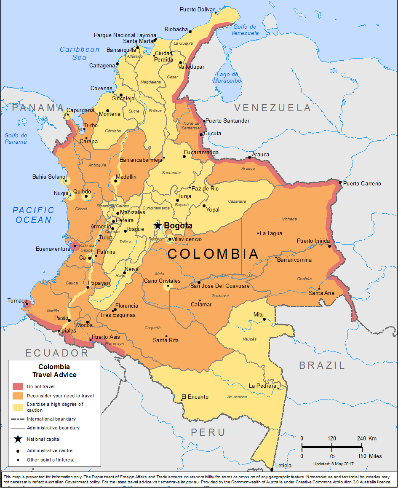

```{r setup, include=FALSE}
options(htmltools.dir.version = FALSE)
knitr::opts_chunk$set(
  fig.width=9, fig.height=3.5, fig.retina=3,
  out.width = "100%",
  cache = FALSE,
  echo = FALSE,
  message = FALSE, 
  warning = FALSE,
  hiline = TRUE
)

library(flipbookr)
library(tidyverse)
```

```{r xaringan-themer, include=FALSE, warning=FALSE}
library(xaringanthemer)

style_mono_accent(
  base_color = "#dc354a",
  header_font_google = google_font("Josefin Sans"),
  text_font_google   = google_font("Montserrat", "300", "300i"),
  code_font_google   = google_font("Fira Mono")
)
```

class: left, middle
background-image: url("images/dubois-spiral-2.png")
background-position: right
background-size: contain

# `r rmarkdown::metadata$title`

### *`r rmarkdown::metadata$subtitle`*

### `r rmarkdown::metadata$author` 

#### University of California, Davis
---

class: center
.large[
# Today's agenda
]

--
.box-1.large.sp-after[What's this class about?]

--
.box-2.large.sp-after[Getting to know each other]

--
.box-3.large.sp-after[UN voting patterns]

---

class: center, middle, inverse
# What's this class about? 

---

# Strongmen and straw men

.pull-left[
- 1 cup milk chocolate chips

--

- 2 large eggs

--

- ... more list items...
]
.pull-right[
```{r, echo = FALSE, out.width="80%",fig.align='right'}
knitr::include_graphics("https://upload.wikimedia.org/wikipedia/commons/9/9a/Saddam_Hussein_in_1998.png")
```
]

---


class: center, middle, inverse
# Who are *you* ? 

???
Testing, testing
---


class: center, middle, inverse
# Who am *I* ?

---

## Colombia

```{r, echo = FALSE, out.width = "40%", fig.align='right'}

```

---


class: middle, left
background-image: url("images/travel-colombia.png")
background-size: contain
background-position: right

## Cali, Colombia

---


class: middle, left
background-image: url("images/florida.jpg")
background-size: contain
background-position: right

### Ft. Lauderdale
### University of Florida

---


class: middle, left
background-image: url("images/nc.jpg")
background-size: 750px
background-position: right

### Duke University (PhD)
### Durham

---


# Class philosophy


Less of this: 

$$\sigma^2 = \frac{\sum_{i=1}^{n}(x_i - \mu)^2} {n}$$

And more of this: 

```{r,eval = FALSE}
var(foo)
ggplot(whatever, aes(x = year, y = volume)) + 
  labs(x = "Tell me")
```
---


# Collect the data


```{r,echo = FALSE}
library(tidyverse)
library(hrbrthemes)
library(ggridges)

set.seed(1990)
n = 200
fake = tibble(government = sample(x = c("Democracy", "Autocracy"), 
                           size = n, 
                           replace = TRUE)) %>% 
  mutate(conflicts = rpois(n = n, lambda = 2 + 
                             5*I(government == "Autocracy")))

# fake table
table = crossing(country = c("Iraq", "Denmark"), 
         year = c(1990:1992)) %>% 
  mutate(government = ifelse(country == "Iraq", 
                             "Autocracy", "Democracy")) %>% 
  mutate(conflicts = rpois(n = n(), lambda = 2 + 
                             5*I(government == "Autocracy")))
knitr::kable(table)
```
---


`r chunk_reveal("dictator-plot")`

```{r dictator-plot, include = FALSE}
ggplot(fake, aes(y = government, 
                 x = conflicts, 
                 fill = government)) + 
  stat_density_ridges(quantile_lines = TRUE, 
                      quantiles = 2, 
                      scale = 3, 
                      color = "white", 
                      alpha = .9, size = 2) + 
  theme_ipsum(base_family = "Fira Sans") + 
  scale_x_continuous(limits = c(-2, 20)) + 
  labs(y = NULL, x = "Number of conflicts", 
       title = "Militarized Conflicts and Regime Type") + 
  theme(legend.position = "none") + 
  scale_fill_viridis_d(option = "rocket", end = .8)
```

---

class: inverse, middle, center

#  Does this mean having a **dictator** as a leader *causes* a country to be more belligerent?

---


